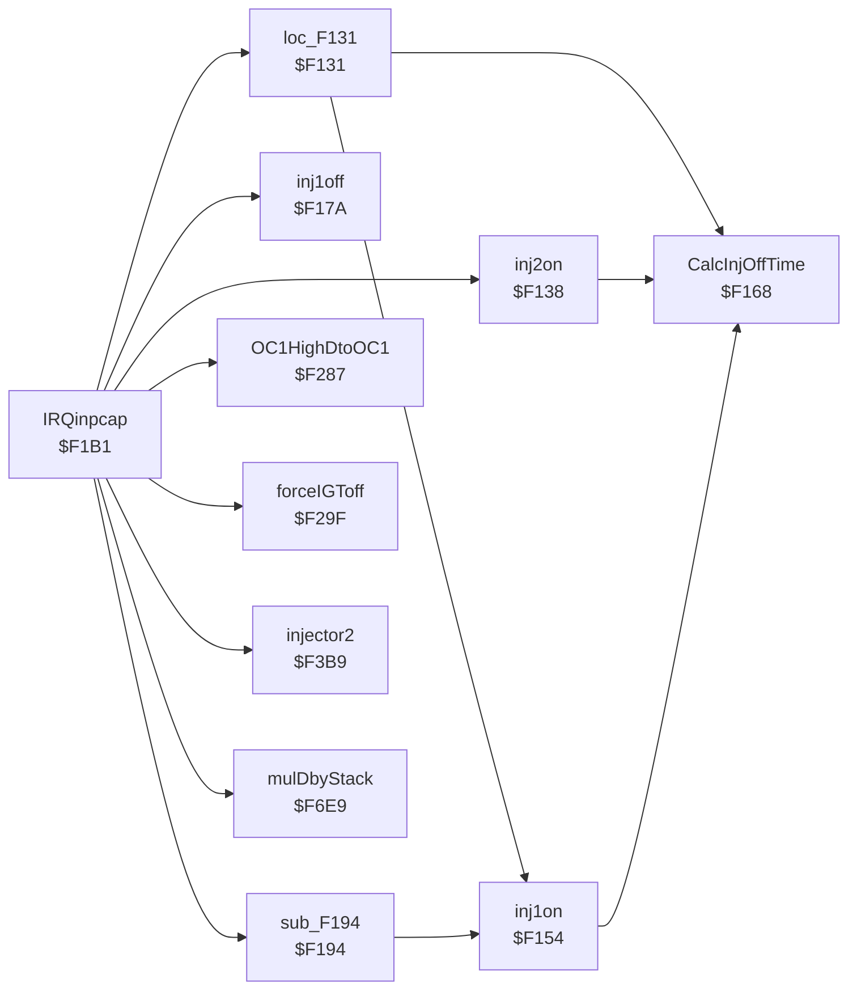
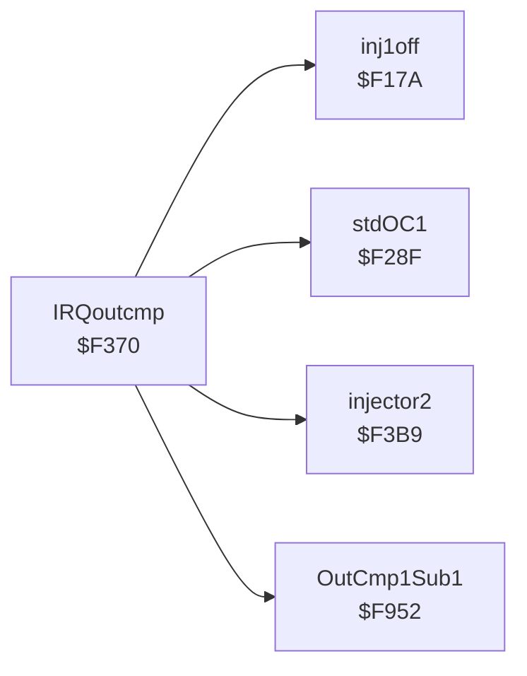
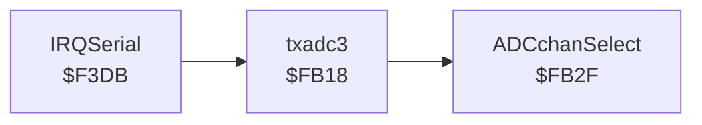

# Cross-references: AE86 Bluetop D151801-0642 (cap.bin), HD6301, $F000-$FFFF

Generated by `analysis/pcmre/xref.py`. **Do not edit by hand**; regenerate with
`PYTHONPATH=analysis uv run python -m pcmre.xref --write`. A test fails if this file is stale.

The analyser follows the code from the interrupt vectors and tracks the X register when it holds a
constant, so it resolves Denso's indexed calls (`ldx #$FFCF` / `jsr $14,x`) and indexed accesses that
wrap past `$FFFF` into RAM. Accesses marked † were resolved that way. IDA's own `XREF` comments in
`cap.asm` are checked against this analysis by `tests/test_xref.py`.

## Summary

| Item | Count |
|---|---|
| Routines (vector entries + call targets) | 68 |
| Instructions reached | 1989 |
| Call edges (unique caller → callee) | 137 |
| Memory accesses resolved | 905 |
| Indirect calls/jumps not resolved | 1 |
| Indexed data accesses with X unknown (not in the tables below) | 18 |
| Listing code lines never reached | 1 |
| Reached instructions the listing calls data | 5 |

## Vectors

| Vector | Address | Handler |
|---|---|---|
| TRAP | `$FFEE` | `$C7BE` outside ROM (not code) |
| SCI | `$FFF0` | `$F3DB` IRQSerial |
| TOF | `$FFF2` | `$F000` reset |
| OCF | `$FFF4` | `$F370` IRQoutcmp |
| ICF | `$FFF6` | `$F1B1` IRQinpcap |
| IRQ1 | `$FFF8` | `$F000` reset |
| SWI | `$FFFA` | `$F000` reset |
| NMI | `$FFFC` | `$F000` reset |
| RES | `$FFFE` | `$F000` reset |

## Routines

Instruction counts include code shared with other routines (fall-through tails).

| Entry | Routine | Instrs | Called by | Calls |
|---|---|---|---|---|
| `$F000` | reset (TOF, IRQ1, SWI, NMI, RES vector) | 138 | sub_FD41 | BeginCalcADV, CPUModeTst, boundData, comAmask4E, flagbadstuf3, loc_F534, loc_FAA7, loc_FFE3, procJmpTable, sub_F420, sub_F96A, sub_FD41 |
| `$F119` | comAmask4E | 6 | loc_F534, reset, sub_F420 | – |
| `$F11A` | mask4E | 5 | loc_F534, sub_F420 | – |
| `$F121` | ForceInjAccD | 29 | jmptable2, sub_F96A | CalcInjOffTime, inj1on |
| `$F129` | ForceInjAccD2 | 26 | sub_F96A | CalcInjOffTime, inj1on |
| `$F131` | loc_F131 | 20 | IRQinpcap | CalcInjOffTime, inj1on |
| `$F138` | inj2on | 15 | IRQinpcap | CalcInjOffTime |
| `$F154` | inj1on | 12 | ForceInjAccD, ForceInjAccD2, loc_F131, sub_F194 | CalcInjOffTime |
| `$F168` | CalcInjOffTime | 9 | ForceInjAccD, ForceInjAccD2, inj1on, inj2on, loc_F131 | – |
| `$F17A` | inj1off | 27 | IRQinpcap, IRQoutcmp | – |
| `$F194` | sub_F194 | 15 | IRQinpcap | inj1on |
| `$F1B1` | IRQinpcap (ICF vector) | 215 | – | OC1HighDtoOC1, forceIGToff, inj1off, inj2on, injector2, loc_F131, mulDbyStack, sub_F194 |
| `$F287` | OC1HighDtoOC1 | 13 | IRQinpcap | – |
| `$F28F` | stdOC1 | 8 | BeginCalcADV, IRQoutcmp | – |
| `$F29F` | forceIGToff | 10 | IRQinpcap | – |
| `$F370` | IRQoutcmp (OCF vector) | 43 | – | OutCmp1Sub1, inj1off, injector2, stdOC1 |
| `$F3B9` | injector2 | 14 | IRQinpcap, IRQoutcmp | – |
| `$F3DB` | IRQSerial (SCI vector) | 37 | – | txadc3 |
| `$F420` | sub_F420 | 138 | reset | DivDby16, DivDby16+4, boundData, boundDataneg, comAmask4E, flagbadstuf3, loc_F534, loc_FF28+5, loc_FFE1, loc_FFE3, mask4E, sub_F5E2, … (+1) |
| `$F534` | loc_F534 | 212 | reset, sub_F420 | Calc72, Calc76, DivDby32, TableThW, comAmask4E, loc_F6E6+1, loc_FF28+5, loc_FFE3, mask4E, mulDbyStack, reinitLoads, sub_F5D8, … (+4) |
| `$F5CE` | reinitLoads | 6 | loc_F534 | – |
| `$F5D8` | sub_F5D8 | 13 | loc_F534 | – |
| `$F5E0` | sub_F5E0 | 8 | loc_F534 | – |
| `$F5E1` | sub_F5E1 | 7 | sub_F70A | – |
| `$F5E2` | sub_F5E2 | 6 | sub_F420 | – |
| `$F5E3` | sub_F5E3 | 5 | BeginCalcADV, sub_F420 | – |
| `$F6BB` | sub_F6BB | 22 | sub_F96A | sub_F6E3, sub_F700 |
| `$F6D4` | sub_F6D4 | 9 | sub_F96A | sub_F700 |
| `$F6E3` | sub_F6E3 | 17 | Calc72, loc_F534, sub_F6BB, sub_F700, sub_F70A | – |
| `$F6E7` | loc_F6E6+1 | 15 | loc_F534 | – |
| `$F6E9` | mulDbyStack | 14 | BeginCalcADV, IRQinpcap, jmptable2, loc_F534, sub_F70A | – |
| `$F6FC` | Calc72 | 9 | loc_F534 | sub_F6E3 |
| `$F700` | sub_F700 | 7 | loc_F534, sub_F6BB, sub_F6D4 | sub_F6E3 |
| `$F70A` | sub_F70A | 47 | loc_F534 | boundData, mulDbyStack, sub_F5E1, sub_F6E3 |
| `$F751` | sub_F751 | 47 | sub_F96A | boundData |
| `$F7BE` | Calc76 | 56 | loc_F534 | loc_FFA4 |
| `$F7F1` | loc_F7F1 | 23 | sub_F96A | – |
| `$F814` | BeginCalcADV | 162 | reset | DivDby16, OutCmp1Sub1, boundData, boundDataneg, loc_FF28, loc_FFA4, loc_FFE3, mulDbyStack, stdOC1, sub_F5E3, sub_FF35 |
| `$F952` | OutCmp1Sub1 | 15 | BeginCalcADV, IRQoutcmp | – |
| `$F96A` | sub_F96A | 229 | reset | ADCchanSelect, FlagBadStuff, ForceInjAccD, ForceInjAccD2, TXtoADC, boundData, jmptable1, jmptable2, jmptable3, jmptable4, loc_F7F1, loc_FF28, … (+4) |
| `$FA9B` | procJmpTable | 79 | reset | ADCchanSelect, FlagBadStuff, TXtoADC, boundData, jmptable1, jmptable2, jmptable3, jmptable4, loc_FF28 |
| `$FAA7` | loc_FAA7 | 73 | reset | ADCchanSelect, FlagBadStuff, TXtoADC, boundData, loc_FF28 |
| `$FB07` | TXtoADC | 22 | loc_FAA7, procJmpTable, sub_F96A | ADCchanSelect |
| `$FB18` | txadc3 | 13 | IRQSerial | ADCchanSelect |
| `$FB2F` | ADCchanSelect | 12 | TXtoADC, loc_FAA7, procJmpTable, sub_F96A, txadc3 | – |
| `$FB43` | boundDataneg | 12 | BeginCalcADV, jmptable2, sub_F420 | – |
| `$FB46` | boundData | 10 | BeginCalcADV, jmptable2, jmptable4, loc_FAA7, procJmpTable, reset, sub_F420, sub_F70A, sub_F751, sub_F96A | – |
| `$FB58` | jmptable2 | 65 | procJmpTable, sub_F96A | FlagBadStuff, ForceInjAccD, boundData, boundDataneg, loc_FF28+3, mulDbyStack |
| `$FBD7` | jmptable4 | 80 | procJmpTable, sub_F96A | Table12V, TableThW, boundData, loc_FF28+2 |
| `$FC6E` | CPUModeTst | 7 | reset, sub_FD41 | – |
| `$FC7C` | DivDby32 | 6 | jmptable3, loc_F534 | – |
| `$FC7D` | DivDby16 | 5 | BeginCalcADV, sub_F420 | – |
| `$FC81` | DivDby16+4 | 1 | sub_F420 | – |
| `$FC82` | jmptable3 | 67 | procJmpTable, sub_F96A | DivDby32, FlagBadStuff, Table12V, loc_FFE1 |
| `$FCBB` | jmptable1 | 50 | procJmpTable, sub_F96A | loc_FFE1 |
| `$FD02` | FlagBadStuff | 32 | jmptable2, jmptable3, loc_FAA7, procJmpTable, sub_F96A | – |
| `$FD11` | flagbadstuf3 | 16 | reset, sub_F420 | – |
| `$FD41` | sub_FD41 | 178 | reset | CPUModeTst, TableThW, loc_FFE3, reset |
| `$FF1B` | TableThW | 26 | jmptable4, loc_F534, sub_FD41 | – |
| `$FF25` | Table12V | 21 | jmptable3, jmptable4 | – |
| `$FF28` | loc_FF28 | 19 | BeginCalcADV, loc_FAA7, procJmpTable, sub_F96A | – |
| `$FF2A` | loc_FF28+2 | 17 | jmptable4 | – |
| `$FF2B` | loc_FF28+3 | 16 | jmptable2 | – |
| `$FF2D` | loc_FF28+5 | 14 | loc_F534, sub_F420 | – |
| `$FF35` | sub_FF35 | 8 | BeginCalcADV | – |
| `$FFA4` | loc_FFA4 | 9 | BeginCalcADV, Calc76 | – |
| `$FFE1` | loc_FFE1 | 8 | jmptable1, jmptable3, sub_F420 | loc_FFE3 |
| `$FFE3` | loc_FFE3 | 7 | BeginCalcADV, loc_F534, loc_FFE1, reset, sub_F420, sub_F96A, sub_FD41 | – |

## Routines with non-standard returns

`inline` = bytes of parameters placed after the call, skipped on return; `pops` = bytes of the
caller's stack removed besides the return address.

| Entry | Routine | Inline bytes | Pops |
|---|---|---|---|
| `$F6E3` | sub_F6E3 | 0 | 1 |
| `$F6E7` | loc_F6E6+1 | 0 | 1 |
| `$F6E9` | mulDbyStack | 0 | 1 |
| `$FB43` | boundDataneg | 2 | 0 |
| `$FB46` | boundData | 2 | 0 |

## RAM and I/O registers

`$00`–`$1F` are the HD6301 on-chip registers; `$80`–`$FF` is on-chip RAM. Read-modify-write instructions (`inc`, `aim` …) count as both. **A dash means no access was
*resolved*, not that none exists:** indexed accesses with an unknown X (for example the ADC result
store at `$54` + channel) are counted in the summary but not attributed here.

| Address | Name | Width | Read by | Written by |
|---|---|---|---|---|
| `$00` | Port1DDR | 2 | – | reset |
| `$02` | Port1 | 2 | CPUModeTst, ForceInjAccD, ForceInjAccD2, inj1off, inj2on, injector2, jmptable1, jmptable4, loc_F131, sub_F194, sub_F96A, sub_FD41 | CPUModeTst, jmptable1, jmptable4, reset, sub_F96A, sub_FD41 |
| `$03` | Port2 | 1 | BeginCalcADV, CPUModeTst, IRQinpcap, forceIGToff, jmptable4 | – |
| `$04` | Port3DDR | 2 | – | reset |
| `$06` | Port3 | 2 | IRQSerial, IRQinpcap, TXtoADC, jmptable3, loc_FAA7, procJmpTable, reset, sub_F420, sub_F96A, txadc3 | IRQSerial, TXtoADC, loc_FAA7, procJmpTable, reset, sub_F96A, txadc3 |
| `$07` | Port4 | 1 | BeginCalcADV, Calc76, FlagBadStuff, IRQinpcap, flagbadstuf3, inj1off, inj1on, jmptable1, jmptable3, jmptable4, loc_F7F1, reset, … (+2) | IRQinpcap, inj1off, inj1on |
| `$08` | TmrCntStat1 | 2 | BeginCalcADV, IRQinpcap, IRQoutcmp, OC1HighDtoOC1, forceIGToff | BeginCalcADV, IRQinpcap, IRQoutcmp, OC1HighDtoOC1, forceIGToff, reset |
| `$09` | Timer | 2 | CalcInjOffTime, ForceInjAccD, ForceInjAccD2, IRQSerial, IRQinpcap, OC1HighDtoOC1, TXtoADC, forceIGToff, inj1off, inj2on, injector2, loc_F131, … (+5) | reset |
| `$0B` | OutCmp1 | 2 | IRQinpcap, IRQoutcmp | BeginCalcADV, IRQinpcap, IRQoutcmp, OC1HighDtoOC1, forceIGToff, stdOC1 |
| `$0D` | InpCap1 | 2 | IRQinpcap | – |
| `$0F` | Port3CntStat | 1 | sub_F420 | sub_F420 |
| `$10` | UARTRateMode | 1 | – | TXtoADC, loc_FAA7, procJmpTable, sub_F96A, txadc3 |
| `$11` | TxRxCntStat | 2 | IRQSerial, TXtoADC, loc_FAA7, procJmpTable, reset, sub_F96A, txadc3 | TXtoADC, loc_FAA7, procJmpTable, reset, sub_F96A, txadc3 |
| `$13` | TxReg | 1 | – | IRQSerial, TXtoADC, loc_FAA7, procJmpTable, sub_F96A, txadc3 |
| `$14` | RAMCnt | 1 | – | reset |
| `$18` | TmrCntStat2 | 1 | ForceInjAccD, ForceInjAccD2, IRQinpcap, IRQoutcmp, inj1off, inj2on, injector2, loc_F131, sub_F194 | ForceInjAccD, ForceInjAccD2, IRQinpcap, inj1off, inj2on, injector2, loc_F131, reset, sub_F194 |
| `$1B` | OutCmp2 | 2 | inj1off, sub_F194 | ForceInjAccD, ForceInjAccD2, inj1off, inj2on, injector2, loc_F131, sub_F194 |
| `$1D` | InpCap2 | 2 | IRQinpcap | – |
| `$40` | word_40 | 2 | sub_F751 | jmptable4, sub_F751 |
| `$42` | word_42 | 2 | BeginCalcADV, jmptable1, loc_F534, sub_F70A, sub_F751 | jmptable4, sub_F751 |
| `$44` | word_44 | 2 | sub_F70A, sub_F751 | jmptable4, sub_F751 |
| `$46` | word_46 | 2 | sub_FD41 | jmptable4, sub_FD41 |
| `$48` | word_48 | 2 | FlagBadStuff, flagbadstuf3, jmptable1, jmptable3, jmptable4†, sub_FD41 | FlagBadStuff, flagbadstuf3, jmptable1, jmptable3, jmptable4 |
| `$4A` | byte_4A | 1 | jmptable4 | jmptable4 |
| `$4B` | byte_4B | 1 | IRQinpcap, sub_F96A | sub_F96A |
| `$4C` | byte_4C | 2 | Calc76, IRQinpcap, loc_F534, reset, sub_F420, sub_F96A, sub_FD41 | loc_F534, reset, sub_F420, sub_F96A, sub_FD41 |
| `$4D` | byte_4D | 1 | Calc76, ForceInjAccD, loc_F534, reset, sub_F420, sub_F6BB, sub_F96A, sub_FD41 | Calc76, sub_F96A |
| `$4E` | byte_4E | 1 | BeginCalcADV, IRQinpcap, IRQoutcmp, comAmask4E, loc_F534, mask4E, reset, sub_F420 | IRQinpcap, IRQoutcmp, comAmask4E, mask4E, sub_F420 |
| `$4F` | ADCflags | 2 | IRQSerial, loc_FAA7, procJmpTable, reset, sub_F96A | IRQSerial, loc_FAA7, procJmpTable, reset, sub_F96A |
| `$50` | ADCRxData | 1 | – | IRQSerial |
| `$51` | EndTxByteTime | 2 | TXtoADC, loc_FAA7, procJmpTable, sub_F96A | IRQSerial |
| `$53` | ADCcontrol | 1 | ADCchanSelect, IRQSerial, TXtoADC, loc_FAA7, procJmpTable, reset, sub_F96A | TXtoADC, loc_FAA7, procJmpTable, reset, sub_F96A |
| `$54` | ADC_TPS | 1 | jmptable2 | – |
| `$55` | ADC_12V | 1 | jmptable3 | – |
| `$56` | ADC_ThA | 1 | jmptable4, loc_FAA7, procJmpTable, sub_F96A | – |
| `$57` | ADC_ThW | 1 | BeginCalcADV, IRQinpcap, TableThW, jmptable4, loc_F534, loc_FAA7, procJmpTable, sub_F420, sub_F96A, sub_FD41 | – |
| `$58` | ADC_PWRr | 1 | loc_FFA4 | – |
| `$59` | ADC_Oxy | 1 | sub_F96A | – |
| `$5A` | byte_5A | 1 | jmptable2 | jmptable2 |
| `$5B` | byte_5B | 1 | jmptable2 | jmptable2 |
| `$5C` | byte_5C | 1 | sub_F751, sub_F96A | sub_F751, sub_F96A |
| `$5D` | byte_5D | 1 | jmptable2, loc_F534, sub_F96A, sub_FD41 | jmptable2 |
| `$5E` | NextADCsamptime | 2 | reset | reset |
| `$5F` | byte_5F | 1 | reset, sub_F96A | – |
| `$60` | SpdPlsdiff | 2 | loc_F534, sub_F420, sub_FD41 | reset |
| `$61` | speedpulses | 1 | reset | reset |
| `$62` | FullRPM | 2 | loc_F534, sub_F420 | sub_F420 |
| `$64` | RPMish | 1 | BeginCalcADV | sub_F420 |
| `$65` | lilRPM | 1 | ForceInjAccD, ForceInjAccD2, jmptable1, jmptable2, jmptable3, jmptable4, loc_F534, sub_F420, sub_F70A, sub_F96A, sub_FD41 | sub_F420, sub_F96A |
| `$66` | deltaNE | 2 | BeginCalcADV, IRQoutcmp, OutCmp1Sub1, sub_F420 | IRQinpcap |
| `$68` | SatCount_68 | 1 | IRQinpcap, loc_FFE3†, sub_F96A | IRQinpcap, loc_FFE3† |
| `$69` | byte_69 | 2 | IRQinpcap, loc_F534 | IRQinpcap, loc_F534, sub_F96A |
| `$6A` | SE056plstime | 2 | IRQinpcap, jmptable2, loc_F534 | IRQinpcap |
| `$6C` | SE056Maxtime | 2 | IRQinpcap, jmptable2 | loc_F534 |
| `$6E` | SE056Mintime | 2 | IRQinpcap | sub_F420 |
| `$70` | word_70 | 2 | loc_F534, sub_F6BB, sub_F6D4 | loc_F534 |
| `$72` | word_72 | 2 | Calc72, loc_F534, loc_F6E6+1, sub_F6BB, sub_F6E3, sub_F700, sub_F70A | Calc72, loc_F534 |
| `$74` | FuelRatioH | 2 | IRQinpcap | loc_F534, sub_F6BB, sub_F6D4 |
| `$75` | FuelRatioL | 1 | IRQinpcap | – |
| `$76` | word_76 | 2 | Calc76, loc_F534, loc_F7F1, sub_F6BB, sub_F6D4, sub_F96A, sub_FD41 | Calc76, loc_F7F1 |
| `$78` | IC2LowCnt | 1 | IRQinpcap | IRQinpcap |
| `$79` | Inj10OffTime | 2 | inj1off, inj1on, sub_F194 | inj1on |
| `$7B` | Inj20OffTime | 2 | ForceInjAccD, ForceInjAccD2, inj2on, injector2, loc_F131 | ForceInjAccD, ForceInjAccD2, inj2on, loc_F131 |
| `$7D` | InjLoadPulse | 2 | IRQinpcap | IRQinpcap |
| `$7F` | Load | 2 | BeginCalcADV, Calc76, jmptable4, loc_F534, reinitLoads, sub_F70A, sub_F96A | loc_F534 |
| `$81` | InjDeadTime | 2 | CalcInjOffTime | jmptable3 |
| `$83` | byte_83 | 2 | Calc76, loc_F534 | sub_FD41 |
| `$84` | byte_84 | 2 | loc_F534 | loc_F534 |
| `$86` | byte_86 | 1 | loc_F534 | loc_F534 |
| `$87` | byte_87 | 2 | Calc76, loc_F534 | loc_F534, sub_F420, sub_F96A |
| `$88` | byte_88 | 2 | loc_F534 | loc_F534 |
| `$89` | byte_89 | 1 | – | loc_F534, reinitLoads |
| `$8A` | ThAcorr | 1 | Calc72 | jmptable4 |
| `$8B` | byte_8B | 1 | loc_F534, sub_F6BB | sub_FD41 |
| `$8C` | word_8C | 2 | loc_F534, sub_F6BB | loc_F534 |
| `$8E` | Loadfilt1 | 2 | loc_F534 | loc_F534, reinitLoads |
| `$90` | Loadfilt2 | 2 | loc_F534 | loc_F534, reinitLoads |
| `$92` | byte_92 | 1 | loc_F534, sub_F70A, sub_FD41 | sub_F70A |
| `$93` | byte_93 | 1 | sub_F751, sub_F96A | sub_F96A |
| `$94` | byte_94 | 1 | sub_F96A | Calc76, sub_F96A |
| `$95` | byte_95 | 2 | BeginCalcADV, IRQinpcap, jmptable1, jmptable2, jmptable4, reset, sub_F420, sub_F751, sub_F96A, sub_FD41 | sub_F96A |
| `$96` | byte_96 | 1 | sub_F96A | reset |
| `$97` | SatCount_97 | 1 | Calc76, IRQinpcap, loc_FFE3† | loc_FFE3†, sub_F420 |
| `$98` | SatCount_98 | 1 | IRQinpcap, loc_FFE1† | loc_FFE1†, sub_F420 |
| `$99` | TVIScounter | 1 | BeginCalcADV, jmptable4 | jmptable4 |
| `$9A` | byte_9A | 1 | Calc76, loc_F7F1, sub_F96A, sub_FD41 | sub_F96A |
| `$9B` | unk_9B | 1 | sub_F96A | Calc76 |
| `$9C` | SatCount_9C | 1 | loc_F534, loc_FFE3†, sub_F6BB | loc_FFE3†, sub_F96A |
| `$9D` | byte_9D | 1 | Calc76, loc_F7F1, reset | reset |
| `$9E` | DecelCutRPM | 1 | loc_F534, sub_F420 | jmptable4 |
| `$9F` | InCp2TrEg | 2 | CalcInjOffTime, IRQinpcap | IRQinpcap, inj1on, inj2on |
| `$A1` | AdvanceinUS | 2 | IRQinpcap, OutCmp1Sub1 | BeginCalcADV |
| `$A3` | BaseAdvance | 1 | BeginCalcADV | BeginCalcADV |
| `$A4` | ThW_tADV | 1 | BeginCalcADV | jmptable4 |
| `$A5` | byte_A5 | 1 | BeginCalcADV | BeginCalcADV |
| `$A6` | IDLcompADV | 1 | BeginCalcADV | BeginCalcADV |
| `$A7` | NEhighWidth | 2 | BeginCalcADV, IRQinpcap | IRQinpcap |
| `$A9` | NEhiDERV_3 | 2 | IRQinpcap | IRQinpcap |
| `$AB` | NEhiDERV_2 | 2 | IRQinpcap | IRQinpcap |
| `$AD` | NEhiDERV_1 | 2 | IRQinpcap | IRQinpcap |
| `$AF` | NEhiDERV | 2 | IRQinpcap | IRQinpcap |
| `$B1` | NEhiwidfilt | 2 | IRQinpcap | IRQinpcap |
| `$B3` | word_B3 | 2 | IRQinpcap | BeginCalcADV |
| `$B5` | altDwell | 2 | BeginCalcADV, IRQoutcmp | jmptable3 |
| `$B7` | NEtrEdge | 2 | IRQinpcap | IRQinpcap |
| `$B9` | NEleEdge | 2 | IRQinpcap, OutCmp1Sub1 | IRQinpcap |
| `$BB` | Dwell | 2 | IRQoutcmp, OutCmp1Sub1 | BeginCalcADV |
| `$BD` | word_BD | 2 | IRQoutcmp, OutCmp1Sub1 | IRQoutcmp |
| `$BF` | word_BF | 2 | BeginCalcADV, jmptable3 | jmptable3 |
| `$C1` | IdleRPMfilt | 2 | BeginCalcADV, sub_F420 | sub_F420 |
| `$C3` | IdleRPMs | 1 | BeginCalcADV | sub_F420 |
| `$C4` | word_C4 | 2 | sub_F420 | sub_F420 |
| `$C6` | byte_C6 | 1 | BeginCalcADV, IRQinpcap, IRQoutcmp, sub_F96A, sub_FD41 | IRQinpcap, sub_F96A |
| `$C7` | SatCount_C7 | 1 | loc_FFE3† | BeginCalcADV, loc_FFE3† |
| `$C8` | byte_C8 | 1 | sub_FD41 | FlagBadStuff, flagbadstuf3, jmptable1, jmptable3, sub_FD41 |
| `$C9` | word_C9 | 2 | sub_FD41 | sub_FD41 |
| `$CB` | byte_CB | 1 | sub_FD41 | sub_FD41 |
| `$CC` | byte_CC | 1 | FlagBadStuff, jmptable2 | FlagBadStuff |
| `$CD` | unk_CD | 1 | BeginCalcADV, FlagBadStuff, IRQinpcap, flagbadstuf3, jmptable1, jmptable3, sub_F96A | FlagBadStuff, flagbadstuf3, jmptable1, jmptable3 |
| `$CE` | SatCount_CE | 1 | loc_FFE3† | Calc76, loc_FFE3†, reset, sub_F96A, sub_FD41 |
| `$CF` | SatCount_CF | 1 | jmptable1, jmptable3, loc_FFE3† | jmptable1, jmptable3, loc_FFE3† |
| `$D0` | SatCount_D0 | 1 | loc_FFE1† | loc_FFE1†, sub_F420 |
| `$D1` | SatCount_D1 | 1 | jmptable1, jmptable3, loc_FFE3† | IRQinpcap, loc_FFE3†, sub_F420 |
| `$D2` | SatCount_D2 | 1 | jmptable1, jmptable4, loc_F534, loc_FFE3† | loc_FFE3†, sub_F96A |
| `$D3` | word_D3 | 2 | BeginCalcADV, loc_F534, sub_F420 | BeginCalcADV, loc_F534, sub_F420 |
| `$D5` | unk_D5 | 1 | sub_F420 | sub_F420 |
| `$D6` | byte_D6 | 1 | sub_FD41 | sub_F70A |
| `$D7` | byte_D7 | 1 | sub_F96A | sub_FD41 |
| `$D8` | unk_D8 | 1 | – | BeginCalcADV |
| `$FE` | – | 2 | – | sub_FD41† |
| `$FF` | TopStack | 1 | – | reset† |

## ROM data and tables

Direct reads of ROM, and 16-bit immediates that point into ROM (`ptr`, usually a table base or an
X base for an indexed call). Code addresses that are only used as call or jump targets are not listed.

| Address | Name | How | Used by |
|---|---|---|---|
| `$F000` | reset | ptr/r | sub_FD41, sub_FD41† |
| `$F7A2` | – | ptr/r | loc_F7F1†, sub_F96A |
| `$F7A4` | – | r | loc_F7F1† |
| `$F7A6` | – | ptr/r | Calc76, Calc76† |
| `$F7A8` | – | r | Calc76† |
| `$FA0D` | – | ptr | IRQinpcap |
| `$FC81` | – | ptr | sub_F420 |
| `$FD39` | JumpTable | ptr/r | procJmpTable, procJmpTable†, sub_F96A, sub_F96A† |
| `$FD3B` | – | r | procJmpTable†, sub_F96A† |
| `$FD3D` | – | r | procJmpTable†, sub_F96A† |
| `$FD3F` | – | r | procJmpTable†, sub_F96A† |
| `$FDF3` | loc_FDF3 | ptr | IRQinpcap |
| `$FE0C` | – | ptr | ForceInjAccD, ForceInjAccD2, inj2on, loc_F131 |
| `$FE9C` | – | ptr | loc_F534 |
| `$FEA7` | – | ptr | jmptable2 |
| `$FEAF` | – | ptr | sub_FD41 |
| `$FEB5` | – | r | TableThW† |
| `$FEB6` | – | ptr | loc_F534 |
| `$FEBC` | – | r | TableThW† |
| `$FEBD` | – | ptr | sub_FD41 |
| `$FEC3` | – | r | TableThW† |
| `$FEC4` | – | ptr | loc_F534 |
| `$FECA` | – | r | TableThW† |
| `$FECB` | – | ptr | loc_F534 |
| `$FED1` | – | r | TableThW† |
| `$FED2` | – | ptr | loc_F534 |
| `$FED8` | – | r | TableThW† |
| `$FED9` | – | ptr | jmptable4 |
| `$FEE2` | – | ptr | jmptable4 |
| `$FEE8` | – | r | TableThW† |
| `$FEE9` | – | ptr | jmptable3 |
| `$FEF0` | – | ptr | loc_FAA7, procJmpTable, sub_F96A |
| `$FEF9` | – | ptr | sub_F420 |
| `$FF0A` | – | ptr | jmptable4 |
| `$FF10` | – | r | TableThW† |
| `$FF11` | – | ptr | jmptable4 |
| `$FF12` | – | ptr | jmptable3 |
| `$FF40` | – | ptr | BeginCalcADV |
| `$FF69` | – | ptr | sub_F96A |
| `$FF73` | – | ptr | jmptable2 |
| `$FF94` | – | ptr | BeginCalcADV |
| `$FF98` | – | ptr | sub_F420 |
| `$FF9C` | – | ptr | Calc76 |
| `$FF9D` | – | ptr | loc_F534 |
| `$FFAE` | – | ptr | reset |
| `$FFAF` | – | r | reset† |
| `$FFB0` | – | r | reset† |
| `$FFC8` | – | ptr | BeginCalcADV |
| `$FFCF` | – | ptr | reset |
| `$FFD0` | – | ptr | jmptable1, jmptable3 |
| `$FFD2` | – | ptr | sub_F420 |
| `$FFD3` | – | ptr | sub_FD41 |
| `$FFD6` | – | ptr | BeginCalcADV |
| `$FFFF` | – | ptr | IRQinpcap |

## Unresolved indirect calls and jumps

A site listed here may also have resolved calls from paths where X was still known (see Routines).

| Site | Routine | Instruction |
|---|---|---|
| `$F45F` | sub_F420 | `jsr $00,x` |

## Coverage against the IDA listing

Listing code lines never reached from a vector (dead code, or reached only through an unresolved
indirect jump):

`$F4C9`

Reached instructions that the listing marks as data. These are Denso skip tricks: a one-byte opcode
(`ldx #`, `brn`) whose operand bytes hide the next instruction, so one path executes the hidden
instruction and the other skips it:

`$F137`, `$F57E`, `$F5E8`, `$FBD0`, `$FF27`

Analysis warnings:

- stack pointer reloaded at $F002 in reset
- stack pointer reloaded at $F064 in reset

## Call graphs

One graph per vector. Tail calls (`jmp` into another routine) count as calls.

### TOF, IRQ1, SWI, NMI, RES: reset

```mermaid
flowchart LR
  rF000["reset<br/>$F000"]
  rF119["comAmask4E<br/>$F119"]
  rF420["sub_F420<br/>$F420"]
  rF534["loc_F534<br/>$F534"]
  rF814["BeginCalcADV<br/>$F814"]
  rF96A["sub_F96A<br/>$F96A"]
  rFA9B["procJmpTable<br/>$FA9B"]
  rFAA7["loc_FAA7<br/>$FAA7"]
  rFB46["boundData<br/>$FB46"]
  rFC6E["CPUModeTst<br/>$FC6E"]
  rFD11["flagbadstuf3<br/>$FD11"]
  rFD41["sub_FD41<br/>$FD41"]
  rFFE3["loc_FFE3<br/>$FFE3"]
  rFF1B["TableThW<br/>$FF1B"]
  rFB07["TXtoADC<br/>$FB07"]
  rFB2F["ADCchanSelect<br/>$FB2F"]
  rFD02["FlagBadStuff<br/>$FD02"]
  rFF28["loc_FF28<br/>$FF28"]
  rFB58["jmptable2<br/>$FB58"]
  rFBD7["jmptable4<br/>$FBD7"]
  rFC82["jmptable3<br/>$FC82"]
  rFCBB["jmptable1<br/>$FCBB"]
  rFFE1["loc_FFE1<br/>$FFE1"]
  rFC7C["DivDby32<br/>$FC7C"]
  rFF25["Table12V<br/>$FF25"]
  rFF2A["loc_FF28+2<br/>$FF2A"]
  rF121["ForceInjAccD<br/>$F121"]
  rF6E9["mulDbyStack<br/>$F6E9"]
  rFB43["boundDataneg<br/>$FB43"]
  rFF2B["loc_FF28+3<br/>$FF2B"]
  rF154["inj1on<br/>$F154"]
  rF168["CalcInjOffTime<br/>$F168"]
  rF129["ForceInjAccD2<br/>$F129"]
  rF6BB["sub_F6BB<br/>$F6BB"]
  rF6D4["sub_F6D4<br/>$F6D4"]
  rF751["sub_F751<br/>$F751"]
  rF7F1["loc_F7F1<br/>$F7F1"]
  rF700["sub_F700<br/>$F700"]
  rF6E3["sub_F6E3<br/>$F6E3"]
  rF28F["stdOC1<br/>$F28F"]
  rF5E3["sub_F5E3<br/>$F5E3"]
  rF952["OutCmp1Sub1<br/>$F952"]
  rFC7D["DivDby16<br/>$FC7D"]
  rFF35["sub_FF35<br/>$FF35"]
  rFFA4["loc_FFA4<br/>$FFA4"]
  rF11A["mask4E<br/>$F11A"]
  rF5CE["reinitLoads<br/>$F5CE"]
  rF5D8["sub_F5D8<br/>$F5D8"]
  rF5E0["sub_F5E0<br/>$F5E0"]
  rF6E7["loc_F6E6+1<br/>$F6E7"]
  rF6FC["Calc72<br/>$F6FC"]
  rF70A["sub_F70A<br/>$F70A"]
  rF7BE["Calc76<br/>$F7BE"]
  rFF2D["loc_FF28+5<br/>$FF2D"]
  rF5E1["sub_F5E1<br/>$F5E1"]
  rF5E2["sub_F5E2<br/>$F5E2"]
  rFC81["DivDby16+4<br/>$FC81"]
  rF000 --> rF119
  rF000 --> rF420
  rF000 --> rF534
  rF000 --> rF814
  rF000 --> rF96A
  rF000 --> rFA9B
  rF000 --> rFAA7
  rF000 --> rFB46
  rF000 --> rFC6E
  rF000 --> rFD11
  rF000 --> rFD41
  rF000 --> rFFE3
  rF420 --> rF119
  rF420 --> rF11A
  rF420 --> rF534
  rF420 --> rF5E2
  rF420 --> rF5E3
  rF420 --> rFB43
  rF420 --> rFB46
  rF420 --> rFC7D
  rF420 --> rFC81
  rF420 --> rFD11
  rF420 --> rFF2D
  rF420 --> rFFE1
  rF420 --> rFFE3
  rF534 --> rF119
  rF534 --> rF11A
  rF534 --> rF5CE
  rF534 --> rF5D8
  rF534 --> rF5E0
  rF534 --> rF6E3
  rF534 --> rF6E7
  rF534 --> rF6E9
  rF534 --> rF6FC
  rF534 --> rF700
  rF534 --> rF70A
  rF534 --> rF7BE
  rF534 --> rFC7C
  rF534 --> rFF1B
  rF534 --> rFF2D
  rF534 --> rFFE3
  rF814 --> rF28F
  rF814 --> rF5E3
  rF814 --> rF6E9
  rF814 --> rF952
  rF814 --> rFB43
  rF814 --> rFB46
  rF814 --> rFC7D
  rF814 --> rFF28
  rF814 --> rFF35
  rF814 --> rFFA4
  rF814 --> rFFE3
  rF96A --> rF121
  rF96A --> rF129
  rF96A --> rF6BB
  rF96A --> rF6D4
  rF96A --> rF751
  rF96A --> rF7F1
  rF96A --> rFB07
  rF96A --> rFB2F
  rF96A --> rFB46
  rF96A --> rFB58
  rF96A --> rFBD7
  rF96A --> rFC82
  rF96A --> rFCBB
  rF96A --> rFD02
  rF96A --> rFF28
  rF96A --> rFFE3
  rFA9B --> rFB07
  rFA9B --> rFB2F
  rFA9B --> rFB46
  rFA9B --> rFB58
  rFA9B --> rFBD7
  rFA9B --> rFC82
  rFA9B --> rFCBB
  rFA9B --> rFD02
  rFA9B --> rFF28
  rFAA7 --> rFB07
  rFAA7 --> rFB2F
  rFAA7 --> rFB46
  rFAA7 --> rFD02
  rFAA7 --> rFF28
  rFD41 --> rF000
  rFD41 --> rFC6E
  rFD41 --> rFF1B
  rFD41 --> rFFE3
  rFB07 --> rFB2F
  rFB58 --> rF121
  rFB58 --> rF6E9
  rFB58 --> rFB43
  rFB58 --> rFB46
  rFB58 --> rFD02
  rFB58 --> rFF2B
  rFBD7 --> rFB46
  rFBD7 --> rFF1B
  rFBD7 --> rFF25
  rFBD7 --> rFF2A
  rFC82 --> rFC7C
  rFC82 --> rFD02
  rFC82 --> rFF25
  rFC82 --> rFFE1
  rFCBB --> rFFE1
  rFFE1 --> rFFE3
  rF121 --> rF154
  rF121 --> rF168
  rF154 --> rF168
  rF129 --> rF154
  rF129 --> rF168
  rF6BB --> rF6E3
  rF6BB --> rF700
  rF6D4 --> rF700
  rF751 --> rFB46
  rF700 --> rF6E3
  rF6FC --> rF6E3
  rF70A --> rF5E1
  rF70A --> rF6E3
  rF70A --> rF6E9
  rF70A --> rFB46
  rF7BE --> rFFA4
```

### ICF: IRQinpcap

### OCF: IRQoutcmp

### SCI: IRQSerial

