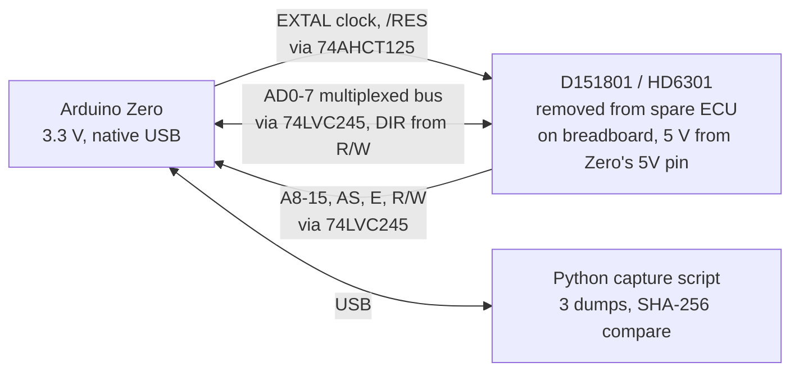
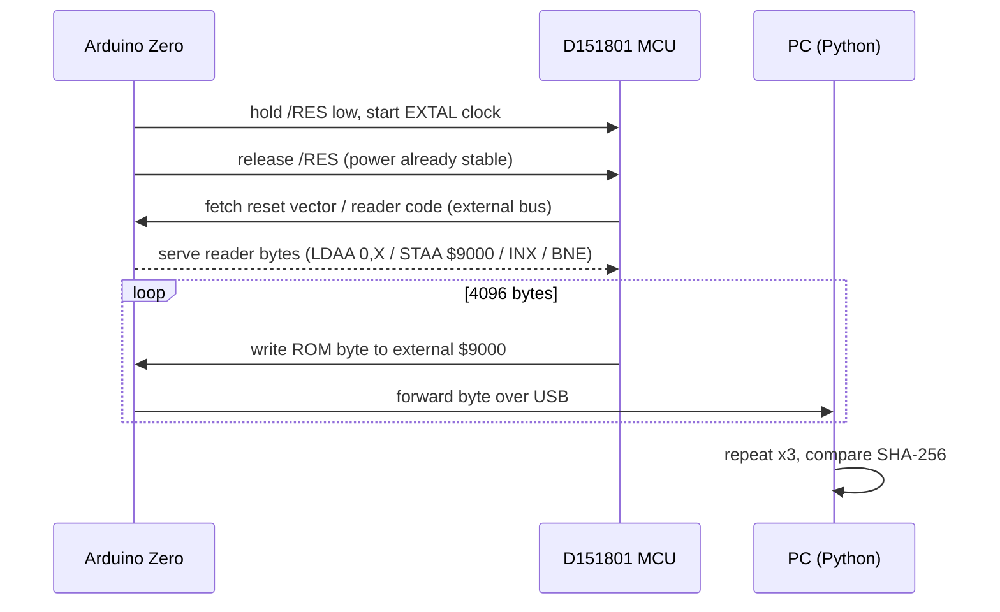
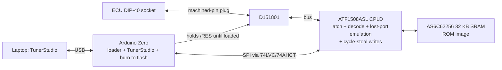

# Reverse-engineering playbook: mk1 MR2 (AW11) ECU

This playbook is for any agent, or person, working in this repo. Standing rules are summarised in [`../CLAUDE.md`](../CLAUDE.md). Current progress is tracked in [`STATUS.md`](STATUS.md).

## Context

The project owner has a UK mk1b MR2 (ECU **89661-17140**). They know aftermarket tuning well but are new to reverse engineering, so **agents lead**. They have a spare ECU, an **Arduino Zero**, a logic analyser, a scope and soldering skills. They are also interested in anything that overlaps with JDM and other-market ECUs.

### Goals, in order

0. **Verify Jeremy Ross's "Lifting the Lid" findings** ([claim register](ross/claims.md)). No cold-start work starts until this is done.
1. Understand **warm-up and cold start** well enough to predict what happens when the **IACV** and **cold start injector** are removed.
2. Find and understand the **"secret" fuel and ignition maps**.
3. **Run a modified ROM** on the ECU, tuned from **TunerStudio** (preferred), or another modern, well-established tool.

### What the repo has

- **There is no MR2 dump yet.** The closest relative is the AE86 **Bluetop**, [`TOYOTA Bluetop PCM/cap.bin`](../TOYOTA%20Bluetop%20PCM/cap.bin).
  - Chip: D151801-0642, a Denso HD6301-family part. The ROM is 4 KB, mapped at `$F000–$FFFF`. It has TVIS and is from the same era as the MR2.
  - [`cap.asm`](../TOYOTA%20Bluetop%20PCM/cap.asm) / `cap.idb` hold a partly annotated disassembly. Names include `ADC_ThW`, `TVIScounter`, `IdleRPMs`, `IdleADVcomp` and `lookup3dTable`. The 3D ignition table is near `$FF40`, and the THW tables are at `$FEAF`, `$FEBD` and `$FED2`.
  - **The Bluetop uses a different strategy from the UK MR2.** The Bluetop is L-type (airflow pulse `SE056`) and has an O2 sensor (`ADC_Oxy`). The UK MR2 is D-type (MAP sensor) with no O2 sensor.
- [`cap2-151801-2860.bin`](../TOYOTA%20Bluetop%20PCM/cap2-151801-2860.bin) is a second D151801 program. It differs from `cap.bin` in 3611 bytes.
- **Redtop** (`D151802-0442`) and **Blacktop** (`D151804-8081`) run on the **Toshiba 8X**, a later and different CPU. They are conceptual references only, unless the MR2 chip turns out to be a T8X (see P3).
- [`Lifting The Lid on the mk1 MR2 ECU (Jeremy Ross).pdf`](../Lifting%20The%20Lid%20on%20the%20mk1%20MR2%20ECU%20%28Jeremy%20Ross%29.pdf) has 18 pages and 16 embedded figures, including the 17×8 ignition table. It covers the UK **17030** in depth and the **17140** for the mixture screw.
- Existing tooling and know-how:
  - D151801 reader (`reader6301v1.asm`, `bluetopreader.sch`)
  - BISON loader/debugger
  - `dasm` (6303)
  - `sfrdefs.h`
  - patch notes in [`replacement.txt`](../TOYOTA%20Bluetop%20PCM/replacement.txt): watchdog `$FC75`, ROM checksum `$FE59`, rev limiter `$F434`
- **The D151801 needs its power rails up before /RES is released.**
- Upstream knowledge is digested in [`upstream_issues.md`](upstream_issues.md). The key points:
  - The chips are mask ROM.
  - Running custom code needs a daughtercard with a CPLD that emulates the ports lost in expanded mode.
  - **The part-number prefix does not identify the CPU.**
  - How to convert spark-table values into degrees is disputed.

### Framing hypothesis for goal 1 (supported by the 1984 wiring diagram; one caveat from the 1988 manual)

On the AW11/4A-GE, the cold start injector is driven by the **start injector time switch and STA**, not by the ECU. The IACV is a coolant-heated **wax auxiliary air valve**, not an ECU-driven ISC valve. Ross's claim R-I08 supports this, and so does the **1984 factory wiring diagram** ([`hardware/ewd_aw11_1984.md`](hardware/ewd_aw11_1984.md)):
- The CSI is wired starter → CSI → time switch, with no ECU connection.
- The electrical idle-up VSV is switched by the electrical loads, and the ECU only senses it on I/UP.
- The `STH` board pin is S/TH, the T-VIS output, not a cold-start terminal.

**Caveat (1988 repair manual, [`hardware/repair_manual_aw11_1988.md`](hardware/repair_manual_aw11_1988.md)):** the 1988 US 4A-GE ECU *does* drive the idle-up VSV, from a `V-ISC` output, during cranking and for 10 s after start. The 17140 board has a `VISC` pad. If the UK 17140 drives it, the ECU adds its own start-up air through the idle-up VSV, separately from the IACV. The CSI is not ECU-driven in either manual.

If the hypothesis holds, the ECU never "knows" the IACV and CSI are gone. It is **LIKELY** for the 17140 until continuity Test B in [`hardware/aw11_ecu.md`](hardware/aw11_ecu.md) and the P4 port audit show whether `VISC` is driven (STATUS Q2). The real question is how its own strategies react to less idle air and less cranking fuel: idle-stability spark advance, THW enrichment and advance, after-start enrichment and cranking fuel.

---

## 1. Ground rules

- **FUNDAMENTAL: Arduino-first, minimal purchases.** Every hardware task is first designed around the owner's **Arduino Zero**:
  - SAMD21, 48 MHz, 3.3 V logic, native USB
  - 12-bit ADC and 10-bit DAC
  - TCC/TC timers with input capture

  Anything new is bought only when the Zero physically cannot do the job, and the reason is written down in the relevant doc and in [`../hardware/BOM.md`](../hardware/BOM.md). There are two accepted exceptions so far:
  1. **Level shifters**, because the Zero is not 5 V tolerant.
  2. **Bus-speed memory and glue logic** for the in-car board, because firmware cannot answer a 1 MHz bus within a few hundred ns.

  Any new exception goes in [`STATUS.md`](STATUS.md) for the owner to approve.
- **FUNDAMENTAL: Modernise.** Use current software, reverse-engineering techniques and hardware (§2). Legacy tools such as IDA 4.9, TASM, dasm, ExpressPCB, WinCUPL, RS232 and RealTerm are used only to cross-check results or read old files. Legacy files (`.idb`, ExpressPCB, `.xls`) are converted to open formats (text, KiCad, CSV) when touched. The originals are never deleted.
- **Source-of-truth order:**
  1. the ROM bytes
  2. bench or car measurements
  3. factory service documentation (wiring diagram, repair manual); see [`hardware/ewd_aw11_1984.md`](hardware/ewd_aw11_1984.md) and [`hardware/repair_manual_aw11_1988.md`](hardware/repair_manual_aw11_1988.md)
  4. the Ross PDF (17030/17140)
  5. existing `cap.asm` annotations
  6. upstream issues and forums

  Log conflicts in `STATUS.md`. Never resolve them silently.
- **Evidence tags on every claim.** Use one of `[ROM:$F863]`, `[PDF:p12]`, `[EMU:test_id]` or `[BENCH:capture.sr]`, plus a confidence of **CONFIRMED**, **LIKELY** or **GUESS**.
- **Documentation format:**
  - Write in Markdown, with **Mermaid** for control flow, signal chains, state machines and phase flow.
  - Put tables in Markdown or CSV. Plots are PNGs produced by scripts in the repo.
  - Every map write-up gives the axes in physical units (°C, rpm, kPa, µs, °BTDC) and the raw-to-physical scaling with its derivation. It also has an **"In tuning terms"** paragraph for the owner.
- **Single source for map definitions.** Each ROM gets one file, `analysis/defs/<rom>.yaml`, listing its maps, scalars and RAM variables with scaling. CSV, Markdown, TunerPro XDF and TunerStudio INI are all generated from it. Nothing is maintained by hand in two places.
- **Never modify the original dumps.** Derived work goes in `analysis/`, `docs/` and `hardware/`.
- **Safety:**
  - Every hardware step needs the owner's confirmation and comes with a safety checklist (power sequencing, ESD, level shifting).
  - Keep a known-good ECU aside at all times.
  - Never run the engine on untested code.
- **Community:** agents may draft questions for the upstream repo (`sparkiedk/Toyota-PCM-hacking`, whose maintainer was active in Dec 2025), but they post only with the owner's approval.

## 2. Modern toolchain

| Purpose | Use | Legacy (cross-check only) |
|---|---|---|
| Disassembly | **`analysis/pcmre`** (Python): a verified HD6301 decoder, the IDA listing importer, generated `asl` source that round-trips byte-identical, and a **cross-reference / call-graph generator** (Markdown + Mermaid). This is text-based, scriptable, checked in CI and diffable, which suits agent work. **Ghidra is optional**: an interactive browser for the owner to explore ROMs. It is never a gate or a dependency, because there is no HD6301 module and the decompiler adds little on hand-written 8-bit code with mid-instruction tricks | IDA 4.9 `.idb` |
| Assembler | **Macroassembler AS (`asl`)**, maintained, with 6301/6303 support | dasm, TASM |
| Emulation | A Python HD6301 core (`analysis/emu/`) with timer, OC/IC, SCI and ADC models, tested against `dasm/test/suite6303` and MAME's hd6301 core as reference. It runs single routines **and** the whole ROM with simulated NE/G and sensor inputs | — (Ross's 8086 port, conceptually) |
| Scripting & tests | Python 3.12+, `uv`, `pytest`, `ruff`. GitHub Actions runs the round-trip and emulator tests | `.bat` files |
| Signal capture | **sigrok / PulseView** with custom decoders (NE/G, IGT/IGF, injector, Denso ADC serial). Captures are committed as `.sr` files | — |
| ROM reader | **The Arduino Zero is the reader** (§6a) | EPROM reader board, RS232, RealTerm |
| Bench stimulus, timing meter, logger | **Arduino Zero** (§6 role matrix) | signal generator, drill + distributor (kept as a physical cross-check) |
| PCB / CPLD | **KiCad** (current) with JLCPCB, PCBWay or Aisler. **ATF1508ASL** (still made, 5 V native), using an open flow where possible (prjbureau-style tools), otherwise WinCUPL in a VM. **Programmed by the Zero** as a JTAG/SVF player | ExpressPCB, Win XP + parallel-port JTAG |
| Tuning | **TunerStudio** for live tuning through the daughterboard's Zero co-processor (P7). **TunerPro RT (XDF)** for editing raw ROM images until then, because TunerStudio cannot open a raw ROM file | — |

## 3. Agent roles

| Role | Owns |
|---|---|
| **Lead** | `STATUS.md`, phase gates, task hand-out, conflict log |
| **Toolsmith** | `pcmre` disassembly and cross-reference tooling, emulator, generators (`defs/*.yaml` → XDF/INI/CSV/MD), CI |
| **Code analyst** | Control flow, RAM map, routine naming |
| **Calibration analyst** | Map discovery, axes and scaling, physical-unit tables and plots |
| **Hardware guide** | Beginner build guides (Markdown + Mermaid + photos), Zero firmware, bench procedures |
| **Verifier** | Independently re-derives claims and can lower their confidence. **Every gate needs Verifier sign-off** |

One session may play several roles, but the Verifier must not sign off its own work in the same session.

## 4. Phases and gates


### P0: Foundations

- Set up the Python project (`uv`), CI and `asl`, and write the `cap.asm` label/comment importer. **Done.**
- Build a cross-reference and call-graph generator. For every RAM variable and routine it lists its readers, writers and callers, and it produces Mermaid call graphs, written to `analysis/bluetop/xref.md`.
- **Gate:**
  - `analysis/bluetop/cap.s`, generated by `pcmre`, reassembles with `asl` **byte-identical** to `cap.bin`, and a cross-check with `dasm` agrees. **Passed 2026-10-09.**
  - The emulator passes the `suite6303` instruction tests.

### P1: Ross claim register (needs only the PDF)

- Maintain [`ross/claims.md`](ross/claims.md), where every claim has an ID, page, ECU, tier and status. The skeleton is already written.
- Extract the 16 figures with `pdfimages` into `docs/ross/figures/`. Digitise the graphs to CSV, and transcribe the 17×8 ignition table, the MX2 curve and the dead-time curve. These are the reference numbers the ROM is compared against.
- Redraw Ross's models in Mermaid (`docs/ross/diagrams.md`):
  - **Fuel chain:** density → speed → hard-driving → THA → secret → global correction → mixture screw → voltage dead time.
  - **Ignition chain:** 3D map or idle map → THW advance → over-temperature map → idle stability → TVIS step.
  - **Injection-mode state machine:** simultaneous injection, every other revolution above 6000 rpm, IGF fuel cut.
- Tiers:
  - **A:** strategy or structure, likely shared with the Bluetop.
  - **B:** a value specific to 17030/17140.
  - **C:** needs a bench measurement.
  - **X:** opinion.

### P2: Bluetop analysis and Tier-A verification

- Map the vectors, main loop and scheduler (`procJmpTable`), the ADC sequencer (`$FA9B`), the RAM map (`$40–$FF`), the table formats (2D and 3D interpolation helpers around `$FF35`), and the full fuel and ignition chains.
- Write `analysis/defs/bluetop.yaml`, then generate CSV, Markdown and XDF from it.
- Give every Tier-A claim a status: CONFIRMED, CONTRADICTED or NOT-APPLICABLE (because the Bluetop is L-type, not D-type). Back each one with ROM and emulator evidence. Diff against `cap2`.
- Optionally cross-check selected routines on the **real CPU** using the Zero slow-clock harness (§6).
- **Gate:** every Tier-A claim has a status, and the Verifier has spot-checked them in the emulator.

### P3: Dump the MR2 89661-17140 ROM (hardware; can start right after P0)

1. Open the spare ECU and photograph both sides. Identify the CPU **by package and pinout**, not by part number. Record everything in `docs/hardware/aw11_ecu.md`.
   - **40-pin, HD6301-type** (expected): use the **§6a Arduino Zero breadboard reader**.
   - **64-pin SDIP:** it is a **Toshiba 8X**. Use the same Zero approach with T8X bus timing, and `pcmre` needs a T8X decoder (the instruction set is in `Toshiba 8x info/`).
2. Write a beginner build guide (`docs/hardware/zero_reader_guide.md`). It covers wiring with Mermaid and photos, the Zero firmware (Arduino-CLI or PlatformIO, in `hardware/zero-reader/`), the Python capture script, and the relevant parts of the upstream bring-up checklist.
3. Before dumping, the Zero firmware runs three self-tests, following the lessons from upstream #4:
   - a walking-ones test on every address and data line;
   - a known-pattern test program;
   - an infinite-loop test from external memory.

   **If the bus shows endless or unexpected activity, the MCU is running its own internal code: fix the mode pins first.** Confirm the internal ROM size (4 KB at `$F000` is assumed).
4. Dump at least 3 times and check that the SHA-256 hashes are identical. Store the image as `AW11 MR2 PCM/89661-17140.bin`.
5. Start a variant matrix, `docs/variants.md`, covering 17030, 17070, JDM and US ECUs, and look for more dumps from the community.

### P4: MR2 analysis and Tier-B verification → "Ross verified" gate

- Run the P0 and P2 steps on the MR2 ROM. Reuse Bluetop labels wherever routines match. A `pcmre` signature matcher compares instruction byte patterns with operands masked out, since addresses shift between ROMs.
- Check every Tier-B claim, including:
  - the 11-site density maps split at 3200 rpm
  - the −10 %/+8 % speed correction
  - the hard-driving sites
  - the **17×8 ignition sites from 800 to 7200 rpm in 400 rpm steps**
  - the idle map sites at 1200/1600/2000 rpm
  - TVIS opening at **4650** and closing at **4250** rpm
  - the 6300 rpm global step
  - the mixture screw: **3600 rpm** cut-off, **MX1 × MX2 / 32000**, and the end-stop fallback
  - injection doubling above 6000 rpm
  - the IGF fuel cut
- **VISC/FPU port audit:** find every write to the port bits behind `VISC` and `FPU` (located by continuity Test B). Record the conditions, for example STA plus a 10 s timer as in the 1988 manual. Compare the decel fuel-cut and return rpm with the 1988 manual (1600/1200 rpm, A/C off).
- Check Ross's 17030-only numbers against the 17140 and mark them `DIFFERS-BY-ECU` where they differ. A 17030 dump would close this gap.
- Tier-C claims are settled by P8 measurements.
- **Deliverable:** `docs/ross/verification_report.md`. It gives a status and evidence for every claim, plus Mermaid diagrams of the **verified** chains, with every difference from Ross highlighted.
- **Gate:** no Tier A or B claim is still PENDING, and the Verifier has signed off. **Cold-start work starts only after this gate.**

### P5: Warm-up and cold start (goal 1)

- Analyse:
  - cranking fuel (STA)
  - after-start enrichment and its decay
  - THW enrichment and advance
  - idle-stability advance (attack, decay, maximum)
  - fast idle
  - decel fuel cut versus temperature
  - the load compensation the ECU applies when the **I/UP (idle-up) input** is active, if the 17140 has one
  - the **`VISC` start-up idle-up output**, if the P4 port audit finds it driven (cranking + 10 s on the 1988 US car)
  - confirm that the ECU drives **no** cold-start-injector output, and settle whether it drives the idle-up VSV (port audit compared against [`hardware/ewd_aw11_1984.md`](hardware/ewd_aw11_1984.md) and [`hardware/repair_manual_aw11_1988.md`](hardware/repair_manual_aw11_1988.md)). The ECU-side cold-start levers are STA, THW-based enrichment and advance, after-start enrichment, idle-stability advance, and either I/UP or `VISC`
- Run whole-ROM emulator sweeps for starts at −5, 10 and 20 °C, each with normal and reduced idle air.
- **Deliverable:** `docs/warmup_cold_start.md`. It contains:
  - a Mermaid state diagram of the cold-start sequence
  - the predicted effects of removing the IACV and the CSI, with symptoms and confidence levels
  - mitigations, including what a custom ROM could change
- Validate against a real cold start logged with the **Zero in-car logger** (P8).

### P6: Secret maps (goal 2)

- Find the port-bit or flag branch that switches the fuel rpm map and the 3D ignition map. Extract both sets, plot the differences, and find the physical strap on the PCB.
- **Deliverable:** `docs/secret_maps.md`.

### P7: Modified ROM and TunerStudio (goal 3)

1. Do a **port-usage audit** of the MR2 ROM: which port bits are read and written, and what each one means.
2. Design the §6b daughterboard in KiCad: expanded mode, emulation of the lost ports and strobes in the CPLD, SRAM, and power-down behaviour.
3. Run an infinite-loop test from external memory, and probe the bus to confirm fetches and check for contention.
4. Run the byte-identical stock image and compare it on the bench against the stock ECU.
5. Make calibration-only edits, handling the ROM checksum (`$FE59` on the Bluetop; find the MR2 equivalent) and the watchdog.
6. Integrate TunerStudio:
   - The Zero co-processor exposes the calibration area in SRAM and live variables to TunerStudio over native USB. It uses the TunerStudio serial protocol with an INI generated from `defs/mr2_17140.yaml`.
   - Live variables come from a small UART stream added to the modified ROM.
   - Map edits are written into SRAM by cycle stealing. A dual-port SRAM is the fallback.
   - "Burn" saves to the Zero's flash.
   - If TunerStudio fails, fall back to TunerPro RT (live via an Ostrich-compatible protocol, then offline XDF).
7. Never run the engine until the bench outputs match the stock ECU.

### P8: Bench rig and validation (in parallel from P3)

- The Zero acts as the **bench stimulus** (NE/G, PIM/VTA, THW/THA) and is scripted from Python to sweep rpm and temperature. Firmware lives in `hardware/bench-sim/`.
- The Zero acts as a **timing meter**: it measures IGT edges against NE/G edges to calibrate spark degrees (settling upstream issue #6 and claim R-I06) and confirms that the µs value equals the injector pulse (R-F23). The logic analyser is an independent cross-check.
- The Zero acts as an **in-car cold-start logger** on the stock ECU, recording a baseline for P5.
- A single Zero is used for one role at a time. That is fine, because the phases are sequential.

## 5. Repo layout (built up over time)

```
CLAUDE.md
docs/{RE_PLAN,STATUS,upstream_issues,variants,glossary}.md
docs/ross/{claims.md,verification_report.md,diagrams.md,figures/}
docs/bluetop/  docs/mr2/  docs/hardware/  docs/warmup_cold_start.md  docs/secret_maps.md
analysis/{pcmre/,emu/,tools/,defs/*.yaml,generated/{xdf,ini,csv}/,captures/*.sr}
hardware/{BOM.md,zero-reader/,bench-sim/,daughtercard/}
```

## 6. Hardware: Arduino-first, minimal purchases

### Arduino Zero role matrix

There is one board, with a swappable firmware project for each role under `hardware/zero-*/` (or `hardware/bench-sim/`).

| Phase | Zero role | Replaces | Extra parts |
|---|---|---|---|
| P3 | **ROM reader**: clock + external memory + bus-snoop dump | EPROM, latch, crystal, EPROM programmer, USB-UART | level shifters |
| P2/P4 | **Real-CPU test harness**: runs ROM routines on the real MCU at slow clock to cross-check the emulator | — | none |
| P4/P8 | **Sensor characterisation**: 12-bit ADC plus known resistors. Measures the THW/THA NTC curves and PIM/VTA transfer, giving ADC → °C/kPa scaling | hand-made multimeter tables | divider resistors |
| P8 | **Bench stimulus**: NE/G from TCC timers, PIM/VTA from DAC/PWM, THW/THA from digital pots | signal generator | 2× MCP41010 |
| P8 | **Spark/injector timing meter**: TC input capture at 48 MHz. Reports °BTDC and µs to Python | logic-analyser post-processing (LA kept as a cross-check) | dividers / 74LVC245 |
| P5 | **In-car cold-start logger**: passively records injector pulse width, IGT advance, TVIS and THW/PIM/VTA from the stock ECU, as CSV over USB | laptop + LA in the car | dividers, protection resistors, TVS |
| P2/P7 | **Slow-clock hardware-in-the-loop** (if the MCU tolerates a slow or stepped clock): the Zero serves memory, including a **modified** image, and generates NE/G in step with the clock, so the real CPU runs code against simulated engine conditions before any daughterboard exists | early daughterboard prototypes | none |
| P7 | **CPLD programmer** (JTAG/SVF player) | ATDH1150USB (~£80+) | none |
| P7 | **Daughterboard co-processor**: image loader, TunerStudio link, burn to flash, live data | Moates Ostrich, separate datalogger | — |

**Always level-shift.** The Zero's I/O is **3.3 V and not 5 V tolerant**. Use 74LVC245 (5 → 3.3 V inputs, and bidirectional) and 74AHCT125 (3.3 → 5 V outputs). Before designing the NE/G stimulus, check against the ECU input circuit whether NE/G need a VR-like bipolar waveform (op-amp stage) or accept a 0–5 V square wave.

### 6a. Arduino Zero ROM reader (P3): buy now, about £10–15

The Zero **is** the MCU's external memory and clock.





- The Zero latches the low address from AD0–7 on AS itself, so no '373 latch is needed. It serves a tiny reader program and records each internal-ROM byte when the MCU writes it to an external address (**bus-snoop dump**). There is no UART and no odd baud rate. [`reader6301v1.asm`](../TOYOTA%20Bluetop%20PCM/reader6301v1.asm) is the reference, and its UART method is the fallback.
- **Two feasibility checks happen before anything is bought.** Use the [HD6301 handbook](../HD6301_HD6303_Series_Handbook_1989.pdf) and `bluetopreader.sch`.
  1. Find the mode-pin strapping that gives external reset/vector fetch while the internal ROM at `$F000` stays readable. The existing reader proves such a configuration exists.
  2. Find the MCU's minimum clock frequency.
     - If the MCU is static, the Zero single-steps the clock.
     - If not, the Zero runs a slow continuous clock (for example EXTAL 1 MHz, giving 4 µs bus cycles, about 190 Zero CPU cycles each) and serves it with a tight loop on the SAMD21 single-cycle IOBUS port.
- About 22 GPIOs are needed. If pins run short, drop high address lines the reader does not need.
- If the CPU is a Toshiba 8X, the same approach applies with T8X bus timing ([`Toshiba 8x info/bus_timing.jpg`](../Toshiba%208x%20info/bus_timing.jpg)). The only extra part is an SDIP-64 socket.
- The same breadboard also runs bench experiments on the real CPU (BISON-style RAM peeking, routine tests against the emulator) without buying anything else.

The parts list is in [`../hardware/BOM.md`](../hardware/BOM.md).

### 6b. In-car modified-ROM daughterboard (P7): deferred, buy nothing yet

At real engine speed the MCU expects memory to answer within a few hundred ns. No Arduino can do that from firmware, so the car board needs real bus-speed memory and glue logic. The Zero still does everything else.



- At power-up the Zero holds /RES, loads the image into SRAM through the CPLD, then releases reset. No EPROM and no programmer are needed.
- For **live tuning**, the HD6301 uses the bus only while E is high. In the other half of each cycle the CPLD lets the Zero write map bytes. A dual-port SRAM is the fallback.
- **The Zero programs the CPLD** (JTAG/SVF). The ATDH1150USB is an exception that needs owner approval.
- **Nothing in 6b is ordered** until three things are done: the CPU is identified (P3), the port audit is complete (P7), and a design review has frozen the pin budget and memory map. After that, `BOM.md` gets live UK stock and prices.

## 7. Glossary seed

The full glossary lives in `docs/glossary.md`, written in tuner terms. Seed terms:

- **Signals and sensors:** NE/G, IGT/IGF, THW/THA, PIM, VTA/IDL, STA, TVIS.
- **ECU concepts:** D-type/L-type EFI, mask ROM, expanded mode, interrupt vector, RAM map, 2D/3D table, interpolation, checksum.
- **Hardware and tooling:** disassembler, cross-reference, CPLD, level shifting (3.3 V ↔ 5 V), dual-port SRAM, cycle stealing.
