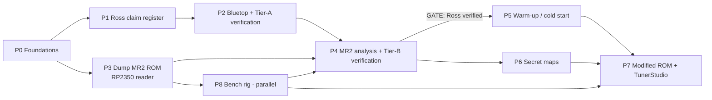
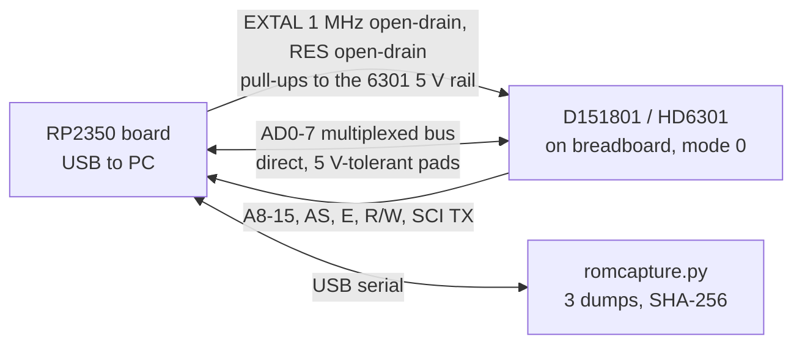
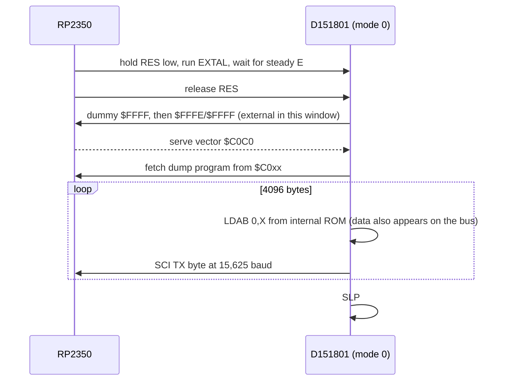
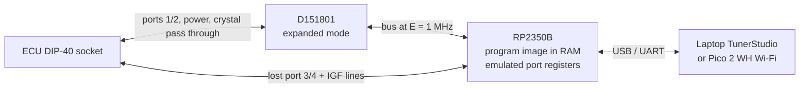

# Reverse-engineering playbook: mk1 MR2 (AW11) ECU

This playbook is for any agent, or person, working in this repo. Standing rules are summarised in [`../CLAUDE.md`](../CLAUDE.md). Current progress is tracked in [`STATUS.md`](STATUS.md).

## Context

The project owner has a UK mk1b MR2 (ECU **89661-17140**). They know aftermarket tuning well but are new to reverse engineering, so **agents lead**. They have a spare ECU, a multimeter, a breadboard and jumpers, and soldering skills. There is no scope or logic analyser; the hardware plan does not need one. They are also interested in anything that overlaps with JDM and other-market ECUs.

### Goals, in order

0. **Verify Jeremy Ross's "Lifting the Lid" findings** ([claim register](ross/claims.md)). No cold-start work starts until this is done.
1. Understand **warm-up and cold start** well enough to predict what happens when the **IACV** and **cold start injector** are removed.
2. Find and understand the **"secret" fuel and ignition maps**.
3. **Run a modified ROM** on the ECU, tuned from **TunerStudio** (preferred), or another modern, well-established tool.

### What the repo has

- **There is no MR2 dump yet.** The closest relative is the AE86 **Bluetop**, [`TOYOTA Bluetop PCM/cap.bin`](../TOYOTA%20Bluetop%20PCM/cap.bin).
  - Chip: D151801-0642, a Denso HD6301-family part. The ROM is 4 KB, mapped at `$F000–$FFFF`. It has TVIS and is from the same era as the MR2.
  - [`cap.asm`](../TOYOTA%20Bluetop%20PCM/cap.asm) / `cap.idb` hold a partly annotated disassembly. Names include `ADC_ThW`, `TVIScounter`, `IdleRPMs`, `IdleADVcomp` and `lookup3dTable`. The 3D ignition table is near `$FF40`, and the THW tables are at `$FEAF`, `$FEBD` and `$FED2`.
  - **The Bluetop uses a different strategy from the UK MR2.** The Bluetop is L-type (airflow pulse `SE056`) and has an O2 sensor (`ADC_Oxy`). The UK MR2 is D-type (MAP sensor) with no O2 sensor.
- [`cap2-151801-2860.bin`](../TOYOTA%20Bluetop%20PCM/cap2-151801-2860.bin) is a second D151801 program. It differs from `cap.bin` in 3611 bytes.
- **Redtop** (`D151802-0442`) and **Blacktop** (`D151804-8081`) run on the **Toshiba 8X**, a later and different CPU. They are conceptual references only, unless the MR2 chip turns out to be a T8X (see P3).
- [`Lifting The Lid on the mk1 MR2 ECU (Jeremy Ross).pdf`](../Lifting%20The%20Lid%20on%20the%20mk1%20MR2%20ECU%20%28Jeremy%20Ross%29.pdf) has 18 pages and 16 embedded figures, including the 17×8 ignition table. It covers the UK **17030** in depth and the **17140** for the mixture screw.
- Existing tooling and know-how:
  - D151801 reader (`reader6301v1.asm`, `bluetopreader.sch`)
  - BISON loader/debugger (Toshiba 8X code, not 6301)
  - `dasm` (6303)
  - `sfrdefs.h`
  - patch notes in [`replacement.txt`](../TOYOTA%20Bluetop%20PCM/replacement.txt): watchdog `$FC75`, ROM checksum `$FE59`, rev limiter `$F434`
- **The D151801 needs its power rails up before /RES is released.**
- Upstream knowledge is digested in [`upstream_issues.md`](upstream_issues.md). The key points:
  - The chips are mask ROM.
  - Running custom code needs a daughtercard with a CPLD that emulates the ports lost in expanded mode.
  - **The part-number prefix does not identify the CPU.**
  - How to convert spark-table values into degrees is disputed.

### Framing hypothesis for goal 1 (supported by the 1984 wiring diagram; one caveat from the 1988 manual)

On the AW11/4A-GE, the cold start injector is driven by the **start injector time switch and STA**, not by the ECU. The IACV is a coolant-heated **wax auxiliary air valve**, not an ECU-driven ISC valve. Ross's claim R-I08 supports this, and so does the **1984 factory wiring diagram** ([`hardware/ewd_aw11_1984.md`](hardware/ewd_aw11_1984.md)):
- The CSI is wired starter → CSI → time switch, with no ECU connection.
- The electrical idle-up VSV is switched by the electrical loads, and the ECU only senses it on I/UP.
- The `STH` board pin is S/TH, the T-VIS output, not a cold-start terminal.

**Caveat (1988 repair manual, [`hardware/repair_manual_aw11_1988.md`](hardware/repair_manual_aw11_1988.md)):** the 1988 US 4A-GE ECU *does* drive the idle-up VSV, from a `V-ISC` output, during cranking and for 10 s after start. The 17140 board has a `VISC` pad. If the UK 17140 drives it, the ECU adds its own start-up air through the idle-up VSV, separately from the IACV. The CSI is not ECU-driven in either manual.

If the hypothesis holds, the ECU never "knows" the IACV and CSI are gone. It is **LIKELY** for the 17140 until continuity Test B in [`hardware/aw11_ecu.md`](hardware/aw11_ecu.md) and the P4 port audit show whether `VISC` is driven (STATUS Q2). The real question is how its own strategies react to less idle air and less cranking fuel: idle-stability spark advance, THW enrichment and advance, after-start enrichment and cranking fuel.

---

## 1. Ground rules

- **FUNDAMENTAL: RP2350-first, minimal purchases.** Every hardware task is designed around two RP2350 boards (§6):
  - **Olimex RP2350-PICO2-BB48R** (RP2350B): the wired, real-time board. All 48 GPIOs on breadboard-friendly headers; GPIO0–39 are 5 V tolerant and GPIO40–47 are 8 ADC inputs; PIO state machines for exact bus and edge timing; PSRAM and microSD.
  - **Raspberry Pi Pico 2 WH** (RP2350A + Wi-Fi/BLE): the wireless link (phone dashboard, wireless tuning) and a spare board that can run the ROM reader on its own.

  Anything else is bought only when these cannot do the job, and the reason is written in [`../hardware/BOM.md`](../hardware/BOM.md). Interfacing rules:
  1. **5 V logic connects directly** to GPIO0–39 (RP2350 5 V-tolerant pads), **but only while the board is powered**: the 5 V side is always powered up last and down first.
  2. Inputs that need a true 5 V high (the 6301's RES, STBY, EXTAL) are driven **open-drain with a pull-up to 5 V**.
  3. 12 V, injector-flyback and VR signals need **dividers or clamps**; the ADC pins (GPIO40–47) are not 5 V tolerant and always use dividers.
  4. Internal pull-downs are never enabled (RP2350 erratum E9).
  5. The in-car modified-ROM board (P7) is a **factory-assembled** PCB.

  Any new exception goes in [`STATUS.md`](STATUS.md) for the owner to approve.
- **FUNDAMENTAL: Modernise.** Use current software, reverse-engineering techniques and hardware (§2). Legacy tools such as IDA 4.9, TASM, dasm, ExpressPCB, WinCUPL, RS232 and RealTerm are used only to cross-check results or read old files. Legacy files (`.idb`, ExpressPCB, `.xls`) are converted to open formats (text, KiCad, CSV) when touched. The originals are never deleted.
- **Source-of-truth order:**
  1. the ROM bytes
  2. bench or car measurements
  3. factory service documentation (wiring diagram, repair manual); see [`hardware/ewd_aw11_1984.md`](hardware/ewd_aw11_1984.md) and [`hardware/repair_manual_aw11_1988.md`](hardware/repair_manual_aw11_1988.md)
  4. the Ross PDF (17030/17140)
  5. existing `cap.asm` annotations
  6. upstream issues and forums

  Log conflicts in `STATUS.md`. Never resolve them silently.
- **Evidence tags on every claim.** Use one of `[ROM:$F863]`, `[PDF:p12]`, `[EMU:test_id]` or `[BENCH:capture.sr]`, plus a confidence of **CONFIRMED**, **LIKELY** or **GUESS**.
- **Documentation format:**
  - Write in Markdown, with **Mermaid** for control flow, signal chains, state machines and phase flow.
  - Put tables in Markdown or CSV. Plots are PNGs produced by scripts in the repo.
  - Every map write-up gives the axes in physical units (°C, rpm, kPa, µs, °BTDC) and the raw-to-physical scaling with its derivation. It also has an **"In tuning terms"** paragraph for the owner.
- **Single source for map definitions.** Each ROM gets one file, `analysis/defs/<rom>.yaml`, listing its maps, scalars and RAM variables with scaling. CSV, Markdown, TunerPro XDF and TunerStudio INI are all generated from it. Nothing is maintained by hand in two places.
- **Never modify the original dumps.** Derived work goes in `analysis/`, `docs/` and `hardware/`.
- **Safety:**
  - Every hardware step needs the owner's confirmation and comes with a safety checklist (power sequencing, ESD, signal levels).
  - Keep a known-good ECU aside at all times.
  - Never run the engine on untested code.
- **Community:** agents may draft questions for the upstream repo (`sparkiedk/Toyota-PCM-hacking`, whose maintainer was active in Dec 2025), but they post only with the owner's approval.

## 2. Modern toolchain

| Purpose | Use | Legacy (cross-check only) |
|---|---|---|
| Disassembly | **`analysis/pcmre`** (Python): a verified HD6301 decoder, the IDA listing importer, generated `asl` source that round-trips byte-identical, and a **cross-reference / call-graph generator** (Markdown + Mermaid). This is text-based, scriptable, checked in CI and diffable, which suits agent work. **Ghidra is optional**: an interactive browser for the owner to explore ROMs. It is never a gate or a dependency, because there is no HD6301 module and the decompiler adds little on hand-written 8-bit code with mid-instruction tricks | IDA 4.9 `.idb` |
| Assembler | **Macroassembler AS (`asl`)**, maintained, with 6301/6303 support | dasm, TASM |
| Emulation | A Python HD6301 core (`analysis/emu/`) with timer, OC/IC, SCI and ADC models, tested against `dasm/test/suite6303` and MAME's hd6301 core as reference. It runs single routines **and** the whole ROM with simulated NE/G and sensor inputs | — (Ross's 8086 port, conceptually) |
| Scripting & tests | Python 3.12+, `uv`, `pytest`, `ruff`. GitHub Actions runs the round-trip and emulator tests | `.bat` files |
| Signal capture | **sigrok / PulseView** with custom decoders (NE/G, IGT/IGF, injector, Denso ADC serial). Captures are committed as `.sr` files | — |
| ROM reader | **RP2350 reader** (§6a): C + pico-sdk + PIO firmware, built in CI to a UF2 | EPROM reader board, RS232, RealTerm |
| Bench stimulus, timing meter, logger | **RP2350 boards** (§6 role matrix) | signal generator, drill + distributor (kept as a physical cross-check) |
| PCB / CPLD | **KiCad** (current) with JLCPCB, PCBWay or Aisler. Boards are ordered **factory-assembled (PCBA)**. The P7 board is RP2350-based first; an **ATF1508ASL** CPLD + SRAM design is the fallback | ExpressPCB, Win XP + parallel-port JTAG |
| Tuning | **TunerStudio** for live tuning through the P7 board's RP2350, over USB or Wi-Fi. **TunerPro RT (XDF)** for editing raw ROM images until then, because TunerStudio cannot open a raw ROM file | — |

## 3. Agent roles

| Role | Owns |
|---|---|
| **Lead** | `STATUS.md`, phase gates, task hand-out, conflict log |
| **Toolsmith** | `pcmre` disassembly and cross-reference tooling, emulator, generators (`defs/*.yaml` → XDF/INI/CSV/MD), CI |
| **Code analyst** | Control flow, RAM map, routine naming |
| **Calibration analyst** | Map discovery, axes and scaling, physical-unit tables and plots |
| **Hardware guide** | Beginner build guides (Markdown + Mermaid + photos), RP2350 firmware, bench procedures |
| **Verifier** | Independently re-derives claims and can lower their confidence. **Every gate needs Verifier sign-off** |

One session may play several roles, but the Verifier must not sign off its own work in the same session.

## 4. Phases and gates



### P0: Foundations

- Set up the Python project (`uv`), CI and `asl`, and write the `cap.asm` label/comment importer. **Done.**
- Build a cross-reference and call-graph generator. For every RAM variable and routine it lists its readers, writers and callers, and it produces Mermaid call graphs, written to `analysis/bluetop/xref.md`. **Done.**
- Build the Python HD6301 CPU core (`analysis/emu/`). **Done.** Peripheral models (timer, OC/IC, SCI, ADC) follow in P2.
- **Gate:**
  - `analysis/bluetop/cap.s`, generated by `pcmre`, reassembles with `asl` **byte-identical** to `cap.bin`, and a cross-check with `dasm` agrees. **Passed 2026-10-09.**
  - The emulator passes the `suite6303` instruction tests. `suite6303` is only an encoding suite, so the core is also compared against MAME's hd6301 handlers: 64 random cases per opcode, matching registers, flags, memory writes and cycles. **Passed and signed off by the Verifier, 2026-10-09.**

### P1: Ross claim register (needs only the PDF)

- Maintain [`ross/claims.md`](ross/claims.md), where every claim has an ID, page, ECU, tier and status. The skeleton is already written.
- Extract the 16 figures with `pdfimages` into `docs/ross/figures/`. Digitise the graphs to CSV, and transcribe the 17×8 ignition table, the MX2 curve and the dead-time curve. These are the reference numbers the ROM is compared against.
- Redraw Ross's models in Mermaid (`docs/ross/diagrams.md`):
  - **Fuel chain:** density → speed → hard-driving → THA → secret → global correction → mixture screw → voltage dead time.
  - **Ignition chain:** 3D map or idle map → THW advance → over-temperature map → idle stability → TVIS step.
  - **Injection-mode state machine:** simultaneous injection, every other revolution above 6000 rpm, IGF fuel cut.
- Tiers:
  - **A:** strategy or structure, likely shared with the Bluetop.
  - **B:** a value specific to 17030/17140.
  - **C:** needs a bench measurement.
  - **X:** opinion.

### P2: Bluetop analysis and Tier-A verification

- Map the vectors, main loop and scheduler (`procJmpTable`), the ADC sequencer (`$FA9B`), the RAM map (`$40–$FF`), the table formats (2D and 3D interpolation helpers around `$FF35`), and the full fuel and ignition chains.
- Write `analysis/defs/bluetop.yaml`, then generate CSV, Markdown and XDF from it.
- Give every Tier-A claim a status: CONFIRMED, CONTRADICTED or NOT-APPLICABLE (because the Bluetop is L-type, not D-type). Back each one with ROM and emulator evidence. Diff against `cap2`.
- Optionally cross-check selected routines on the **real CPU** using the RP2350 real-CPU harness (§6).
- **Gate:** every Tier-A claim has a status, and the Verifier has spot-checked them in the emulator.

### P3: Dump the MR2 89661-17140 ROM (hardware; can start right after P0)

1. **CPU identified** (done): the spare ECU's IC7 is a 40-pin D151801-7110, HD6301V1-compatible, soldered to the board ([`hardware/aw11_ecu.md`](hardware/aw11_ecu.md)). Reading it in-circuit is impossible: J4 grounds AD2, J8 loads AD4, and other board chips drive the bus pins.
2. **Remove the chip and fit a socket** in the same session: conformal coat off with IPA, desoldering braid and pump (low-melt alloy as the backup), photos of pin 1 and the notch first, then a turned-pin DIP-40 socket. With the socket fitted, Q10 (node N) can be measured powered with the chip out, with the owner's confirmation at the time.
3. **Build the §6a RP2350 reader on a breadboard.** The guide is [`hardware/rp2350_reader_guide.md`](hardware/rp2350_reader_guide.md); firmware is in `hardware/rp2350-reader/`. A factory-assembled carrier PCB (§6a) is built in parallel.
4. **Bring-up, in order:** guided multimeter checklist → `rigcheck` (chip out) → insert the chip → `clock` → `listen` (nothing driven) → `probe` → `dump`. **If the bus shows endless or unexpected activity, the MCU is running its own code: fix the mode straps first** (upstream #4). The `size` run confirms the internal ROM size (4 KB at `$F000` is expected).
5. **Dump at least 3 times** and check that the SHA-256 hashes match, the mode byte reads 0, and the SCI and bus-snoop channels agree. Store the image as `AW11 MR2 PCM/89661-17140.bin`.
6. **Gate:** an independent Verifier signs off the procedure and the dump's integrity before P4 starts.
7. Start a variant matrix, `docs/variants.md`, covering 17030, 17070, JDM and US ECUs.

### P4: MR2 analysis and Tier-B verification → "Ross verified" gate

- Run the P0 and P2 steps on the MR2 ROM. Reuse Bluetop labels wherever routines match. A `pcmre` signature matcher compares instruction byte patterns with operands masked out, since addresses shift between ROMs.
- Check every Tier-B claim, including:
  - the 11-site density maps split at 3200 rpm
  - the −10 %/+8 % speed correction
  - the hard-driving sites
  - the **17×8 ignition sites from 800 to 7200 rpm in 400 rpm steps**
  - the idle map sites at 1200/1600/2000 rpm
  - TVIS opening at **4650** and closing at **4250** rpm
  - the 6300 rpm global step
  - the mixture screw: **3600 rpm** cut-off, **MX1 × MX2 / 32000**, and the end-stop fallback
  - injection doubling above 6000 rpm
  - the IGF fuel cut
- **VISC/FPU port audit:** find every write to the port bits behind `VISC` and `FPU` (located by continuity Test B). Record the conditions, for example STA plus a 10 s timer as in the 1988 manual. Compare the decel fuel-cut and return rpm with the 1988 manual (1600/1200 rpm, A/C off).
- Check Ross's 17030-only numbers against the 17140 and mark them `DIFFERS-BY-ECU` where they differ. A 17030 dump would close this gap.
- Tier-C claims are settled by P8 measurements.
- **Deliverable:** `docs/ross/verification_report.md`. It gives a status and evidence for every claim, plus Mermaid diagrams of the **verified** chains, with every difference from Ross highlighted.
- **Gate:** no Tier A or B claim is still PENDING, and the Verifier has signed off. **Cold-start work starts only after this gate.**

### P5: Warm-up and cold start (goal 1)

- Analyse:
  - cranking fuel (STA)
  - after-start enrichment and its decay
  - THW enrichment and advance
  - idle-stability advance (attack, decay, maximum)
  - fast idle
  - decel fuel cut versus temperature
  - the load compensation the ECU applies when the **I/UP (idle-up) input** is active, if the 17140 has one
  - the **`VISC` start-up idle-up output**, if the P4 port audit finds it driven (cranking + 10 s on the 1988 US car)
  - confirm that the ECU drives **no** cold-start-injector output, and settle whether it drives the idle-up VSV (port audit compared against [`hardware/ewd_aw11_1984.md`](hardware/ewd_aw11_1984.md) and [`hardware/repair_manual_aw11_1988.md`](hardware/repair_manual_aw11_1988.md)). The ECU-side cold-start levers are STA, THW-based enrichment and advance, after-start enrichment, idle-stability advance, and either I/UP or `VISC`
- Run whole-ROM emulator sweeps for starts at −5, 10 and 20 °C, each with normal and reduced idle air.
- **Deliverable:** `docs/warmup_cold_start.md`. It contains:
  - a Mermaid state diagram of the cold-start sequence
  - the predicted effects of removing the IACV and the CSI, with symptoms and confidence levels
  - mitigations, including what a custom ROM could change
- Validate against a real cold start logged with the **RP2350 in-car logger** (P8).

### P6: Secret maps (goal 2)

- Find the port-bit or flag branch that switches the fuel rpm map and the 3D ignition map. Extract both sets, plot the differences, and find the physical strap on the PCB.
- **Deliverable:** `docs/secret_maps.md`.

### P7: Modified ROM and TunerStudio (goal 3)

1. Do a **port-usage audit** of the MR2 ROM: which port bits are read and written, and what each one means.
2. **Prototype on the BB48R** (§6b): the D151801 runs in an expanded mode with its program served from RP2350 RAM. The board emulates the port registers that become external (`$04`–`$07`, `$0F`, including the IS3/IGF flag) and drives the ECU's lost port 3/4 lines. Outputs that need 5 V CMOS levels get an HCT buffer.
3. Run an infinite-loop test from external memory, and check the bus for contention with the firmware's own bus monitor.
4. Run the **stock image plus a documented mode-test patch**: `CPUModeTst` feeds the watchdog only in single-chip mode [ROM:Bluetop `$FC6E`], so a byte-identical image cannot run in expanded mode. Compare it on the bench with the stock reference, the car's own ECU.
5. Make calibration-only edits, handling the ROM checksum (word sum `$AA55` balanced at `$FFEE` on the Bluetop, `pcmre.checksum`; find the MR2 equivalent) and the watchdog.
6. Integrate TunerStudio:
   - The RP2350 exposes the calibration area and live variables to TunerStudio over USB, or over Wi-Fi through the Pico 2 WH. It uses the TunerStudio serial protocol with an INI generated from `defs/mr2_17140.yaml`.
   - Live variables come from a small UART stream added to the modified ROM.
   - Map edits go straight into the RP2350's RAM image; "Burn" saves to its flash.
   - If TunerStudio fails, fall back to TunerPro RT (offline XDF).
7. Port the prototype to a **factory-assembled** in-car board (RP2350B + wireless module + automotive power). The CPLD + SRAM design is the fallback if the port audit rules out the RP2350 route.
8. Never run the engine until the bench outputs match the stock ECU.

### P8: Bench rig and validation (designed after P4)

P8 is required before P7 runs on the engine. Its design waits for P4 and STATUS Q5 (whether NE/G need a VR-style waveform).
- **Prediction** comes from the whole-ROM simulator ([`bluetop/simulation.md`](bluetop/simulation.md)), which will run the 17140 ROM too.
- The BB48R is the **bench stimulus** (NE/G from PIO; fixed resistors or a potentiometer for THW/THA; PIM/VTA from PWM + RC), scripted from Python. Firmware lives in `hardware/bench-sim/`.
- The BB48R is the **timing meter**: PIO edge capture of IGT, injectors and NE/G calibrates spark degrees (upstream issue #6, R-I06) and checks the injector pulse (R-F23).
- The BB48R is the **in-car logger**: up to 8 analogue channels through dividers, logged to microSD; the Pico 2 WH streams live values to a phone.
- **Protection:** clamps on injector-flyback and NE/G lines, or tap the logic-side signals; a fused 12 V supply on the bench.
- **P4 check:** the Bluetop has a serial RAM-peek routine (`SerialDebug`, `$F40D`). If the 17140 has one, a 3-wire SCI tap gives the ECU's own live variables with no analogue front-end.

## 5. Repo layout (built up over time)

```
CLAUDE.md
docs/{RE_PLAN,STATUS,upstream_issues,variants,glossary}.md
docs/ross/{claims.md,verification_report.md,diagrams.md,figures/}
docs/bluetop/  docs/mr2/  docs/hardware/  docs/warmup_cold_start.md  docs/secret_maps.md
analysis/{pcmre/,emu/,tools/,defs/*.yaml,generated/{xdf,ini,csv}/,captures/*.sr}
docs/hardware/rp2350_reader_guide.md
hardware/{BOM.md,rp2350-reader/{6301,firmware,pcb}/,bench-sim/,incar-board/}
```

## 6. Hardware: RP2350-first, minimal purchases

### Controller choice

| Board | 5 V-tolerant pins | Analogue in | Wireless | Role |
|---|---|---|---|---|
| **Olimex RP2350-PICO2-BB48R** (RP2350B) | 40 (GPIO0–39) | 8 (GPIO40–47) | — | Wired, real-time work: reader, real-CPU harness, bench, logger, P7 prototype |
| **Raspberry Pi Pico 2 WH** (RP2350A) | 23 (GP0–22) | 3 | Wi-Fi 4 + BLE 5.2 | Wireless link (dashboard, tuning); spare reader |

Why the RP2350: its digital pads take 5 V while powered, so the ECU's 5 V logic needs no level shifters; its **PIO** state machines give hardware-exact bus timing (a published RP2350 design serves a 6301 bus at E ≈ 1 MHz, the ECU's own speed); both boards share one SDK and code base. Two boards are used because no available board combines wireless with the 35–40 usable 5 V-tolerant pins the P7 prototype needs, and keeping Wi-Fi off the bus-serving chip keeps its timing clean.

Alternatives considered: ESP32 family (3.3 V only, no PIO), STM32 (no PIO, no wireless, no published 6301 design), 5 V Arduinos (software bus timing too slow), Teensy and FPGA boards (3.3 V only), single RP2350B + wireless boards (Pimoroni Pico LiPo 2 XL W, Waveshare RP2350B-Plus-W, SparkFun IoT RedBoard: too few usable pins for the P7 prototype).

### Role matrix

| Phase | Board and role | Extra parts |
|---|---|---|
| P3 | **ROM reader** (BB48R, or the Pico 2 WH): clock, external memory, SCI capture and bus snoop | 5 resistors, 2 capacitors |
| P4 | **Real-CPU harness**: runs ROM routines on the real D151801 in mode 0 to cross-check the emulator | none |
| P4/P8 | **Sensor characterisation**: ADC plus known resistors gives the THW/THA NTC and PIM/VTA transfer | divider resistors |
| P8 | **Bench stimulus**: NE/G from PIO, THW/THA from fixed resistors or a potentiometer, PIM/VTA from PWM + RC | resistors |
| P8 | **Spark/injector timing meter**: PIO edge capture at 150 MHz | dividers / clamps |
| P5/P8 | **In-car logger**: analogue + edge timing to microSD; live view on a phone via the Pico 2 WH | dividers, clamps, 12 V → 5 V supply |
| P7 | **Prototype in-car board**: serves the modified image, emulates the lost ports, links to TunerStudio | HCT buffer if needed |

### 6a. RP2350 ROM reader (P3)

The RP2350 **is** the MCU's external memory and clock. The D151801 runs in **mode 0** (P22/P21/P20 strapped low), where the internal ROM stays enabled but the reset vector is fetched externally for 3–4 cycles after RES rises.





- **Drive only where nothing else can:** the RP2350 drives the bus only for reads of `$C0xx` and for the in-window vector. It never drives during reset, `$0000`–`$00FF`, `$F000`–`$FFFF` outside the window, or write cycles. The handbook forbids overlapping internal and external space, because internal reads are driven onto the bus in mode 0.
- **Two dump channels:** the program sends the ROM over the 6301's own SCI, and the RP2350 also samples the bus during the internal reads.
- **Safety:** the mode straps go to GND through 10 kΩ (never bare wires); the 6301's 5 V rail is connected last and removed first; power-good waits for a steady E clock before releasing RES; the AD lines use the lowest drive strength to limit any contention.
- **Carrier PCB:** a DIP-40 ZIF socket, headers for the BB48R, the resistors and capacitors, and a load switch that sequences the 6301's 5 V rail automatically. Ordered factory-assembled (JLCPCB PCBA). It later serves as the P4 real-CPU harness.

The parts list is in [`../hardware/BOM.md`](../hardware/BOM.md).

### 6b. In-car modified-ROM board (P7): prototype first, buy nothing yet



- The RP2350 serves the modified image from RAM at the ECU's own bus speed, emulates the port registers that become external in expanded mode, and recreates the lost port 3/4 and IGF lines on the ECU side.
- Live tuning edits the RAM image directly; there is no cycle stealing and no dual-port SRAM.
- Prototype on the BB48R first; the final board is factory-assembled. The CPLD + SRAM design stays the fallback.
- **Nothing in 6b is ordered** until the P4 port audit is done and a design review has frozen the pin budget.

## 7. Glossary seed

The full glossary lives in `docs/glossary.md`, written in tuner terms. Seed terms:

- **Signals and sensors:** NE/G, IGT/IGF, THW/THA, PIM, VTA/IDL, STA, TVIS.
- **ECU concepts:** D-type/L-type EFI, mask ROM, expanded mode, interrupt vector, RAM map, 2D/3D table, interpolation, checksum.
- **Hardware and tooling:** disassembler, cross-reference, CPLD, 5 V-tolerant pads, open-drain + pull-up, PIO.
