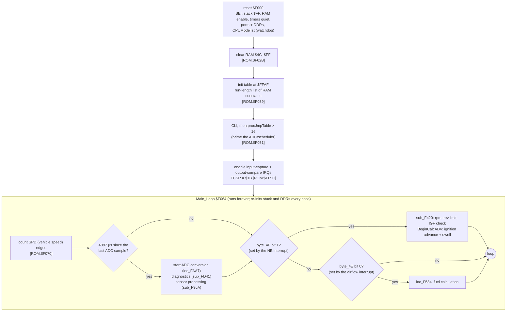
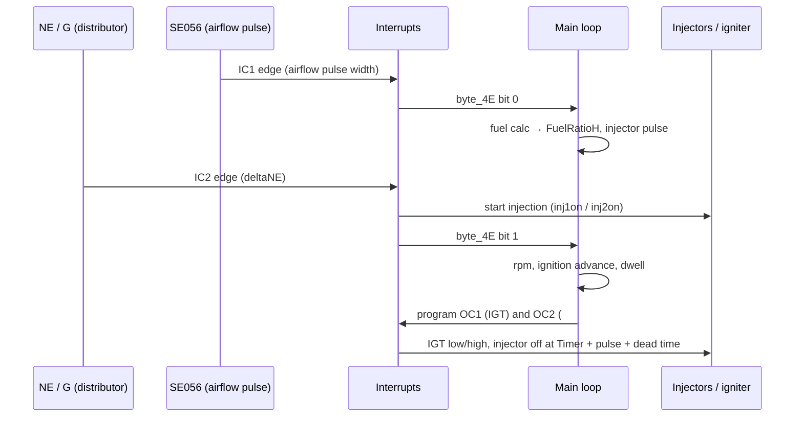

# Bluetop ECU firmware architecture (P2)

This page explains how the AE86 Bluetop ROM (`cap.bin`, D151801-0642, HD6301V1 in single-chip mode) is organised. It is the reference for analysing the 17140 ROM in P4, which uses the same chip family and the same Denso coding style.

**Evidence:**
- Tags are `[ROM:$addr]` for code reading and `[EMU:test]` for behaviour proven in the emulator.
- Labels come from the IDA listing and [`../../analysis/bluetop/cap.s`](../../analysis/bluetop/cap.s).
- Readers and writers of each variable are in [`../../analysis/bluetop/xref.md`](../../analysis/bluetop/xref.md).
- Map data is in [`../../analysis/bluetop/maps.md`](../../analysis/bluetop/maps.md).

## 1. Reset and the main loop

- **Watchdog:** `CPUModeTst` toggles a Port 1 pin only when the mode bits read 1, 1, 1 (mode 7, single chip) [ROM:$FC6E]. Every main-loop path calls it.
- **The work is event-driven.** The interrupts only time the edges and set flags in `byte_4E`. The maths runs in the main loop when a flag is seen [ROM:$F0FD–$F116].

## 2. Interrupts and timers

The HD6301's free-running 16-bit timer counts the 1 MHz E clock, so every timing variable is in µs [ROM:$F168 CalcInjOffTime].

| Vector | Handler | Does | Evidence |
|---|---|---|---|
| ICF (input capture) | `IRQinpcap` $F1B1 | **IC1** measures the `SE056` pulse, which is the airflow/load measurement. It is clamped between `SE056Mintime` and `SE056Maxtime`, and it sets `byte_4E` bit 0, which triggers the fuel calculation. **IC2** handles the NE-derived edges: it measures `deltaNE` and `NEhighWidth`, counts edges against G+, and sets bits 1/2/6, which trigger the rpm and ignition calculation. | [ROM:$F1B1–$F286] |
| OCF (output compare) | `IRQoutcmp` $F370 | **OC1** drives **IGT**: dwell start and spark. **OC2** switches injector group **#20** (P1-1). Group **#10** is switched in software on P4-7 when its scheduled off time passes. | [ROM:$F370–$F3DA, $F154, $F196] |
| SCI (serial) | `IRQSerial` $F3DB | Receives the external ADC's result over the serial port and requests the next channel | [ROM:$F3DB, $FB18] |
| TOF, IRQ1, SWI, NMI, RES | `reset` | Unused; all point at reset | [ROM:$FFF2–$FFFE] |
| TRAP | `$C7BE` (outside the ROM) | The vector word is chosen to make the ROM checksum $AA55 | [cap.asm comment] |

## 3. Sensors and the ADC sequencer

The analogue sensors are read by an **external ADC on the serial port**, one channel per ~4.1 ms main-loop tick [ROM:$F083 `NextADCsamptime` += 4097]. `ADCchanSelect` picks the channel from `ADCcontrol` [ROM:$FB2F]. `procJmpTable` dispatches the result through a 4-entry jump table, `jmptable1`–`jmptable4`, indexed by `ADCcontrol & 6` [ROM:$FA9B] [EMU: xref jump-table resolution].

| RAM | Variable | Sensor | Processing |
|---|---|---|---|
| $54 | `ADC_TPS` | throttle position | rate of change → acceleration enrichment, `byte_5D` [ROM:$FB99] |
| $55 | `ADC_12V` | battery (+B1 ÷ 5) | → injector dead time table `$FF12`, dwell [ROM:$FCA5] |
| $56 | `ADC_ThA` | intake air temperature | → `ThAcorr` via table `$FED9` [ROM:$FBF6] |
| $57 | `ADC_ThW` | coolant temperature | linearised by table `$FEF0` into **°F**, bounded to 241 [ROM:$FAD3] |
| $58 | `ADC_PWRr` | ("power" input, purpose unknown) | small ignition trim at `$FF94` [ROM:$F8A5] |
| $59 | `ADC_Oxy` | oxygen sensor | → `word_76` (O2 trim; default $8000) [ROM:$F7BE Calc76] |

Digital inputs: IDL (via `byte_95` bit 7), A/C (P4-3), T test terminal (P4-5, active low), SPD (P4-6), G+ (P3-7), IGF (/IS3).

## 4. RAM map (by function)

| Group | Variables (address) |
|---|---|
| Engine speed | `deltaNE` $66 (µs per 180° crank, LIKELY), `FullRPM` $62, `RPMish` $64 (map axis), `lilRPM` $65 (24 = 600 rpm, 255 = 6375 rpm), `IdleRPMs`, `IdleRPMfilt` |
| Load (airflow) | `SE056plstime` $6A, `SE056Maxtime` $6C, `SE056Mintime` $6E, `Load` $7F, `Loadfilt1` $8E, `Loadfilt2` $90 |
| Fuel | `word_72`, `word_70`, `word_76` (O2), `ThAcorr` $8A, `FuelRatioH` $74, `InCp2TrEg` $9F (the pulse), `InjDeadTime` $81, `Inj10OffTime`, `Inj20OffTime`, `DecelCutRPM` |
| Enrichments (fuel) | `byte_83`, `byte_84`, `byte_86`–`byte_89`, `byte_8B`, `word_8C` (see [`fuel_chain.md`](fuel_chain.md)) |
| Ignition | `BaseAdvance`, `IDLcompADV`, `ThW_tADV`, `AdvanceinUS`, `Dwell`, `TVIScounter` $99 |
| Flags | `byte_4C` (bit 7 inhibits injection), `byte_4D`, `byte_4E` (ISR → main-loop events), `byte_95` (bit 7 ≈ IDL), `unk_CD` |
| Saturating counters | `SatCount_*` (updated by the shared helpers at $FFE1/$FFE3) |
| Diagnostics | `FlagBadStuff` / `flagbadstuf3` set fault bits that the T terminal reads out |

The complete reader/writer list for every address is in [`xref.md`](../../analysis/bluetop/xref.md#ram-and-io-registers).

## 5. Coding conventions to expect in the 17140 ROM

These all have tooling support already, so they won't surprise P4:
- **Indexed calls through a constant X:**
  - the saturating counters (`ldx #$FFCF` / `jsr $14,x`);
  - the 1D table helper (`ldx #table` / `jsr $65,x`).

  `pcmre/xref.py` resolves both, and `pcmre/tables.py` models the helper.
- **Inline parameters after a call** (`boundData`), **stack arguments** (`mulDbyStack`), and **skip tricks** where one opcode hides the next instruction (`brn`, `cpx #`). The analyser handles all three.
- **Run-length RAM init table** at the end of the ROM.
- **Interrupt-flag handshake:** the ISRs time the edges; the main loop does the maths.
