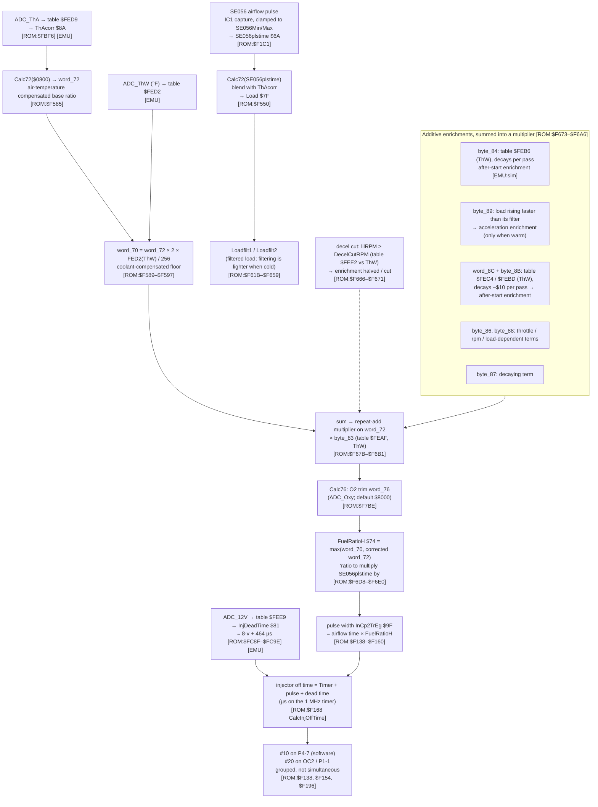
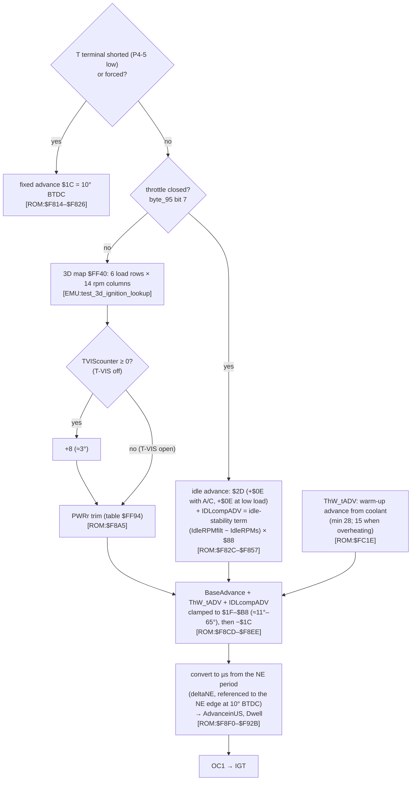

# Bluetop fuel and ignition chains (P2)

This page traces how the AE86 Bluetop computes the injector pulse and the spark advance. The figures follow the layout of Ross's 17030 diagrams ([`../ross/diagrams.md`](../ross/diagrams.md)), so the two can be compared box by box. That comparison is what P4 will do with the 17140 ROM.

**Confidence:**
- The structure (which variable feeds which) is read from the code [ROM].
- The table lookups and the helper arithmetic are proven in the emulator [EMU].
- Physical meanings are LIKELY or GUESS as marked.
- The Bluetop is **L-type** (airflow meter), so its base fuel is an airflow pulse time, not a MAP-based density value.

## 1. Fuel chain

Notes:
- **`Calc72` arithmetic** [ROM:$F6FC–$F709]: it stores the input in `word_72`, then returns `(2·x·ThAcorr/256 + 3x) / 4`. That is a blend, not a pure multiplication: three quarters of the value passes through unchanged. The test `tests/test_fuel_chain.py` checks this formula in the emulator.
- **The multiplier loop** [ROM:$F6A8–$F6B1] adds `word_72` to itself `word_D3` times. `word_D3` is 1 plus the summed enrichments, so the enrichments act as a **multiplier on the base ratio**. That matches Ross's "everything after the base is a correction factor" (R-F02).
- `FuelRatioH` is the larger of the corrected ratio and the coolant floor `word_70` [ROM:$F6D8–$F6DE]. So a cold engine can never run leaner than the warm-up floor.

### Warm-up numbers

Realistic warm-up and after-start numbers come from the whole-ROM simulation: [`warmup_sim.md`](warmup_sim.md) [EMU:sim].
- **Steady warm-up fuel:** 2.0× warm at −10 °C, 1.7× at 0 °C, gone by about 60 °C.
- **After-start boost:** on top of that, bleeding off over a fixed number of revolutions (about 33 s at 1000 rpm from 0 °C).
- **Extra cold advance:** about +10° at idle.

An earlier routine-level experiment (running `loc_F534` alone) gave 2.5× at 0 °C. It is superseded, because the diagnostic routine that sets `byte_83`/`byte_8B` did not run.

## 2. Ignition chain

**Raw → degrees:** the clamp comments and the T-terminal value ($1C = 10° BTDC, matching the factory "10° BTDC with T–E1 shorted") point to **degrees ≈ raw × 90/256** before the −$1C offset. LIKELY; this feeds R-I06 / STATUS Q3. It needs a bench check: Zero timing meter against IGT (P8).

### In tuning terms

- **Fuel:** the Bluetop builds fuel from an airflow measurement times a "ratio". The ratio carries all the corrections: air temperature, coolant warm-up floor, after-start, acceleration, O2 trim. There is no rpm × load VE table; the airflow meter does that job. The MR2's speed-density ROM will differ here (density and speed maps, per Ross).
- **Ignition:** a conventional rpm × load map that only applies off idle. At idle the spark is a fixed value plus an idle-stability term that adds advance when rpm drops. Warm-up advance and a T-VIS step are added on top. That idle-stability loop is the ECU's only active idle control, which matters for goal 1.
