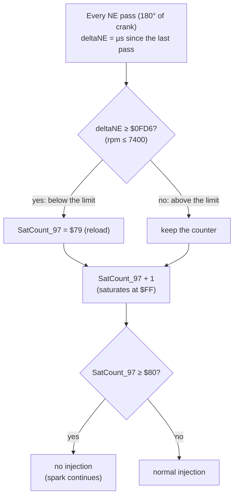

# Rev limiter (Bluetop D151801)

**ROM:** `cap.bin`, AE86 Bluetop, D151801.

**Identical limiter in:**
- `cap1-151801-0642.bin`
- `cap2-151801-2860.bin` (the code sits 5 bytes lower)

**Patched:** `replacement.bin` has the original author's test patch: limit `$0D04` (9000 rpm).

**Tests:** [`tests/test_rev_limiter.py`](../../tests/test_rev_limiter.py) runs patched ROMs in the whole-ROM simulator [EMU:test_rev_limiter].

## Mechanism

| Item | Detail | Evidence |
|---|---|---|
| **Decision** | `ldx deltaNE` / `cpx #$0FD6` / `bcs` / `stab SatCount_97`, then the saturating-increment helper at `$FFE1` (both counters, once per NE pass) | [ROM:$F431–$F43A] CONFIRMED |
| **Cut** | Injection is skipped while `SatCount_97`, `SatCount_98` or `byte_4C` has bit 7 set | [ROM:$F1F0–$F1FC] CONFIRMED |
| **Engage delay** | Below the limit the counter sits at reload + 1 = `$7A`. Fuel stops on the **6th consecutive pass** above the limit: 1.5 crank revolutions, ≈12 ms at 7400 rpm | [EMU] CONFIRMED |
| **Release** | The first pass at or below the limit reloads the counter, and fuel returns immediately. **No rpm hysteresis** | [EMU] CONFIRMED |
| **Type** | Fuel only; ignition continues during the cut | [EMU] CONFIRMED |
| **Shared mechanism** | `SatCount_98` is the missing-IGF safety cut. It is reloaded with `$7B` on each IGF echo, so fuel stops after 4 passes without one | [ROM:$F42A–$F42F] CONFIRMED |

## Calibration constants

| Constant | Address | Stock | Scaling | Valid range |
|---|---|---|---|---|
| **Limit** | `$F434`–`$F435` (word) | `$0FD6` = 7400 rpm | value = 30,000,000 ÷ rpm (µs per 180° of crank) | Any rpm |
| **Engage delay** (`SatCount_97` reload) | `$F42C` (byte) | `$79` = 6 passes | passes before the cut = `$80` − (reload + 1) | `$00`–`$7E`. `$7E` = cut on the first pass above the limit. **`$7F` and above cut fuel at every rpm** [EMU:test_reload_7f_cuts_fuel_at_every_rpm] |

| Limit (rpm) | 7000 | 7200 | 7400 | 7600 | 7800 | 8000 |
|---|---|---|---|---|---|---|
| Value | `$10BE` | `$1047` | `$0FD6` | `$0F6B` | `$0F06` | `$0EA6` |

- Any edit changes the ROM checksum. Re-balance it with `python -m pcmre.checksum <file> --fix` (word `$FFEE`).
- The scaling assumes `deltaNE` is the time for 180° of crank (LIKELY). That reading puts `$0FD6` at 7400 rpm, matching the original author's notes, and keeps the ROM's rpm variables consistent.
- The limit resolution is about 1.8 rpm per count at 7400 rpm.

**In tuning terms:** the limit word sets where the cut happens. The reload byte sets how long the engine may stay above the limit before the cut: from 6 passes (stock) down to 1 pass (`$7E`). The release is always immediate, because the code has no hysteresis.

## Characteristics of a fuel-cut limiter

These are general port-injection behaviour, not ROM facts (GUESS for this engine):

- **Cut onset:** the cylinders keep pumping air while the fuel film on the port walls evaporates, so combustion fades out over one or two cycles rather than stopping at once.
- **Recovery:** returning fuel first re-wets the port walls, so the first cycles run lean.
- **Exhaust:** during the cut the exhaust receives air only, so there is no unburnt fuel in it to ignite.

## Spark-cut limiter: potential

A spark-cut limiter suppresses ignition and keeps injection running. The cut takes effect on the next firing event, and the unburnt mixture passes into the exhaust, where it can ignite. The relevant ROM structure:

1. **Dwell control:** the output-compare interrupt `IRQoutcmp` starts each coil charge. It already has an exit that skips charging the coil while `byte_C6` > 0 (start mode) [ROM:`ldab byte_C6 / bgt OutCmpBombout`]. A spark cut would extend that test to "or the limiter is active".
2. **IGF safety cut:** with no spark there is no IGF echo, so `SatCount_98` reaches `$80` after 4 passes and cuts fuel. A spark-cut patch must reload `SatCount_98` while the deliberate cut is active, and leave the safety cut working outside it.
3. **Spark source outside the CPU:** in start mode the ROM never drives `/IGT`, yet the engine sparks. So something outside the CPU (presumably the SE056) fires the coil from NE (simulation finding 8 in [`simulation.md`](simulation.md)). If that path also fires during a CPU spark cut, the result is a fixed ~10° BTDC spark instead of no spark. This needs a bench measurement (P8) of `/IGT` and the coil with the CPU withholding dwell.
4. **Code space:** the 4 KB internal ROM has no free bytes: no run of 6 or more identical bytes. The P7 modified-ROM board runs from external memory, which leaves room for added code.
5. **Variants:**
   - **Full spark cut:** the patch above.
   - **Alternating cut:** spark cut on every other event, or per cylinder. This gives a finer rpm hold.
   - **Retard instead of cut:** at the limit the advance is set near or after TDC (`AdvanceinUS` minimal). Combustion continues late into the exhaust stroke, and the IGF echo is kept, so item 2 does not apply.
6. **Consequences:** higher exhaust gas and exhaust valve temperatures, and thermal load on any catalytic converter. Bench outputs must match the stock ECU before engine running (CLAUDE.md).

## 17140 cross-check

Search the dump for the signatures `DE 66 8C xx xx 25` (load deltaNE, compare, branch if above the limit) and `CC 7B 79` (the two counter reloads). If both are present, the mechanism and scaling above apply at the 17140's own addresses. Any difference, for example added hysteresis, gets its own section here.
