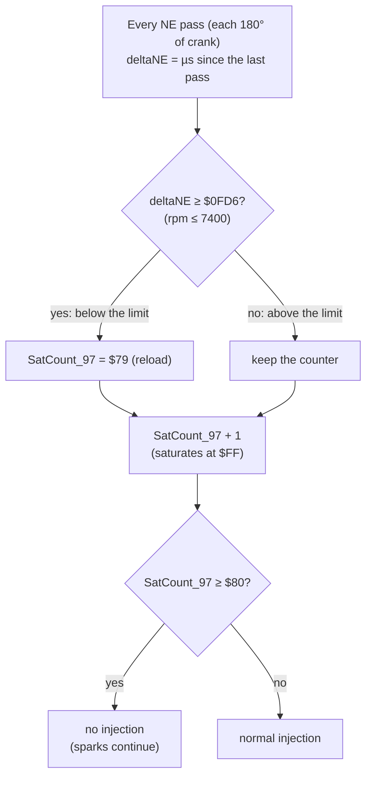

# Rev limiter (Bluetop, as a rehearsal for the 17140)

The 17140 ROM is not dumped yet. This page covers the Bluetop D151801 ROM (`cap.bin`), the same chip family, so that the 17140's limiter can be found and judged quickly once it is dumped. All three Bluetop dumps in the repo (`cap.bin`, `cap1-151801-0642.bin`, `cap2-151801-2860.bin`) have the identical limiter; `replacement.bin` is the original author's 9000 rpm test patch.

Tests: [`tests/test_rev_limiter.py`](../../tests/test_rev_limiter.py), which runs patched ROMs in the whole-ROM simulator [EMU:test_rev_limiter].

## How the stock limiter works

- **The decision** [ROM:$F431–$F43A]: `ldx deltaNE` / `cpx #$0FD6` / `bcs` / `stab SatCount_97`, then the saturating-increment helper at `$FFE1`. CONFIRMED (code and simulation).
- **The cut** [ROM:$F1F0–$F1FC]: injection is skipped while `SatCount_97`, `SatCount_98` or `byte_4C` has bit 7 set. CONFIRMED.
- **Engage delay:** below the limit the counter sits at $7A. Each pass above the limit adds 1, so fuel stops on the **6th consecutive pass above 7400 rpm**: 1.5 crank revolutions, about 12 ms. CONFIRMED [EMU].
- **Release:** the first pass at or below the limit reloads the counter, so fuel returns at once. **There is no rpm hysteresis.** CONFIRMED [EMU].
- **Fuel-only:** sparks carry on during the cut. CONFIRMED [EMU].
- **The same mechanism is the missing-IGF safety cut.** `SatCount_98` is reloaded with $7B on every IGF echo from the igniter, so fuel stops after 4 passes with no echo [ROM:$F42A–$F42F]. This matters for any spark-cut idea (below).

## The two adjustable constants

| What | Address | Stock | Scaling | Safe range |
|---|---|---|---|---|
| **Limit rpm** | `$F434`–`$F435` (word) | `$0FD6` = 7400 rpm | value = 30,000,000 ÷ rpm (µs per 180° of crank) | Any; see the table below |
| **Engage delay** (`SatCount_97` reload) | `$F42C` (byte) | `$79` = 6 passes | passes before the cut = $80 − (reload + 1) | **`$79`–`$7E` only.** `$7E` = cut on the first pass above the limit. **`$7F` cuts fuel at every rpm; the engine will not run** [EMU:test_reload_7f_cuts_fuel_at_every_rpm] |

| Limit | 7000 | 7200 | 7400 (stock) | 7600 | 7800 | 8000 rpm |
|---|---|---|---|---|---|---|
| Value | `$10BE` | `$1047` | `$0FD6` | `$0F6B` | `$0F06` | `$0EA6` |

Any edit changes the ROM checksum. Re-balance it with `python -m pcmre.checksum <file> --fix` (word `$FFEE`).

The scaling assumes `deltaNE` is the time for 180° of crank. That is LIKELY: it is the only reading that makes `$0FD6` the 7400 rpm in the original author's notes and keeps the ROM's rpm variables consistent.

**In tuning terms:** the stock limiter is already a "no-hysteresis" fuel cut. The only "slowness" built into the code is the 6-pass (≈12 ms) engage delay. Setting the reload to `$7E` makes it cut on the first pass over: a harder, tighter limiter with no other change. That is the one safe constant-only way to make it more aggressive.

## Why a fuel-cut limiter feels soft, and gives no bangs

These points are general engine behaviour, not ROM facts (GUESS for this engine):
- When fuel is cut, the cylinders still pump air, and the fuel film on the port walls takes a cycle or two to dry out. So the cut fades in rather than snapping.
- When fuel returns, the film has to re-wet, so the first few cycles are lean and weak. The rpm drifts back up instead of jumping.
- So even with no code hysteresis, a fuel-cut limiter "bounces" on the engine's own timescale: tens of milliseconds per bounce.
- **No bangs:** bangs come from unburnt fuel lighting in the hot exhaust. A fuel cut sends air, not fuel, into the exhaust, so a fuel-cut limiter is quiet by nature.

## What a fast, crackly limiter needs: spark cut

A sharp limiter that crackles cuts **spark** and keeps fuel flowing, so the unburnt mixture lights in the exhaust. That is a code change, not a constant. Design outline for the Bluetop, for a later patch:

1. **Hook:** in the output-compare interrupt (`IRQoutcmp`), the ROM already skips charging the coil while `byte_C6` > 0 (cranking) [ROM:`ldab byte_C6 / bgt OutCmpBombout`]. A spark cut adds "or the limiter is active" to that test.
2. **Keep the IGF safety cut from firing.** With no spark there is no IGF echo, so `SatCount_98` would cut fuel after 4 passes and silence the bangs. The patch must reload `SatCount_98` only during the deliberate cut, and keep the safety cut working the rest of the time.
3. **Check what fires the coil when the CPU doesn't.** While cranking, the ROM never drives `/IGT`, yet the engine sparks. Something outside the CPU (presumably the SE056) fires the coil from NE (simulation finding 8 in [`simulation.md`](simulation.md)). If that also happens during a "CPU spark cut", the cut would turn into a fixed ~10° spark instead. This must be measured on the bench (P8) before any spark cut is trusted.
4. **Space:** the 4 KB internal ROM has no free bytes. That is no obstacle for the P7 modified-ROM board, which runs the code from external memory with room to spare.
5. **Gentler alternative: retard instead of cut.** At the limit, the spark is pulled close to TDC, so fuel keeps burning late into the exhaust. This gives pops with less violence than a full cut, and keeps the IGF echo, so step 2 isn't needed.

**Risks to weigh before running either version:**
- much higher exhaust gas and exhaust valve temperatures;
- damage to a catalytic converter if one is fitted;
- louder exhaust (MOT noise check).

The CLAUDE.md rule applies: nothing runs on the engine until the bench outputs match the stock ECU.

## For the 17140 dump

Search the dump for the same signature: `DE 66 8C xx xx 25` (load deltaNE, compare, branch if above the limit) and `CC 7B 79` (the two counter reloads). If they match, the table above applies with the 17140's own addresses. If the 17140 limiter differs, for example by having real hysteresis, which might explain a slow bounce on the car, this page gets a 17140 section.
