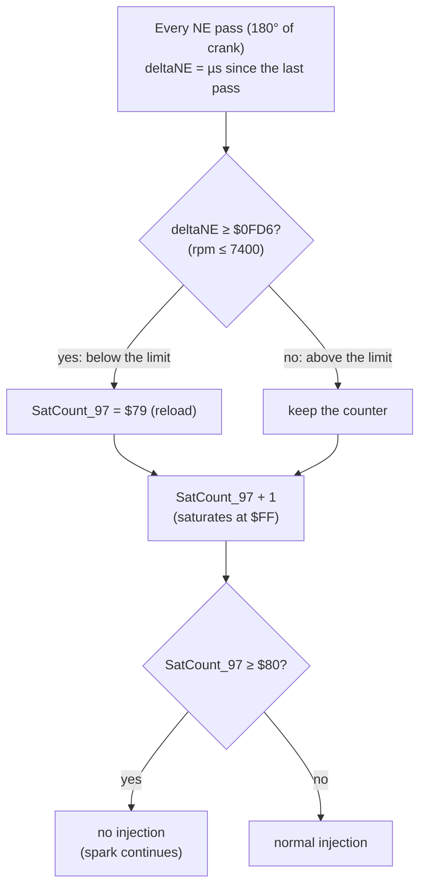

# Rev limiter (Bluetop D151801)

**ROM:** `cap.bin`, AE86 Bluetop, D151801.

**Identical limiter in:**
- `cap1-151801-0642.bin`
- `cap2-151801-2860.bin` (the code sits 5 bytes lower)

**Patched:** `replacement.bin` has the original author's test patch: limit `$0D04` (9000 rpm).

**Tests:** [`tests/test_rev_limiter.py`](../../tests/test_rev_limiter.py) runs patched ROMs in the whole-ROM simulator [EMU:test_rev_limiter].

## Mechanism



| Item | Detail | Evidence |
|---|---|---|
| **Decision** | `ldx deltaNE` / `cpx #$0FD6` / `bcs` / `stab SatCount_97`, then the saturating-increment helper at `$FFE1` (both counters, once per NE pass) | [ROM:$F431–$F43A] CONFIRMED |
| **Cut** | Injection is skipped while `SatCount_97`, `SatCount_98` or `byte_4C` has bit 7 set | [ROM:$F1F0–$F1FC] CONFIRMED |
| **Engage delay** | Below the limit the counter sits at reload + 1 = `$7A`. Fuel stops on the **6th consecutive pass** above the limit: 1.5 crank revolutions, ≈12 ms at 7400 rpm | [EMU] CONFIRMED |
| **Release** | The first pass at or below the limit reloads the counter, and fuel returns immediately. **No rpm hysteresis** | [EMU] CONFIRMED |
| **Type** | Fuel only; ignition continues during the cut | [EMU] CONFIRMED |
| **Shared mechanism** | `SatCount_98` is the missing-IGF safety cut. It is reloaded with `$7B` on each IGF echo, so fuel stops after 4 passes without one | [ROM:$F42A–$F42F] CONFIRMED |

## Calibration constants

| Constant | Address | Stock | Scaling | Valid range |
|---|---|---|---|---|
| **Limit** | `$F434`–`$F435` (word) | `$0FD6` = 7400 rpm | value = 30,000,000 ÷ rpm (µs per 180° of crank) | Any rpm |
| **Engage delay** (`SatCount_97` reload) | `$F42C` (byte) | `$79` = 6 passes | passes before the cut = `$80` − (reload + 1) | `$00`–`$7E`. `$7E` = cut on the first pass above the limit. **`$7F` and above cut fuel at every rpm** [EMU:test_reload_7f_cuts_fuel_at_every_rpm] |

| Limit (rpm) | 7000 | 7200 | 7400 | 7600 | 7800 | 8000 |
|---|---|---|---|---|---|---|
| Value | `$10BE` | `$1047` | `$0FD6` | `$0F6B` | `$0F06` | `$0EA6` |

- Any edit changes the ROM checksum. Re-balance it with `python -m pcmre.checksum <file> --fix` (word `$FFEE`).
- The scaling assumes `deltaNE` is the time for 180° of crank (LIKELY). That reading puts `$0FD6` at 7400 rpm, matching the original author's notes, and keeps the ROM's rpm variables consistent.
- The limit resolution is about 1.8 rpm per count at 7400 rpm.

**In tuning terms:** the limit word sets where the cut happens. The reload byte sets how long the engine may stay above the limit before the cut: from 6 passes (stock) down to 1 pass (`$7E`). The release is always immediate, because the code has no hysteresis.

## Characteristics of a fuel-cut limiter

These are general port-injection behaviour, not ROM facts (GUESS for this engine):

- **Cut onset:** the cylinders keep pumping air while the fuel film on the port walls evaporates, so combustion fades out over one or two cycles rather than stopping at once.
- **Recovery:** returning fuel first re-wets the port walls, so the first cycles run lean.
- **Exhaust:** during the cut the exhaust receives air only, so there is no unburnt fuel in it to ignite.

## Spark-cut limiter: prototype

A spark-cut limiter suppresses ignition and keeps injection running. The cut takes effect on the next firing event, and the unburnt mixture passes into the exhaust, where it can ignite.

**Patch:** [`analysis/patches/bluetop_sparkcut.asm`](../../analysis/patches/bluetop_sparkcut.asm) (asl), applied with `pcmre.patch`.

**Tests:** [`tests/test_sparkcut.py`](../../tests/test_sparkcut.py) [EMU:test_sparkcut].

### Where the ROM starts a coil charge

`/IGT` low (coil charging) is only ever selected in two places. Every other Timer-1 control write sets the output level high or leaves it unchanged [ROM: all TCSR1 writes].

| Site | Address | Stock test | What it does |
|---|---|---|---|
| `IRQoutcmp` | `$F387` | `ldab byte_C6 / bgt OutCmpBombout` | After each spark, schedules the next dwell start |
| NE handler (`InCp2high`) | `$F252` | `ldaa byte_C6 / bgt IGTisON` | At the NE edge, starts a dwell 13 µs later if none is running (catch-up) |

Both already skip the dwell in start mode (`byte_C6` > 0). The patch extends both tests to "or `SatCount_97` bit 7 set".

### The patch

| Hook | Address | Change |
|---|---|---|
| A | `$F387` | `jmp` to new code: no dwell while `byte_C6` > 0 **or limiting** |
| B | `$F252` | Same check for the NE handler's catch-up dwell |
| C | `$F1F2` | `ldaa SatCount_97` → `clra`: the limiter no longer cuts fuel. `byte_4C` and the IGF counter `SatCount_98` still do |
| D | `$F42D` | `bcc / staa SatCount_98` → `jsr`: `SatCount_98` is also reloaded while limiting, because a spark cut produces no IGF echo. Outside the limiter the IGF safety cut is unchanged |
| New code | `$E000`–`$E025` | 38 bytes, outside the 4 KB ROM: external memory on the P7 board |

- The 4 KB ROM changes only at the hook bytes, and its checksum is re-balanced to `$AA55`.
- The limit (`$F434`) and the engage-delay reload (`$F42C`) keep the meanings in the table above.

### Simulator results [EMU:test_sparkcut]

| Condition | Stock ROM | Patched ROM |
|---|---|---|
| 7600 rpm (above the limit) | Sparks continue, **no injection** | **No sparks**, injection continues; `SatCount_98` stays below `$80` |
| 3000 rpm and 7300 rpm (below the limit) | — | Spark advance identical to stock. Injector pulse widths within 1 % of stock (see note) |
| 3000 rpm, no IGF (dead igniter) | Fuel cut | Fuel cut (the safety cut is intact) |
| 7300 → 7600 rpm, stock reload `$79` | — | Spark stops after ≤ 7 passes, then none; fuel on every pass |
| 7300 → 7600 rpm, reload `$7E` | — | Spark stops after ≤ 2 passes; fuel on every pass |
| 7600 → 7300 rpm | — | Spark returns within 2 passes; fuel on every pass |

Per-pass timeline (S = spark, F = fuel; first pass after each rpm step):

```
reload $79   7600: SF SF SF SF SF SF -F -F -F -F -F -F -F
             7300: -F -F SF SF SF SF SF SF SF
reload $7E   7600: SF SF -F -F -F -F -F -F -F -F -F -F -F
             7300: -F -F SF SF SF SF SF SF SF
```

- **Pass counts:** one more pass than the counter arithmetic gives. The ROM measures each NE period at its end, and a coil charge already in progress still fires.
- **Pulse-width note:** the hooks lengthen two interrupts by a few cycles. That shifts sampled timer values by a few µs, and the phase of slow loops paced by main-loop passes (after-start decay, feedback). So pulse widths agree to within 1 % rather than exactly.

### Open points

1. **Spark source outside the CPU.** In start mode the ROM never drives `/IGT`, yet the engine sparks. So something outside the CPU (presumably the SE056) fires the coil from NE (simulation finding 8 in [`simulation.md`](simulation.md)). The simulator models that only while cranking. If the real hardware also fires when the CPU withholds dwell at speed, the patch gives a fixed ~10° BTDC spark instead of a cut. This needs a bench measurement (P8) of `/IGT` and the coil with the patched ROM.
2. **IGF safety cut during the cut.** The missing-igniter protection is suspended while limiting, by design. A failed igniter at the limit is detected once rpm falls below it.
3. **No engine dynamics.** The simulator imposes the rpm, so the rpm oscillation at the limit (its period and amplitude) is not modelled.
4. **Variants not yet prototyped:**
   - **Alternating cut:** cut every other event, or per cylinder, for a finer rpm hold.
   - **Retard at the limit:** set the advance near or after TDC, which keeps the IGF echo and so needs no hook D.
5. **Consequences:** higher exhaust gas and exhaust valve temperatures, and thermal load on any catalytic converter. Bench outputs must match the stock ECU before engine running (CLAUDE.md).

## 17140 cross-check

Search the dump for the signatures `DE 66 8C xx xx 25` (load deltaNE, compare, branch if above the limit) and `CC 7B 79` (the two counter reloads). If both are present, the mechanism and scaling above apply at the 17140's own addresses. Any difference, for example added hysteresis, gets its own section here.
