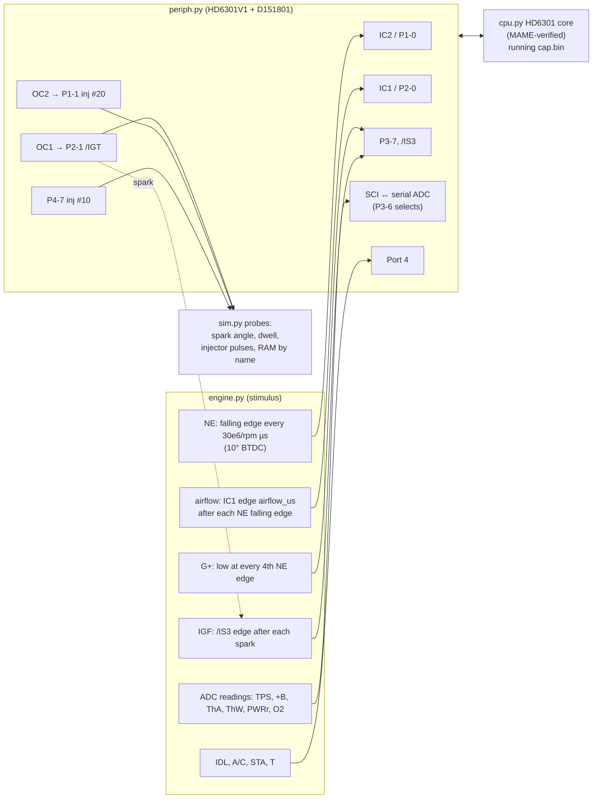

# Whole-ROM simulation of the Bluetop ECU (P2)

The Bluetop ROM (`cap.bin`) now runs unmodified from reset in Python, with its timers, serial ADC and interrupts driven by a simulated engine. This is the tool goal 1 needs: the same set-up will run the 17140 ROM in P4/P5 to predict what removing the IACV and the cold-start injector does.

Code:
- [`analysis/emu/periph.py`](../../analysis/emu/periph.py): the on-chip peripherals.
- [`analysis/emu/engine.py`](../../analysis/emu/engine.py): engine and sensor stimulus.
- [`analysis/emu/sim.py`](../../analysis/emu/sim.py): the `Simulation` class and probes.
- [`analysis/emu/scenarios.py`](../../analysis/emu/scenarios.py): the warm-up experiments, write-up to follow in `warmup_sim.md`.

Tests: [`tests/test_periph.py`](../../tests/test_periph.py) (register behaviour) and [`tests/test_sim.py`](../../tests/test_sim.py) (the whole ROM against its own arithmetic).



## Using it

```python
from emu.sim import Simulation
sim = Simulation()                         # boots cap.bin from reset
sim.inputs.rpm = 900                       # engine turning at 900 rpm
sim.inputs.coolant_f = 50                  # coolant in °F, as the ROM sees it
sim.engine.update_sensors()                # apply input changes
sim.run_ms(1500)
sim.ram("FuelRatioH", 2)                   # any RAM variable by its cap.s name
sim.injector_pulses("#10")[-1]             # µs the injector was open
sim.spark_advance()[-1]                    # degrees BTDC
```

Run `PYTHONPATH=analysis uv run python ...` from the repo root. Speed is about real time: one simulated second takes about one second of CPU.

## What is modelled, and how sure we are

| Part | Model | Confidence |
|---|---|---|
| CPU | `cpu.py`, checked against MAME on more than 1.3 million cases | CONFIRMED |
| Timer 1, SCI, port 3 IS3 flag | HD6301 handbook §2.5–2.6: TCSR flags and their two-step clear sequences, FRC preset on writes, OLVL onto P2-1 at the compare cycle, edge-selected capture | CONFIRMED (handbook); [EMU:test_periph] |
| Timer 2 ($18–$1E) | Same layout as timer 1. IC2 on P1-0, OC2 on P1-1, sharing the ICF and OCF vectors. Inferred from the ROM's use of it [ROM:$F1B1, $F242, $F370] | LIKELY: the whole ROM runs correctly on it |
| Serial ADC | Channel byte sent while P3-6 is low; reply is the bit-reversed reading 320 µs later. Channels 0–5 = TPS, +B, ThA, ThW, PWRr, O2 [ROM:$FAA7–$FB2E] | LIKELY (protocol); GUESS (real conversion time) |
| Timing granularity | Peripheral registers update between instructions; external edges are captured to the exact cycle | Accurate to a few µs |
| NE | Falling edge = 10° BTDC, one per 180° of crank, `deltaNE` = 30e6/rpm | CONFIRMED by T terminal → 10.3° and by the ROM's rpm variables |
| NE duty (high part of the period) | 50 % | GUESS. It sets the earliest dwell start at low rpm, so the **dwell numbers are not trustworthy** yet |
| G+ | Low across every 4th NE falling edge | LIKELY function, GUESS phase |
| Airflow | A delay after each NE falling edge (`SE056plstime`), set directly in µs | Mechanism CONFIRMED from the code; the volts → µs relation is unknown |
| IGF | One /IS3 edge 20 µs after each spark | LIKELY |
| Cranking spark | Made outside the CPU on each NE edge while the ROM's start mode holds /IGT high (see below) | LIKELY that it exists; GUESS for its timing |
| Thermistors | ThW raw value from the inverse of the ROM's own $FEF0 table; ThA uses the same curve | LIKELY (ThW); GUESS (ThA) |
| Not modelled | Vehicle speed (SPD), T-VIS, VF/MIL outputs, watchdog, A/C | — |

## What the simulation established (Bluetop)

All of these are asserted in `tests/test_sim.py` [EMU:sim].

1. **rpm scaling.** At 900, 2400 and 4800 rpm: `deltaNE` = 30e6/rpm, `lilRPM` = rpm/25 and `RPMish` = rpm/25 − 32. The variables in [`maps.md`](../../analysis/bluetop/maps.md) are confirmed.
2. **Injection.**
   - **Warm (above 80 °F / 27 °C):** grouped. Each group fires once per crank revolution for 2 × `InjLoadPulse` + `InjDeadTime`.
   - **Cold (72 °F / 22 °C or below), and while starting:** simultaneous. Both groups fire on every NE edge (4 times per cycle) for `InjLoadPulse` + `InjDeadTime`.
   - The fuel per cycle is the same in both modes. The dead time is added per pulse, so it is **not doubled** in the grouped mode. That matches Ross R-F24's "dead time not doubled", although on the Bluetop the switch depends on coolant temperature, not on 6000 rpm.
   - `InjLoadPulse` = `SE056plstime` × `FuelRatioH`/256 [ROM:$F1F0–$F217].
3. **Ignition.**
   - Off idle, `BaseAdvance` is exactly the 3D-map value from `pcmre.tables.lookup_3d`, plus 8 while T-VIS is shut [ROM:$F8A3].
   - The spark lands where the ROM's own µs conversion puts it [ROM:$F8CD–$F90D], within 0.15°.
   - At idle the base is the fixed $2D.
   - With the T terminal shorted, the spark is at **10.3° BTDC** at 900 rpm, against the factory spec of 10°.
4. **Raw → degrees** (STATUS Q3, R-I06) for the Bluetop:

   `BTDC = (BaseAdvance + ThW_tADV + IDLcompADV) × 90/256 − 10.74° + 256 µs`.

   The 256 µs is a fixed time lead added by the ROM (`inca` at $F900), worth 0.15° per 100 rpm. Warm, `ThW_tADV` is 28 ($1C), so a **map cell value v gives about v × 90/256 − 0.9° BTDC, plus the 256 µs lead**: idle $2D → 16.3° at 900 rpm. The cap.asm comment "raw/255 × 90" is right to within about 1°.
5. **Rev limiter cuts fuel only.** At 7600 rpm both injector groups stop and the sparks continue. Fuel returns at 6000 rpm (R-F26 for the Bluetop).
6. **Missing IGF cuts fuel.** With no IGF echo, `SatCount_98` saturates and both groups stop (R-I16 for the Bluetop).
7. **IDL polarity.** At the CPU pin, P4-2 is **high** with the throttle closed, the opposite of the cap.asm comment. Evidence: the idle branches [ROM:$F814, $F1E0, $FA19]; details in `engine.py`. This is logged as a conflict in STATUS.
8. **Cranking.** While `byte_C6` > 0 (starting), the ROM never drives /IGT low itself, but it still cuts fuel when IGF is missing. So the cranking spark must come from hardware outside the CPU, presumably the SE056 firing from NE. With that modelled, the ROM fuels on every NE edge while cranking (`InjLoadPulse` + dead time; about 8 ms at 0 °C with the stand-in airflow signal).

## Limits

- **The airflow signal is a stand-in.** Fuel results are only meaningful as ratios between conditions.
- **Dwell depends on the NE duty GUESS** and is not reported.
- **The 256 µs lead may be compensating** for a real delay (igniter, or the SE056's NE filtering). Only a bench capture of IGT against the crank can tell whether the true spark is at the computed angle or 256 µs later (P8).
- **Single-instruction timing:** a register read sees the FRC at the start of its instruction, so ISR timings can be a few µs off.

The verifier review of this model is pending (STATUS). Simulated numbers should not be used as evidence until it is done.
