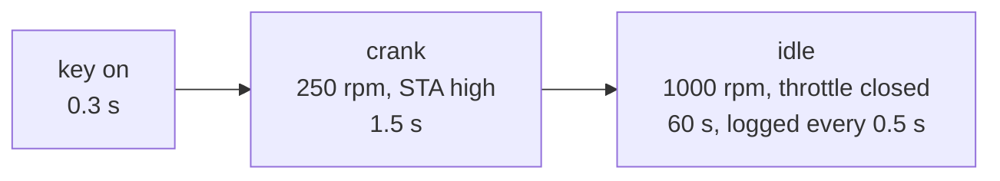
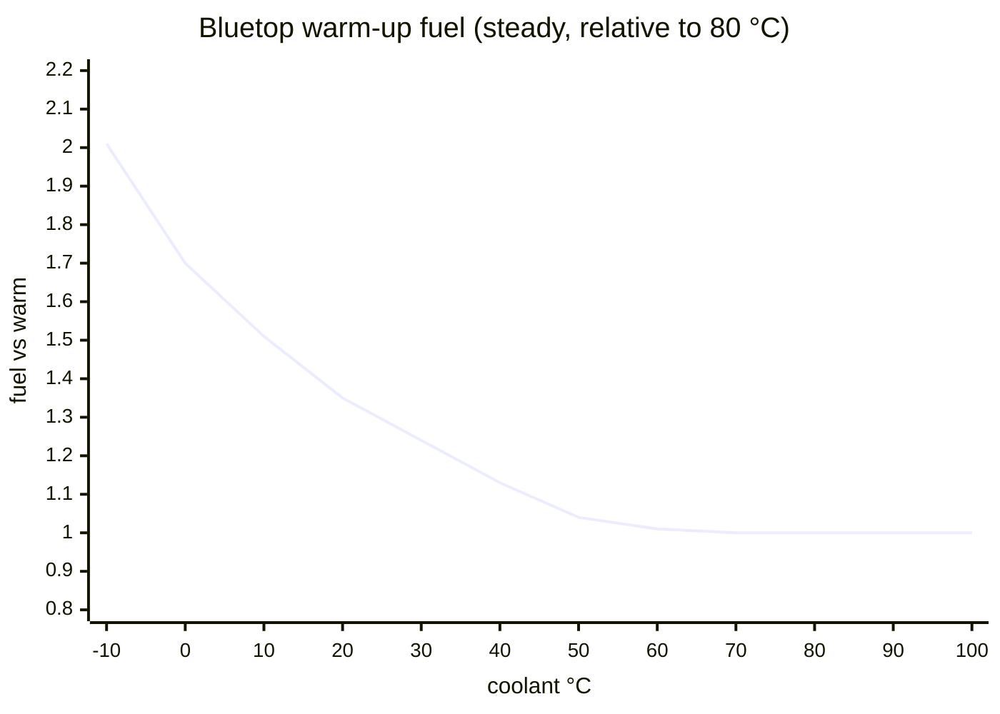
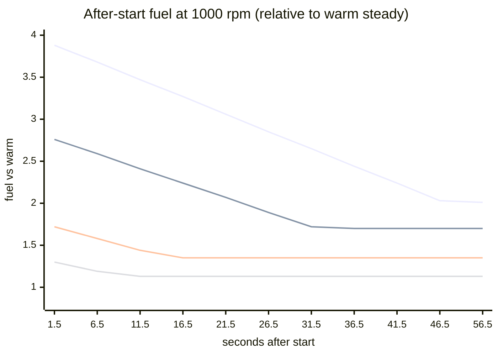

# Bluetop warm-up and after-start fuel, from the whole-ROM simulation (P2)

This is a rehearsal of goal 1 on the AE86 Bluetop ROM. It asks what the ECU does to fuel and spark from a cold start until the engine is warm. The same experiments will run on the 17140 ROM once it is dumped (P3) and the Ross gate is passed (P4/P5).

- **Method:** [`analysis/emu/scenarios.py`](../../analysis/emu/scenarios.py) on the simulation described in [`simulation.md`](simulation.md). The simulation was reviewed by an independent Verifier (PASS WITH ISSUES, all fixed; STATUS).
- **Data:** [`analysis/bluetop/sim/`](../../analysis/bluetop/sim/): `steady_vs_coolant.csv` and `afterstart_<°F>F.csv`.
- **Evidence tag:** [EMU:sim]. Everything below is the unmodified ROM's response to the simulated inputs.

## Set-up

The following are held fixed so that only the coolant temperature and the time since start change:
- **rpm:** 1000.
- **Airflow signal:** 800 µs.
- **Air temperature:** equal to the coolant temperature (a cold soak).
- **Battery:** 14 V.
- **O2 sensor:** 0.1 V. With that reading the ROM keeps its O2 trim `word_76` at the neutral $8000; a fixed 0.45 V reading drives it down to about $1A00 when warm.

The airflow signal is a stand-in, because the SE056's volts-to-µs relation is unknown. So the fuel results are given **relative to the warm engine** (80 °C). That ratio is what the ROM's corrections do; the absolute µs are only correct for this stand-in airflow.

"Fuel" below means injector open time beyond the dead time, per injector, per 720° engine cycle. This is the quantity that sets mixture strength. It counts 4 pulses per cycle in the cold simultaneous mode and 2 in the warm grouped mode.

## 1. Steady values against coolant temperature (after the after-start terms run out)

| Coolant °C | −10 | 0 | 10 | 20 | 30 | 40 | 50 | 60 | 70 | 80 | 90 | 100 |
|---|---|---|---|---|---|---|---|---|---|---|---|---|
| Fuel vs warm | **2.01×** | **1.70×** | 1.51× | 1.35× | 1.24× | 1.13× | 1.04× | 1.01× | 1.00× | 1.00× | 1.00× | 1.00× |
| `FuelRatioH` | 3.82 | 3.23 | 2.88 | 2.57 | 2.35 | 2.15 | 1.98 | 1.91 | 1.90 | 1.90 | 1.90 | 1.90 |
| Injection mode | simult. | simult. | simult. | simult. | grouped | grouped | grouped | grouped | grouped | grouped | grouped | grouped |
| Spark (° BTDC, idle) | 26.3 | 26.3 | 26.0 | 25.6 | 24.5 | 23.5 | 22.4 | 20.0 | 16.5 | 16.5 | 16.5 | 16.5 |
| `ThW_tADV` (raw) | 56 | 56 | 55 | 54 | 51 | 48 | 45 | 38 | 28 | 28 | 28 | 28 |

- **Warm-up fuel:** twice the warm fuel at −10 °C, 1.7× at 0 °C, fading out by about 60 °C.
  - This replaces the routine-level estimate in [`fuel_chain.md`](fuel_chain.md). That one ran a single routine with the diagnostic terms missing, and gave 2.5× at 0 °C; the whole ROM gives 1.7×.
- **Warm-up advance:** about +10° at idle below 20 °C, from `ThW_tADV` (56 against the warm 28, at 90/256° per count). It fades out between 50 and 70 °C.
- **Injection mode:** switches from simultaneous to grouped between 20 and 30 °C. The switch is set at 72/80 °F [ROM:$F534–$F550]. Fuel per cycle is continuous across it; only the number of dead-time additions changes.

## 2. After-start enrichment

Extra fuel on top of the steady value, decaying after the starter is released. The sample times start 1.5 s after the end of cranking.

| Seconds after start | 1.5 | 6.5 | 11.5 | 16.5 | 21.5 | 26.5 | 31.5 | 36.5 | 41.5 | 46.5 | 56.5 | Steady |
|---|---|---|---|---|---|---|---|---|---|---|---|---|
| −10 °C | 3.88× | 3.68× | 3.47× | 3.27× | 3.06× | 2.85× | 2.65× | 2.44× | 2.24× | 2.03× | 2.01× | 2.01× |
| 0 °C | 2.76× | 2.59× | 2.41× | 2.24× | 2.07× | 1.89× | 1.72× | 1.70× | 1.70× | 1.70× | 1.70× | 1.70× |
| 20 °C | 1.72× | 1.58× | 1.44× | 1.35× | 1.35× | … | | | | | | 1.35× |
| 40 °C | 1.30× | 1.19× | 1.13× | 1.13× | … | | | | | | | 1.13× |
| 80 °C | 1.02× | 1.00× | … | | | | | | | | | 1.00× |

(All values relative to the warm steady fuel.)

(Lines from top: −10, 0, 20, 40 °C.)

- **Size and decay:**
  - The after-start term starts at about **+1.9× of warm fuel at −10 °C**, +1.1× at 0 °C, +0.4× at 20 °C and +0.2× at 40 °C.
  - It decays in a straight line.
  - It is gone after about 48 s at −10 °C, 33 s at 0 °C, 16 s at 20 °C, 10 s at 40 °C and 4 s at 80 °C.
- **It is driven by `byte_84`**, the coolant table $FEB6, which counts down at a fixed amount per fuel pass. `word_8C` (table $FEC4) decays alongside it.
  - Because the decay is per pass (per NE edge), **the duration is in engine revolutions**, not seconds. At 2000 rpm it would be over in half the time.
  - The routine-level note in `fuel_chain.md` that labelled `byte_84` an over-temperature term is corrected there.
- **Cranking itself:** both groups fire on every NE edge. At 0 °C the pulse is about 8 ms with this airflow signal.

## In tuning terms

- The Bluetop's cold-running fuel comes from **three places**:
  - **a coolant warm-up curve** (2× at −10 °C, gone by 60 °C);
  - **a coolant-sized after-start boost** that bleeds off over a fixed number of revolutions (about 550 revolutions at 0 °C);
  - **cranking fuel** on every NE edge.

  The ECU also adds about 10° of extra spark while cold.
- **The ECU has no say in idle air.** The Bluetop has no idle-air output, so the cold fast idle on the AE86 is purely the mechanical air valve. If that valve is removed, the ECU will still deliver the full warm-up fuel and extra advance. The engine will just idle slower and richer per unit of air, because the fuel follows the measured airflow.
- **For the MR2 (goal 1)** the question is the same and the method is ready. On the 17140 (speed-density), check four things:
  - whether a missing IACV changes the measured load the same way;
  - whether the ECU drives `VISC` (STATUS Q2);
  - whether the cold-start injector's job is covered by the ECU's cranking and after-start fuel;
  - the size of the 17140's tables.

  That is P5, after the Ross gate.

## Limits

- **Fixed rpm and airflow:** a real cold engine idles faster and draws more air, so absolute pulse widths in a car will differ. The **ratios** are the ROM's correction factors.
- **O2 trim** is held neutral, as an open loop. If the closed loop is active when warm, it will trim on top of these numbers.
- **Air temperature** equals the coolant temperature; the `ThAcorr` air-temperature correction is part of the ratios above.
- The **first sample after cranking** mixes cranking and running pulses, so the tables start at 1.5 s.
