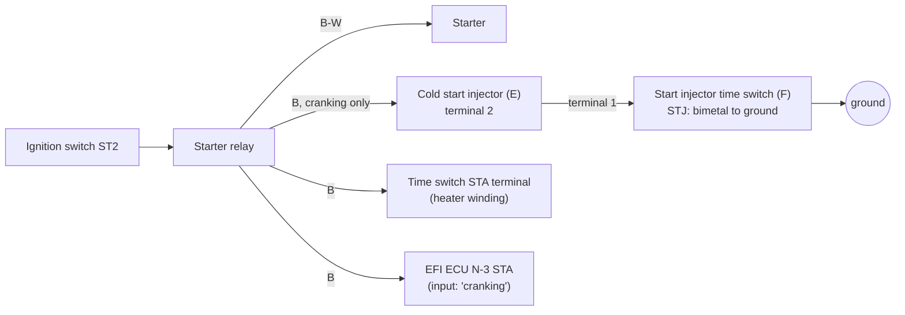
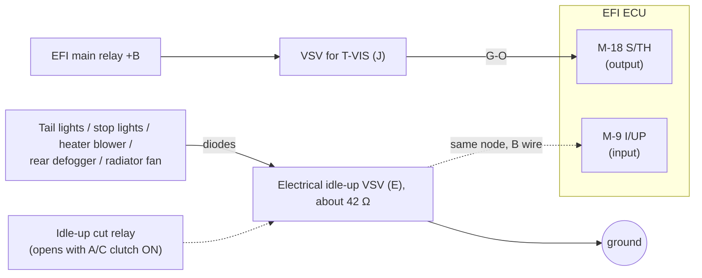

# Factory wiring diagram: MR2 AW11 EFI ECU (Nov 1984 edition)

**Source:** *Toyota Electrical Wiring Diagram, MR2 AW11 series, Nov. 1984*, "For Europe & General", Pub. No. 36711E (© 1986 Toyota). The owner supplied it as `UK_MK1_Electrical.pdf`: 62 scanned pages with no text layer.

The PDF is **not committed**, because it is Toyota copyright. This page records the facts the project needs. Each fact cites the printed page number (top of the page), with the PDF page in brackets.

**Source-of-truth level:** factory service documentation. It ranks below ROM bytes and bench measurements, and above the Ross PDF (see [`CLAUDE.md`](../../CLAUDE.md)).

> **Edition caveat.** This is the **1984 (mk1a-era)** edition. The owner's ECU is the mk1b **89661-17140**, whose board ([`aw11_ecu.md`](aw11_ecu.md)) has some pin labels that are missing here, and lacks some that are present here (see the [comparison](#1984-pinout-vs-the-17140-board-labels) below). Facts carried over to the 17140 are tagged **LIKELY** until a continuity test or a 1986–89 wiring diagram confirms them.

## What this settles for goal 1 (removing the IACV and cold start injector)

1. **The cold start injector (CSI) is not connected to the ECU.** It is powered from the starter circuit and grounded through the start injector time switch. The ECU only sees **STA**, the starter signal. [EWD p16–17 (PDF 10)]
2. **Idle air is not ECU-driven.**
   - The *electrical idle-up VSV* is switched directly by the electrical loads, through diodes. The ECU's **I/UP** pin only *senses* that VSV line. [p23, p28–29 (PDF 13, 16)]
   - The auxiliary air valve (IACV) is a mechanical wax valve and does not appear in the diagram at all.
> **1988 repair manual caveat.** On the 1988 US 4A-GE the ECU *does* drive the idle-up VSV, from a `V-ISC` output, during cranking and for 10 s after start ([`repair_manual_aw11_1988.md`](repair_manual_aw11_1988.md), FI-119). The 17140 board has a `VISC` pad. Point 2 is therefore proven for the **1984 car only**, and is open for the 17140 until continuity Test B and the ROM port audit settle it (STATUS Q2).

3. **Consequence:** removing the IACV or CSI takes away hardware the ECU neither drives nor monitors. Every ECU-side cold-start behaviour comes from **STA**, **THW**, **IDL** and **I/UP**. This is studied in P5 once the "Ross verified" gate has passed.

### Cold-start circuit [p16–17]

| Item | Factory spec |
|---|---|
| Cold start injector, 2→1 | 12 V while the start injector time switch is closed and the starter is cranking |
| Start injector time switch | Points **open above 35 °C (95 °F)** |
| Time switch STA–STJ (2–1) | 20–40 Ω below 30 °C; 40–60 Ω above 40 °C |
| Time switch STA–ground | 20–80 Ω |

### T-VIS (S/TH) and electrical idle-up [p23, p25, p28–29]

- **S/TH drives the T-VIS VSV.** Spec: M-18 to N-7 is **0–2 V at idle and 10–14 V above 4350 rpm** [p25]. This is factory evidence for Ross's mk1a T-VIS opening point of 4350 rpm ([claim R-I10](../ross/claims.md)).
- **Idle-up VSV:** about 42 Ω (pins 1–2). Pin 1 to ground reads 12 V with the tail lights, stop lights, heater blower, rear defogger or radiator fan on. The idle-up cut relay contacts (3–4) open when the A/C magnet clutch is on [p29].

## ECU connector pinout (1984)

The ECU has three connectors: **L** (14-pin), **M** (18-pin) and **N** (10-pin), which matches the case label's 14P/18P/10P. The connector face drawings are on p26 (PDF 15). Pins not listed are not shown in the diagram (unused, or for other markets).

| Conn-pin | Name | Wire | Connects to | Direction |
|---|---|---|---|---|
| L-1 | +B1 | B | EFI main relay output | power |
| L-2 | BATT | W-R | Battery (via N1-13), memory supply | power |
| L-4 | FC | G-R | Circuit opening relay coil (fuel pump control) | output |
| L-8 | +B | B | EFI main relay output | power |
| L-9 | DG | G-W | Diagnostic (combination meter / check connector) | output |
| L-11 | A/C | B-W | From A/C amplifier (A/C switch on) | input |
| L-12 | SPD | V-W | Speed sensor in the combination meter | input |
| L-14 | VAF | R | **CO control resistor** (EUR mixture screw), wiper, 5 kΩ | input |
| M-1 | THW | W | Water thermo sensor | input |
| M-2 | PIM | LG-R | Vacuum sensor output | input |
| M-3 | THA | Y | Air thermo sensor | input |
| M-4 | T | W | Service connector T (diagnostic test) | input |
| M-5 | IGF | B-Y | Igniter IGF (spark confirmation) | input |
| M-6 | G+ | B | Distributor G pickup + | input |
| M-7 | G− | R | Distributor G pickup − | input |
| M-8 | IGT | B-W | Igniter IGT (spark trigger) | output |
| M-9 | I/UP | B | Electrical idle-up VSV line (load sense) | input |
| M-10 | E2 | BR | Sensor ground | ground |
| M-11 | VTA | R | Throttle position sensor, potentiometer | input |
| M-12 | VCC | Y | 5 V sensor supply (TPS, vacuum sensor, CO resistor) | output |
| M-13 | IDL | B | Throttle idle contact | input |
| M-15 | NE | W | Distributor NE pickup | input |
| M-16 | E21 | BR | Sensor ground | ground |
| M-17 | VF | R-W | Service connector VF (feedback/CO check) | output |
| M-18 | S/TH | G-O | VSV for T-VIS | output |
| N-3 | STA | B | Starter signal | input |
| N-4 | #10 | L | Injectors No.1 and No.3 | output |
| N-5 | E01 | BR | Power ground | ground |
| N-6 | BF | W | Injector supply after the 10 A INJ fuse and injector relay. **LIKELY** used for battery-voltage (dead-time) correction | input |
| N-7 | E1 | BR | ECU ground | ground |
| N-9 | #20 | Y | Injectors No.2 and No.4 | output |
| N-10 | E02 | BR | Power ground | ground |

Notes:
- The injectors are wired as **two groups**, No.1+3 on #10 and No.2+4 on #20. Ross says the ECU straps #10 and #20 together inside, which would make injection simultaneous ([R-F22](../ross/claims.md)).
- G+ to G− (M-6 to M-7) reads 140–180 Ω; that is the distributor pickup coil.

## Factory test values [p25]

| Check | Spec |
|---|---|
| L-2 to N-7 | 10–14 V (always) |
| L-1, L-8 to N-7 | 10–14 V (ignition on) |
| M-13 (IDL) to M-10 | 4–6 V throttle open; resistance ∞ open, < 2.3 kΩ closed |
| M-11 (VTA) to M-10 | 0.1–1.0 V closed, 4–5 V wide open; 0.2–0.6 kΩ closed, 3.3–10 kΩ wide open |
| M-4 (T) to N-7 | 10–14 V with T–E1 open; 0 V with T–E1 shorted |
| M-3 (THA) to M-10 | 1–3 V at 20 °C; 2–3 kΩ at 20 °C |
| M-1 (THW) to M-10 | 0.1–0.5 V at 80 °C; 0.2–0.4 kΩ at 80 °C |
| N-3 (STA) to N-7 | 6–14 V with the ignition switch at ST |
| M-18 (S/TH) to N-7 | 0–2 V idling; 10–14 V above 4350 rpm |
| L-11 (A/C) to N-7 | > 7 V with A/C on; < 0.5 V with A/C off |
| N-4, N-9 (#10, #20) to N-7 | 10–14 V (ignition on) |
| M-12 (VCC) to M-10 | about 5 V (ignition on) |
| Injector, each | 1.5–3.0 Ω |
| Circuit opening relay | Closed with the starter running, or the engine running above 5 rpm |
| CO control resistor 2–3 | about 5 kΩ |
| TPS | 2–4: 0.2–0.8 kΩ at 0 mm lever gap; 3–4: < 2.3 kΩ at 0.35 mm gap, ∞ at 0.59 mm; 2–4: 3.3–10 kΩ wide open; 1–4: 3–7 kΩ |

**Sensor transfer curves** (vacuum sensor, coolant and air thermistors) are in [`analysis/sensors/`](../../analysis/sensors/) as CSV files, with a note on every ambiguous scan digit. They are the first scaling ground truth for `analysis/defs/*.yaml`, and the P8 Arduino Zero sensor characterisation will check them.

## 1984 pinout vs the 17140 board labels

| On both | Only in the 1984 diagram | Only on the 17140 board |
|---|---|---|
| E01, E02, E1, E2, E21, #10, #20, IGT, IGF, STA, NE, G−, VF, T, IDL, VTA, VCC, THA, PIM, THW, SPD, A/C, FC, BATT, +B, +B1, **STH = S/TH** | DG, **VAF**, **I/UP**, BF, G+ | ACT, FPU, NSW, **VISC**, **OX**, G1, L1, L2, L3, ECT, EGW, CCO, W |

Hypotheses for the 17140, each to be settled by the continuity test in [`aw11_ecu.md`](aw11_ecu.md):
- **`VISC` = V-ISC**, the ECU's idle-up VSV **output** (cranking + 10 s), as on the 1988 US car. LIKELY for the board design; whether the UK 17140 drives it is open. The older idea that `VISC` ≈ I/UP (a sense input) is now the less likely reading. GUESS.
- **`OX` carries the CO control resistor** (the mixture screw) instead of VAF. This fits Ross's claim R-M08 that the 17140 reads the screw on a different pin. GUESS.
- **`G1` ≈ G+.** LIKELY.
- **`W`** is the check-engine lamp output, which is probably what the 1984 `DG` pin did. LIKELY.
- **`FPU`** is the ECU's low-side output for the fuel-pressure-up VSV (the 1988 "high temperature line pressure up" hot-restart system). Probably unused on UK cars. GUESS.
- `ACT`, `NSW`, `L1`–`L3`, `ECT`, `EGW` and `CCO` are other-market or automatic-gearbox functions and are probably unused on the UK manual car. GUESS.

A 1986–89 **UK** mk1b wiring diagram would settle most of these (STATUS Q9). The 1988 repair manual is mk1b-era but US-spec; see its [comparison table](repair_manual_aw11_1988.md#1984-ewd-vs-1988-repair-manual).
