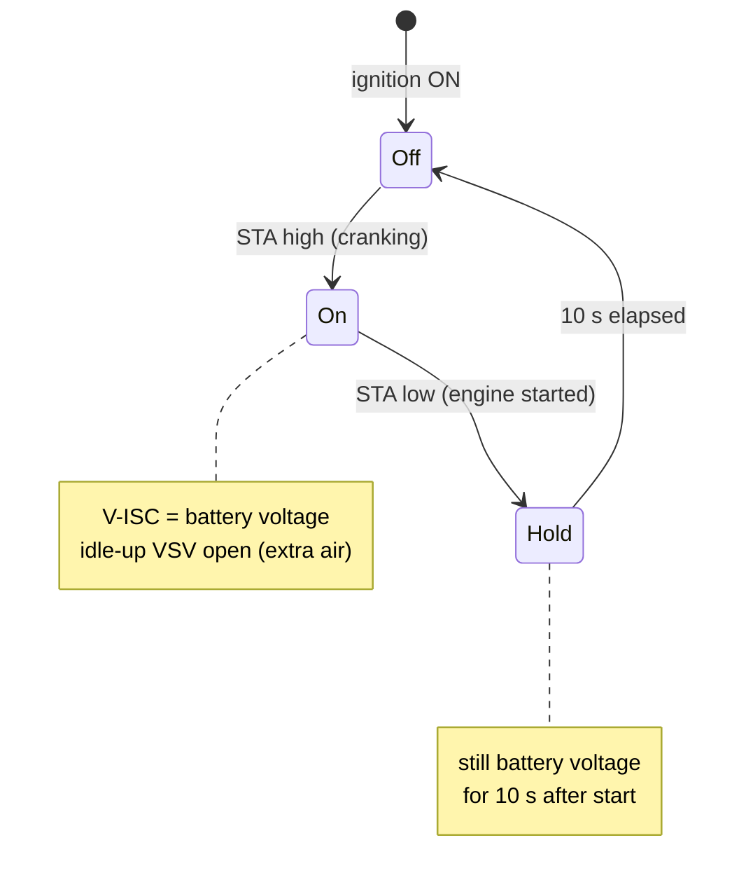
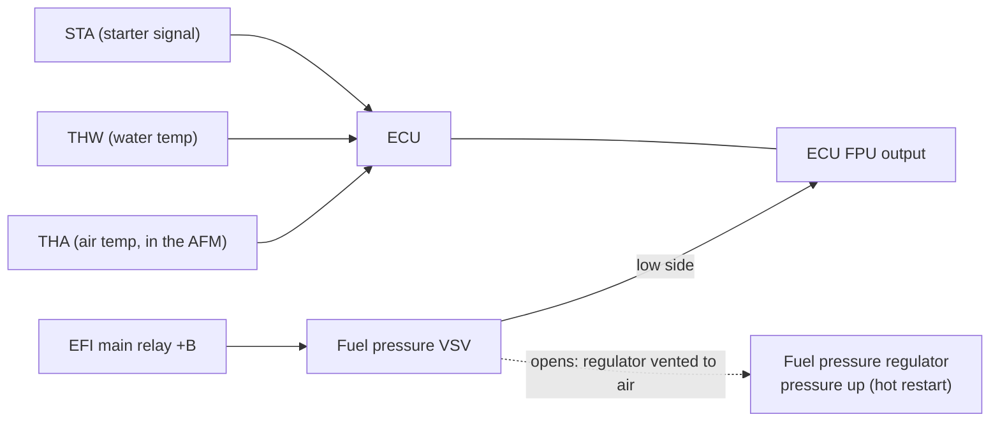

# Factory repair manual: MR2 AW11, 1988 edition (4A-GE EFI facts)

**Source:** *Toyota MR2 AW11 Repair Manual, 1988*. The owner supplied it as `AW11 1988 Repair Manual.pdf`: about 1,000 scanned pages with no text layer.

The PDF is **not committed**, because it is Toyota copyright. This page records only the facts the project needs. Each fact cites the printed page (for example FI-119), with the PDF page in brackets.

**Source-of-truth level:** factory service documentation. It ranks below ROM bytes and bench measurements, and above the Ross PDF (see [`CLAUDE.md`](../../CLAUDE.md)).

> **Edition caveat.** This manual covers the **US / general-export 4A-GE**, with an air flow meter (VC/VS), an oxygen sensor (OX/HT), California EGR (THG), A/T lines (NSW, L1–L3, ECT) and the 4A-GZE. The owner's car is the **UK mk1b 89661-17140**, which uses a vacuum sensor (PIM) and has no O2 sensor. This manual is therefore the **closest era** to the 17140 but the **wrong market**, while the [1984 wiring diagram](ewd_aw11_1984.md) is the right market but the wrong era. Facts carried over to the 17140 are tagged **LIKELY** or **GUESS** until a continuity test or the ROM confirms them (STATUS Q2, Q9).

## What this changes for goal 1 (removing the IACV and cold start injector)

1. **The cold start injector is still not ECU-driven.** It is fed from the starter circuit and grounded through the start injector time switch, exactly as in 1984. [FI-73 (PDF 268); FI-115 to FI-116 (PDF 310–311)] CONFIRMED for the 1988 US car.
2. **On the 1988 US car the ECU *does* drive the idle-up VSV**, from a dedicated output called **V-ISC**:
   - battery voltage is applied to the VSV **during cranking and for 10 seconds after starting** [FI-119 (PDF 314)];
   - the VSV sits between V-ISC and ground, so the ECU switches it on the **high side**;
   - STA is the only input shown, so the trigger is cranking plus a timer.
   In the 1984 diagram, by contrast, the idle-up VSV is switched by the electrical loads and the ECU only *senses* it on I/UP.
3. **The aux air valve (IACV) is still a mechanical wax valve** [FI-108 (PDF 303)]. The ECU does not drive or sense it.
4. **The 17140 board carries a `VISC` pad**, and also `FPU`. So the board is *designed* for an ECU-driven start-up idle-up. Whether the UK 17140 actually uses it is **open**:
   - Continuity **Test B** in [`aw11_ecu.md`](aw11_ecu.md) shows whether `VISC` is driven by an output transistor or only sensed.
   - The **ROM port audit** (P4) shows whether the 17140 code ever writes that port bit.

**Consequence for goal 1:** removing the IACV still removes hardware the ECU neither drives nor monitors. But if the 17140 drives `VISC`, the ECU itself adds start-up air for about 10 s after every start, and that is ECU behaviour P5 must model. Removing the idle-up VSV (or blocking its hose) would remove that air too.

### V-ISC start-up idle-up [FI-119]

### High-temperature line-pressure-up (FPU) [FI-118 (PDF 313)]

- The fuel pressure VSV is fed from +B and **grounded by the ECU's FPU pin** (low-side switch).
- It is the *"High Temperature Line Pressure Up System"*: on a hot restart, the ECU raises fuel pressure to fight vapour lock. The ECU decides from STA, THW and THA. LIKELY (the decision logic is not printed; it is inferred from the inputs drawn).
- For goal 1 this is a **hot-start** feature, not a cold-start one. It is recorded because `FPU` is on the 17140 board.

## 4A-GE ECU terminals (1988) [FI-29 to FI-30 (PDF 224–225)]

| Symbol | Terminal | Direction | Note |
|---|---|---|---|
| E01, E02 | Engine ground (power) | ground | |
| No.10 | **No.3 and No.4** injectors | output | The 1984 EWD wires #10 to No.1+3; see the comparison below |
| No.20 | **No.1 and No.2** injectors | output | |
| STA | Starter switch | input | 6–14 V at ST with the clutch pressed (M/T) |
| IGT | Igniter | output | 0.7–1.0 V idling |
| VF | Service connector | output | |
| E1 | Engine ground | ground | |
| NSW | Neutral start switch | input | A/T only |
| S/TH | VSV (T-VIS) | output | |
| **FPU** | **VSV (FPU)** | **output** | Low-side switch, see above |
| **V-ISC** | **VSV (ISC)** | **output** | Idle-up during cranking + 10 s, see above |
| W | Warning light | output | 9–14 V with no fault and the engine running (lamp off) |
| HT | Oxygen sensor heater | output | |
| T | Service connector | input | |
| IDL | Throttle position sensor (idle contact) | input | |
| A/C | A/C magnet clutch | input | 5–14 V with A/C on |
| IGF | Igniter (confirmation) | input | |
| E2, E21 | Sensor ground | ground | |
| G−, G+ | Engine revolution sensor (cam position) | input | |
| OX | Oxygen sensor | input | |
| VCC | Throttle position sensor supply | output | 4–6 V |
| THG | EGR temperature sensor | input | California only |
| VTA | Throttle position sensor | input | |
| NE | Engine revolution sensor | input | |
| THW | Water temperature sensor | input | 0.1–1.0 V at 80 °C |
| L1, L2, L3, ECT | ECT computer | in/out | A/T only |
| VC, VS | Air flow meter | out/in | US AFM. The UK car uses PIM instead |
| STP | Stop light switch | input | |
| THA | Inlet air temperature sensor | input | 1–3 V at 20 °C |
| SPD | Speedometer sensor | input | |
| BATT | Battery | power | |
| +B, +B1 | EFI main relay | power | 10–14 V ignition ON |

The connector face drawing (FI-29) has three connectors. Read left to right, top row then bottom row:
- `E01 No10 STA VF NSW` / `E02 No20 IGT E1 S/TH`
- `FPU W T IDL IGF G− G+ THG NE` / `V-ISC HT – A/C E2 OX VCC VTA THW`
- `L3 L1 VC VS THA BATT +B1` / `ECT L2 E21 STP SPD – +B`

## Specifications

| Item | Spec | Page | Confidence for the 17140 |
|---|---|---|---|
| Start injector time switch, STA–STJ | 20–40 Ω below 30 °C; 40–60 Ω above 40 °C | FI-115 to FI-116 (PDF 310–311) | LIKELY (same as 1984) |
| Cold start injector resistance | 3–5 Ω | FI-73 (PDF 268) | LIKELY |
| Auxiliary air valve | Coolant wax type; check it is open below 80 °C | FI-108 (PDF 303) | LIKELY |
| Fuel cut rpm (decel) | Cut at **1600 rpm** (A/C off) / 1900 rpm (A/C on); return at **1200 rpm** / 1500 rpm | FI-128 (PDF 323) | GUESS (US calibration) |
| Base ignition timing | **10° BTDC at idle, with T–E1 shorted** | IG section (PDF 364–367) | LIKELY |
| Injector resistance | about **13.8 Ω** (4A-GE, high impedance); about 2.9 Ω (4A-GZE) | FI-80 (PDF 275) | GUESS (1984 says 1.5–3.0 Ω) |
| Fuel pressure | 265–304 kPa | Service specs (PDF 980–992) | LIKELY |
| Throttle body, fully closed angle | 6° | Service specs (PDF 980–992) | LIKELY |
| THW / THA thermistor | −20 °C 10–20 kΩ … 80 °C 0.2–0.4 kΩ | FI-116 (PDF 311), FI-94 (PDF 289) | LIKELY (agrees with [`analysis/sensors/`](../../analysis/sensors/)) |
| Thermostat | Opens at 80–84 °C; fully open at 95 °C | Service specs (PDF 980–992) | LIKELY |
| Ignition coil | Primary 0.5–0.7 Ω; secondary 11–16 kΩ | IG section (PDF 364–367) | LIKELY |
| Distributor pickups (G, NE) | 140–180 Ω | IG section (PDF 364–367) | LIKELY (same as 1984) |
| T-VIS (S/TH) | VSV switches **above 4350 rpm** | FI section (page not yet re-checked) | LIKELY for mk1a; Ross says 4650 for mk1b (R-I10) |
| EGR gas temp sensor (Calif.) | 69.4–88.5 kΩ at 50 °C; 11.89–14.37 kΩ at 100 °C; 2.79–3.59 kΩ at 150 °C | FI-117 (PDF 312) | Not fitted to the UK car |

The tuning-relevant numbers to check against the 17140 ROM are the **fuel cut and return rpm** (Ross R-F25, the Bluetop's `DecelCutRPM`) and the **base timing of 10° BTDC with T–E1 shorted**. The base timing gives the fixed reference that the raw-to-degrees conversion (STATUS Q3, Ross R-I06) must reproduce.

## 1984 EWD vs 1988 repair manual

| Topic | 1984 EWD (Europe, mk1a era) | 1988 RM (US / general, mk1b era) | 17140 board | Status |
|---|---|---|---|---|
| Load sensing | Vacuum sensor PIM | Air flow meter VC/VS | `PIM` | The UK car is speed-density, like 1984 |
| Idle-up VSV | Load-switched; ECU **senses** on I/UP | ECU **drives** on V-ISC (cranking + 10 s) | `VISC`, no `I/UP` | **Open**: Test B + ROM port audit |
| Fuel-pressure-up VSV | Absent | ECU drives on FPU | `FPU` | Open: probably unused on UK cars (GUESS) |
| Cold start injector | Time switch, not ECU | Time switch, not ECU | no CSI pin | Agreed: not ECU-driven |
| Mixture adjust | CO resistor on VAF | O2 sensor on OX (closed loop) | `OX`, no `VAF` | STATUS Q7/Q8 |
| Check-engine lamp | DG | W | `W` | `W` = warning lamp, LIKELY |
| Injector grouping | #10 = No.1+3; #20 = No.2+4 | No.10 = No.3+4; No.20 = No.1+2 | `#10`, `#20` | Different harness grouping. Irrelevant if the ECU joins them internally (R-F22) |
| Injector resistance | 1.5–3.0 Ω (low impedance) | about 13.8 Ω (high impedance) | n/a | Measure the UK car's injectors before P8 |
| T-VIS | S/TH, above 4350 rpm | S/TH, above 4350 rpm | `STH` | Agreed for the factory spec |
