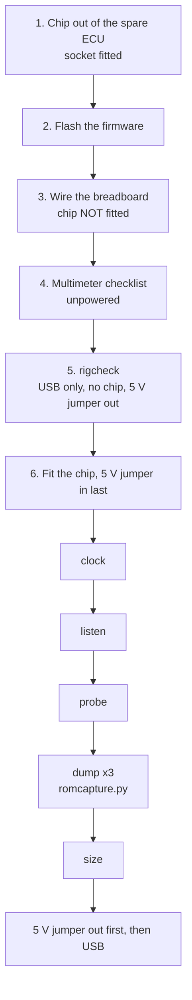
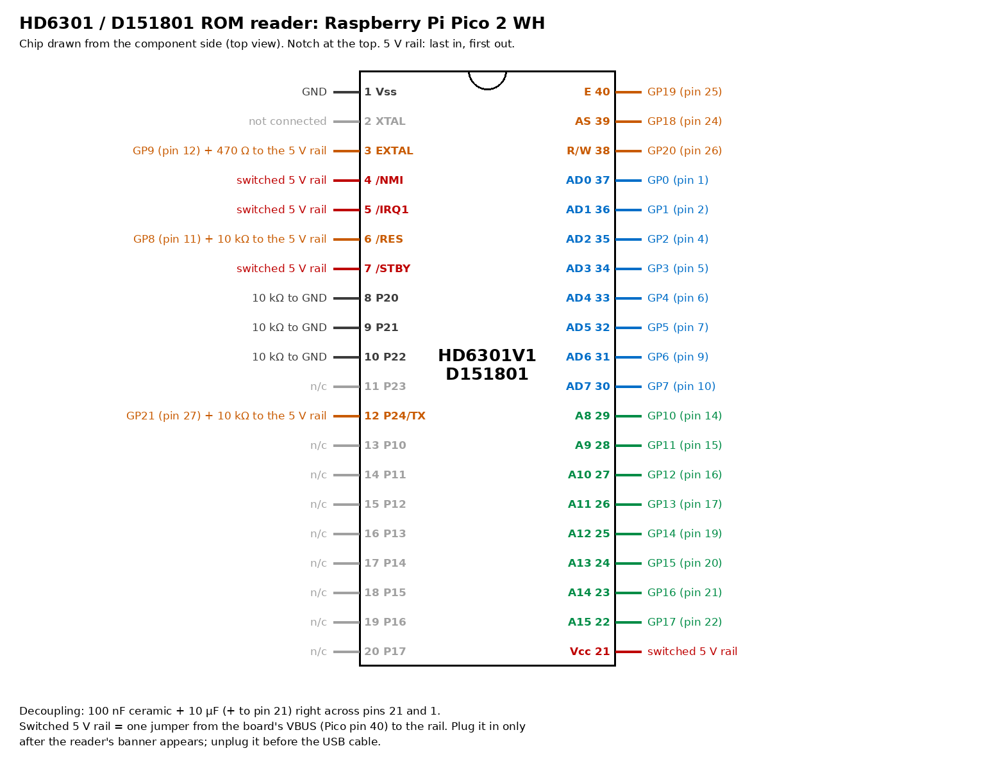
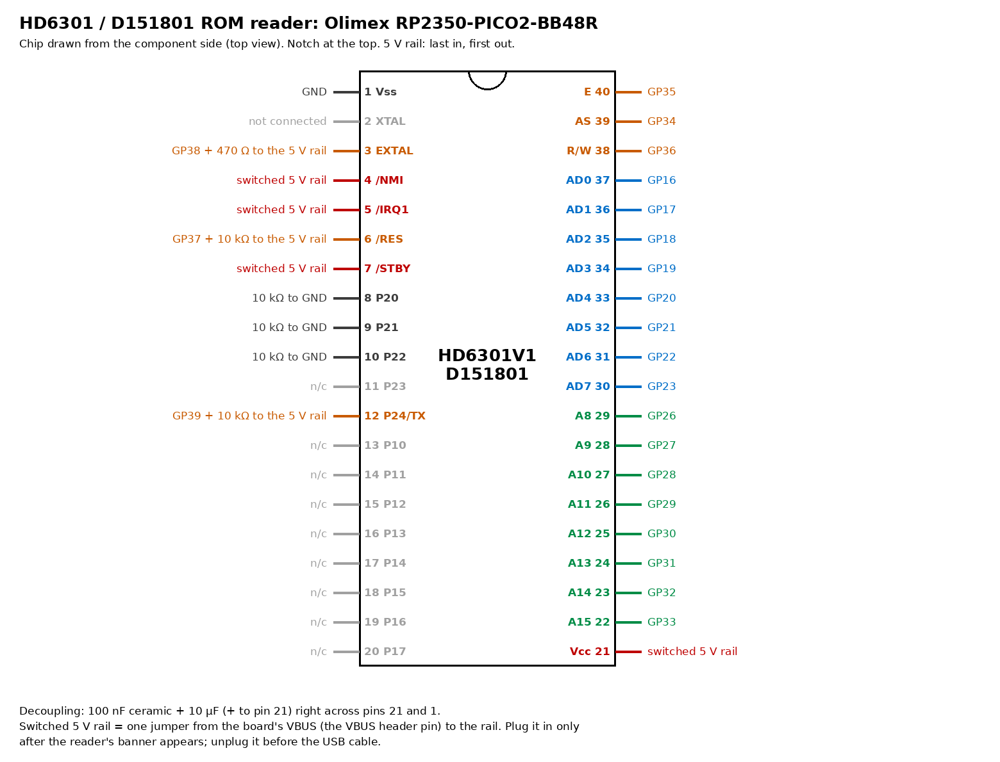

# RP2350 ROM reader: build and dump guide (P3)

This guide takes the spare 89661-17140 ECU's CPU (IC7, the D151801-7110) from the board to a verified ROM file. The reader is one RP2350 board and a few resistors on a breadboard. There are no level shifters: the RP2350's pins take 5 V while the board is powered. It runs on either the **Raspberry Pi Pico 2 WH** (first build) or the **Olimex RP2350-PICO2-BB48R**: the same firmware with a different pin map.

How it works is in [RE_PLAN §6a](../RE_PLAN.md#6a-rp2350-rom-reader-p3). In short, the RP2350 does four jobs:
- clocks the chip;
- holds it in reset until its clock is steady;
- serves it a 43-byte program;
- receives the ROM over the chip's own serial port, while also listening to the bus as a second copy.

**Parts:** [`../../hardware/BOM.md`](../../hardware/BOM.md) section A.



## Rules for every powered step

The agent asks for your go-ahead before each powered step (CLAUDE.md, hardware safety).

1. **USB first, 5 V jumper last. 5 V jumper out first, USB last.** The RP2350's pins are 5 V tolerant only while the RP2350 itself is powered.
2. Insert or remove the chip only with **USB unplugged**.
3. The mode pins (8, 9, 10) go to GND **through 10 kΩ**, never with a bare wire.
4. Touch a grounded point (or wear the strap) before handling the chip. It is the only D151801 we have.

---

## 1. Take the chip out of the spare ECU

1. **Photograph IC7 first.** Note the notch end: the notch is at the X-TAL end and pin 1 is corner B in [`step1-ic7-corners.jpg`](photos/89661-17140/guide/step1-ic7-corners.jpg) ([`aw11_ecu.md`](aw11_ecu.md#ic7-pin-numbering)). Mark pin 1 on the board with a pen.
2. **Clear the conformal coat** from the 40 solder joints on the underside with IPA and a stiff brush. Coating left on a joint stops the solder melting cleanly.
3. **Desolder each joint:**
   - add a little fresh solder and flux;
   - heat it and use the pump;
   - clear what remains with braid.

   Work along one row, then the other. Let the board cool between groups of 10.
4. **Check every pin is free:** each one should wiggle in its hole. Re-do any that are stuck. Never lever the chip out with force.
5. **Backup method, if pins stay stuck:**
   - run Chip Quik low-melt alloy along both rows, keeping them molten, and lift the chip evenly;
   - then remove **all** the low-melt alloy from the pads with braid and fresh solder before fitting the socket. Leftover low-melt alloy makes weak joints.
6. **Fit the turned-pin DIP-40 socket** with its notch at the same end as the chip's was, and solder it. Check with the meter that socket hole 1 beeps to the ECU ground and hole 21 to the ECU's +5 V.
7. Put the chip in anti-static foam or foil, with pin 1 marked.

**Optional measurement (open question Q10):** with the chip out, node N and pins 8–10 can be measured in the **powered** ECU. This is done only with your confirmation at the time; the agent will walk you through it.

## 2. Flash the firmware

1. Get the UF2 file for your board:
   - GitHub → **Actions** → the latest **ci** run on this branch → **Artifacts**: `rp2350_reader_pico2_w` (Pico 2 WH) or `rp2350_reader_olimex_rp2350_pico2_bb48` (BB48R);
   - or build it: see [`../../hardware/rp2350-reader/firmware/CMakeLists.txt`](../../hardware/rp2350-reader/firmware/CMakeLists.txt).
2. Hold **BOOTSEL** (on the BB48R: the boot button) while plugging in USB. A drive called `RP2350` appears.
3. Copy the `.uf2` onto it. The board restarts as the reader.
4. Open a serial terminal on its port (any baud rate):
   - PuTTY on Windows (COMx);
   - `screen /dev/tty.usbmodem* ` on macOS;
   - or, anywhere: `uv run --with pyserial python -m serial.tools.miniterm <port> 115200`.

   Press Enter. You should see:

```
HD6301 ROM reader on Raspberry Pi Pico 2 W(H)
Wiring: AD0 GP0, A8 GP10, AS GP18, E GP19, R/W GP20, RES GP8, EXTAL GP9, SCI GP21
RES is held low. Plug the 6301 5 V jumper in only now; unplug it before USB.
Commands: rigcheck  clock  listen  probe  dump  size  help
>
```

Unplug USB again before wiring.

## 3. Wire the breadboard (chip NOT fitted)

Put the board along one end of the breadboard and leave room for the chip to straddle the centre gap, notch towards the board. Wire the chip's holes, not the chip. "The 5 V rail" is a separate breadboard rail strip, fed by **one** jumper from the board's VBUS: this is the **5 V jumper**, and it stays out until step 6.

<!-- generated: python -m pcmre.wiring (from pins.h); tests/test_wiring.py checks these tables -->

**Raspberry Pi Pico 2 WH**



| 6301 pin | Signal | GPIO | Pico pin | Also |
|---|---|---|---|---|
| 3 | EXTAL | GP9 | 12 | 470 Ω to the 5 V rail |
| 6 | /RES | GP8 | 11 | 10 kΩ to the 5 V rail |
| 12 | P24/TX | GP21 | 27 | 10 kΩ to the 5 V rail |
| 22 | A15 | GP17 | 22 |  |
| 23 | A14 | GP16 | 21 |  |
| 24 | A13 | GP15 | 20 |  |
| 25 | A12 | GP14 | 19 |  |
| 26 | A11 | GP13 | 17 |  |
| 27 | A10 | GP12 | 16 |  |
| 28 | A9 | GP11 | 15 |  |
| 29 | A8 | GP10 | 14 |  |
| 30 | AD7 | GP7 | 10 |  |
| 31 | AD6 | GP6 | 9 |  |
| 32 | AD5 | GP5 | 7 |  |
| 33 | AD4 | GP4 | 6 |  |
| 34 | AD3 | GP3 | 5 |  |
| 35 | AD2 | GP2 | 4 |  |
| 36 | AD1 | GP1 | 2 |  |
| 37 | AD0 | GP0 | 1 |  |
| 38 | R/W | GP20 | 26 |  |
| 39 | AS | GP18 | 24 |  |
| 40 | E | GP19 | 25 |  |

The 5 V jumper runs from Pico pin 40 (VBUS) to the 5 V rail.

**Olimex RP2350-PICO2-BB48R** (GPIO numbers as printed on the board; never use GP40–47, which are not 5 V tolerant)



| 6301 pin | Signal | GPIO | Also |
|---|---|---|---|
| 3 | EXTAL | GP38 | 470 Ω to the 5 V rail |
| 6 | /RES | GP37 | 10 kΩ to the 5 V rail |
| 12 | P24/TX | GP39 | 10 kΩ to the 5 V rail |
| 22 | A15 | GP33 |  |
| 23 | A14 | GP32 |  |
| 24 | A13 | GP31 |  |
| 25 | A12 | GP30 |  |
| 26 | A11 | GP29 |  |
| 27 | A10 | GP28 |  |
| 28 | A9 | GP27 |  |
| 29 | A8 | GP26 |  |
| 30 | AD7 | GP23 |  |
| 31 | AD6 | GP22 |  |
| 32 | AD5 | GP21 |  |
| 33 | AD4 | GP20 |  |
| 34 | AD3 | GP19 |  |
| 35 | AD2 | GP18 |  |
| 36 | AD1 | GP17 |  |
| 37 | AD0 | GP16 |  |
| 38 | R/W | GP36 |  |
| 39 | AS | GP34 |  |
| 40 | E | GP35 |  |

**Both boards: the chip's other pins**

| 6301 pin | Name | Connect to |
|---|---|---|
| 1 | Vss | GND (any GND pin on the board) |
| 21 | Vcc | switched 5 V rail; 100 nF and 10 µF from pin 21 to pin 1, at the chip |
| 7 | /STBY | switched 5 V rail (/STBY high: run) |
| 4 | /NMI | switched 5 V rail (/NMI inactive) |
| 5 | /IRQ1 | switched 5 V rail (/IRQ1 inactive) |
| 8 | P20 | 10 kΩ to GND (mode bit 0) |
| 9 | P21 | 10 kΩ to GND (mode bit 1) |
| 10 | P22 | 10 kΩ to GND (mode bit 2) |
| 2 | XTAL | not connected (XTAL) |
| 11, 13–20 | P23, P10–P17 | not connected |

<!-- end generated -->

The 10 µF capacitor is polarised: its + leg goes to pin 21 (the 5 V side). Keep the two capacitors' legs short.

The unused port pins (11, 13–20) are CMOS inputs left open. That is safe for short runs. If you have spare resistors, 47–100 kΩ from each to the 5 V rail keeps them quiet; never tie them straight to a rail.

## 4. Multimeter checklist (nothing powered)

The agent goes through this with you **one line at a time**. Report each reading before moving on.

1. **Every signal wire:** beep from the chip hole to the board pin, for each row of the board table (22 rows).
2. **Neighbours:** no beep between adjacent chip holes on each side (1–2, 2–3 … 39–40). A beep means a short.
3. **Resistors:**
   - chip hole 3 to the 5 V rail: 470 Ω;
   - holes 6 and 12 to the rail: 10 kΩ;
   - holes 8, 9 and 10 to GND: 10 kΩ each.
4. **Rail straps:** holes 21, 7, 4 and 5 beep to the 5 V rail; hole 1 beeps to GND.
5. **Rail to GND:** with the jumper out, the 5 V rail must not beep to GND (it reads open, or climbs as the 10 µF charges).
6. **Polarity:** the 10 µF + leg is on the pin 21 side.

## 5. `rigcheck` (USB only, no chip, 5 V jumper out)

**The chip must be out of the breadboard.** `rigcheck` cannot tell an unpowered chip from an empty socket, and its pull-ups would feed the chip through its input diodes.

Plug in USB and type `rigcheck`. It pulls every bus line up gently, then pulls each one low in turn, looking for lines stuck low or shorted together.

```
rigcheck: PASS (no stuck or shorted lines)
```

If it reports that the 5 V rail is on, the jumper is in: take it out. Any other failure names the 6301 pins involved; fix the wiring and repeat.

## 6. Fit the chip and power it

1. **Unplug USB.** Fit the chip, with the notch towards the board, straddling the gap and fully seated.
2. Plug in USB and wait for the banner. RES is now held low and the clock is running.
3. **Plug in the 5 V jumper.**

### `clock`

```
E: 250000 Hz, high 50% of the time (want 250000 Hz, about 50%)
clock: PASS
```

E is the chip's own output at EXTAL/4, so this proves the chip is powered and clocked. This measurement replaces a scope.

With the meter, check the 5 V rail at chip pin 21 (4.75–5.25 V). RES (pin 6) reads near 0 V now, because the reader holds it low.

### `listen`

RES is released for 5 ms while the reader **drives nothing**. The log shows the chip's first bus cycles: `$FFFF`, `$FFFE`, `$FFFF` near the top is the reset-vector fetch. After that the chip runs from a floating vector, which is harmless because nothing is driven. Send the agent the whole log.

```
listen: vector fetch at cycle 1 reads $FEFF (floating bus, external as expected) -> PASS
```

With nothing driving, the vector reads float and echo the address bus (`$FE`, `$FF`). This is the check that the vector really is external in mode 0. **If it says STOP, do not run `probe` or `dump`**: the chip may be driving its vector itself, and serving it would make both chips drive the bus. Send the log to the agent.

### `probe`

The reader serves only the reset vector (`$C0C0`) and a 2-byte loop at `$C0C0`.

```
probe: vector served yes, $C0C0 fetched yes, late cycles 0 -> PASS
```

### `dump`

Run it through the capture tool, so the result is saved and checked (close the serial terminal first):

```
PYTHONPATH=analysis uv run --with pyserial python -m pcmre.romcapture <port>
```

The reader runs the dump **three times** (about 3 s each). It checks four things before printing the ROM:
- the latched mode is 0;
- all three runs are identical;
- how much of the snoop channel agrees (`$FFFF` is not compared: the 6301's dummy cycles read it too);
- the 16-bit word sum and the vectors.

The tool then:
- saves `AW11 MR2 PCM/89661-17140.bin` and its SHA-256;
- refuses to overwrite an existing file that differs.

Then type `size` in the terminal. It reports whether `$E000`–`$EFFF` is also internal ROM; a 4 KB ROM is expected.

**Finish: 5 V jumper out, then USB out.**

## Troubleshooting

| Symptom | Likely cause | What to do |
|---|---|---|
| `clock` reports 0 Hz | 5 V jumper out; chip not seated; EXTAL not reaching pin 3 | Check the jumper, then the multimeter checklist steps 1–4 for pins 3, 21 and 1 |
| `clock` frequency is wrong, or E is high nearly all the time | EXTAL pull-up missing or wrong value; XTAL (pin 2) wired by mistake | 470 Ω from pin 3 to the rail; pin 2 open |
| `listen` shows no cycles | AS (39) or E (40) not wired; RES not rising | Check pins 39, 40 and 6, and the 10 kΩ RES pull-up. RES must reach 4.5 V when released; if it does not, the agent will have you swap its pull-up to 4.7 kΩ |
| `listen` says STOP | The vector did not float, or came late | Do not run `probe` or `dump`. Send the log to the agent |
| `listen` shows endless odd activity, never `$FFFE` | Wrong mode: a strap missing (upstream issue #4) | Pins 8, 9 and 10 each 10 kΩ to GND |
| `probe` FAIL with `$FFFE` at cycle 3 or later | The chip fetches its vector later than the handbook's window | Send the log to the agent. Do not change the window: outside it, the vector is internal |
| `late cycles` above 0 | The RP2350 could not answer before E rose; it stopped driving for the rest of that run, so the run fails | Report it; it should never happen at 250 kHz |
| `wrong mode` in `dump` | A mode strap is wrong | As for "endless odd activity" |
| `runs differ` | A loose wire or a marginal connection | Re-seat the chip and jumpers, then repeat; never accept a dump that differs |
| `ABORT: bus stopped` | The 5 V jumper came out, or the chip lost its clock | RES is already held low; check the jumper and wiring |

## After the dump

An independent Verifier re-checks the capture before P4 starts:
- the hashes;
- that the snoop and SCI channels agree;
- that `pcmre` disassembles the image cleanly.

Keep the chip in its socket in the spare ECU. The socket also serves the P4 real-CPU harness.
