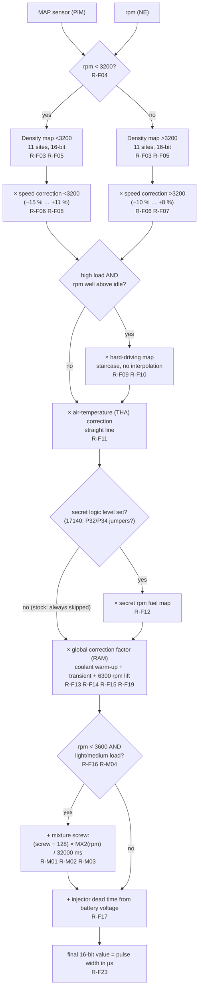
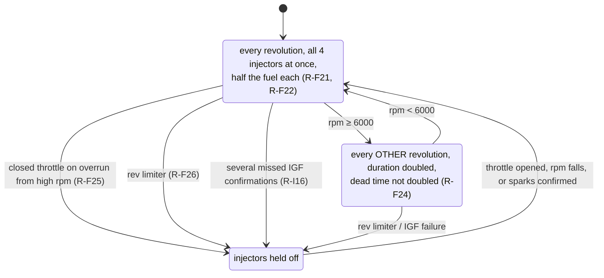
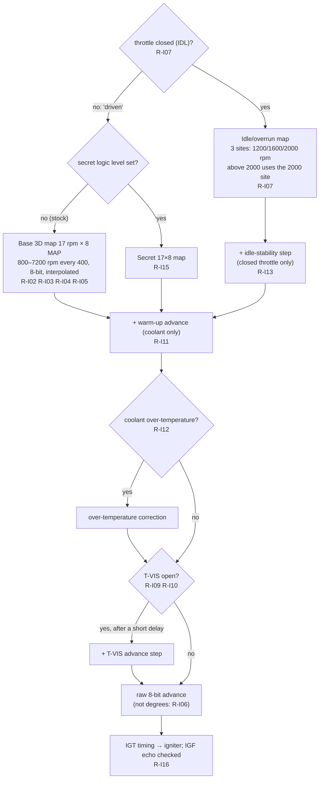
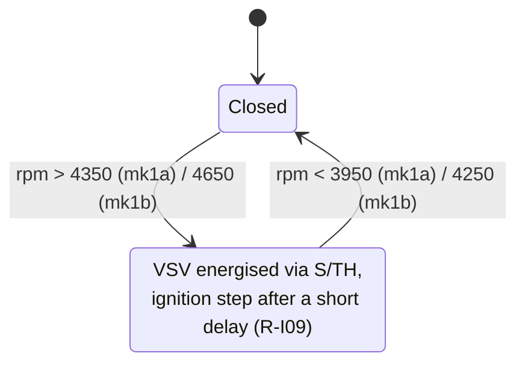
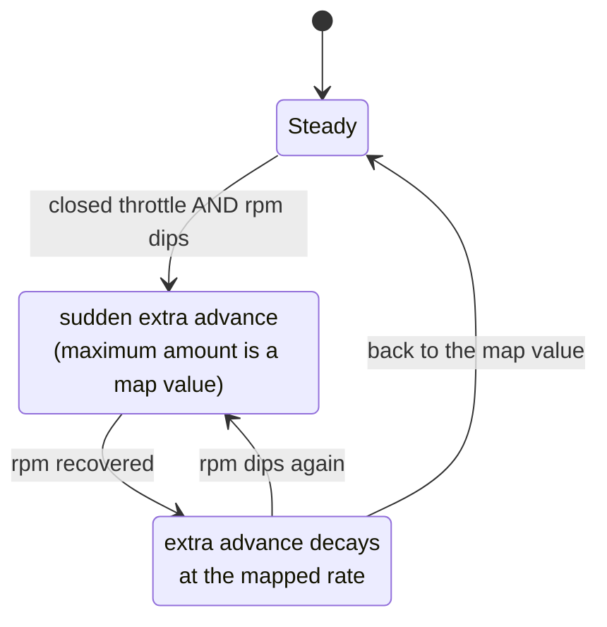
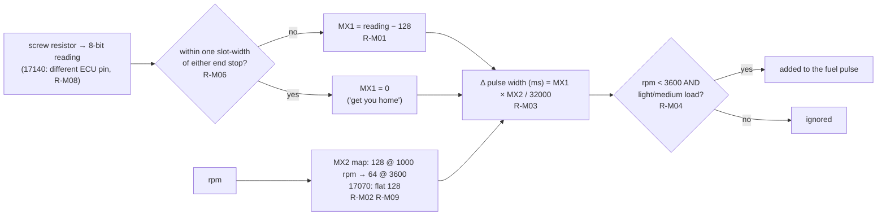
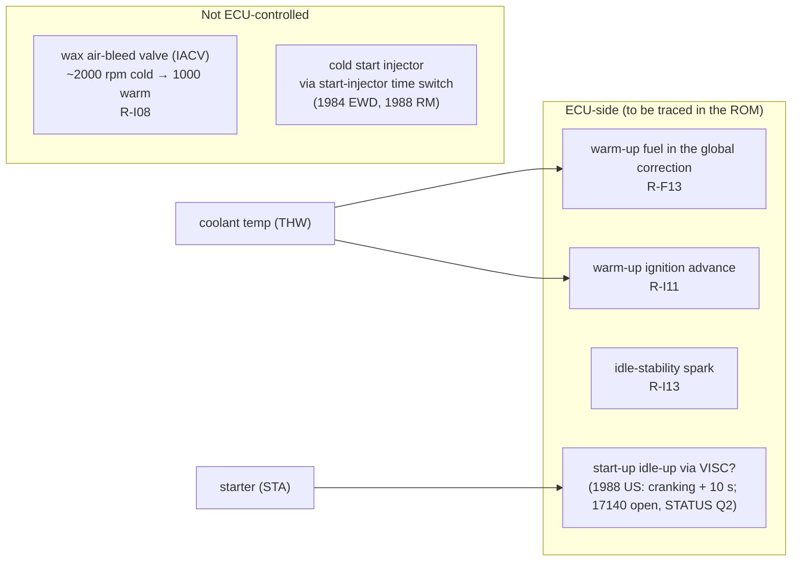

# Ross's ECU logic as diagrams (P1)

These diagrams show **what Ross says** the 89661-17030 (mk1a) ECU does, in the order he describes it ([PDF] *Lifting the Lid*, parts 2–4). Every box carries the claim IDs from [`claims.md`](claims.md).
- **Nothing here is verified yet.** P2 (Bluetop) and P4 (17140 ROM) check each box against the code. A box is redrawn when the ROM disagrees, and the difference is logged in [`../STATUS.md`](../STATUS.md).
- Digitised data for the maps is in [`figures/`](figures/README.md).
- **Bench finding (17140):** Ross's secret-map "logic level" is most likely the factory jumper pair on **P32/P34** ([`../hardware/aw11_ecu.md`](../hardware/aw11_ecu.md)).

## 1. Fuel chain (warm engine) [PDF p2–p10]

Every map after the density map is a correction to its 16-bit base value (R-F02). The final number is the injector pulse width in µs (R-F23).

### Fuel cut and injection mode [PDF p9–p10]

Factory return thresholds for the overrun cut on the 1988 US car: 1600 rpm cut, 1200 rpm return (A/C off). See [`../hardware/repair_manual_aw11_1988.md`](../hardware/repair_manual_aw11_1988.md).

## 2. Ignition chain [PDF p12–p16]

### T-VIS switching [PDF p15]

Ross's figures, mk1a first, then mk1b. The 1984 EWD and the 1988 repair manual both give 4350 rpm.

### Idle stability [PDF p15]

**In tuning terms:** this is the ECU's only closed-loop idle control on a UK car (no ISC valve, no O2 sensor). Idle speed is held by snapping the spark forward when rpm drops, then easing it back. It matters for goal 1: with the IACV removed there is less idle air, so this loop works harder on a cold engine. P5 measures how far it can compensate.

## 3. Mixture screw [PDF p17–p18]

## 4. Cold start and warm-up as Ross describes it [PDF p14–p15]

Ross says little about cold start; goal 1 (P5) fills this in from the ROM. This is the starting picture, with the factory-manual evidence added.

